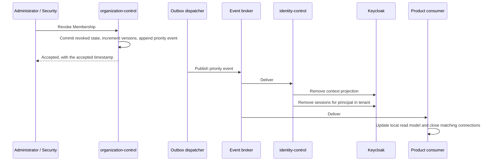

---
doc_meta:
  id: TDD-organization-control-002
  title: Membership Authority, Revocation, and Projection Publication
  owner: Core Platform Team
  version: 1.1.0
  status: approved
  classification: restricted
  review_cycle_days: 90
  created_date: 2026-08-11
  last_reviewed: 2026-08-23
  parent_sad: SAD-004
---

# Membership Authority, Revocation, and Projection Publication

## Purpose

Specify the authoritative side of Membership: the state machine, the version counters
consumers use to detect staleness, the revocation transaction, and the projection
contract through which consumers obtain and resume Membership state without calling
this service on every request.

The preceding custom identity implementation held a revocation marker in a cache with
a 24-hour lifetime and no invalidation on write. Suspending an account, resetting a
credential, and revoking all sessions each left issued tokens valid for up to a day.
A containment action that does not contain is worse than an absent one, because
incident response is planned around it. This design makes the authority-side share of
the enforcement interval an explicit, measured, alertable property.

## Scope

**In scope**

- Membership and Tenant authoritative state, versions, and lifecycle transitions.
- The revocation transaction and the priority event it emits.
- Snapshot generation, the high-water mark, and the consumer registry.
- The bootstrap contract every projection consumer follows.
- The authoritative fresh-check contract reserved for high-risk decisions.
- The share of the enforcement budget this service owns.

**Out of scope**

- Applying context into Keycloak and removing Keycloak sessions — owned by
  `TDD-identity-control-002`. This service never calls Keycloak.
- Row-Level Security and tenant isolation — owned by `TDD-organization-control-001`.
- The outbox table, dispatcher, and event envelope — owned by
  `TDD-foundation-platform-001`.
- Access token lifetime, which is the other term in the enforcement interval and
  belongs to the STD-IAM-002 Token and Verification Profile.

## Technical Context

Membership is authoritative in the Organization Database. Two classes of consumer read
it, and neither calls this service per request:

| Consumer | Reads projection for | Delivery |
| :-- | :-- | :-- |
| `identity-control` | Deciding which Tenant context a token may assert, and removing sessions on revocation | Priority event on the broker |
| Product APIs | Enforcing context on requests carrying an already-issued token | Event stream into a local read model |

A token asserts exactly one active Tenant context and at most one Workspace context.
An operator holding Membership in thirty client Tenants receives a token naming one of
them. The full set is retrieved through the context API and never placed in a token,
which bounds token size and stops a single stolen token from carrying authority across
every client relationship. STD-IAM-001 §3.3 makes that rule normative.

The enforcement interval is a sum, not a number:

```text
max_enforcement_delay
    = projection_propagation_time      ← owned here and by foundation-platform
    + remaining_access_token_lifetime  ← owned by the token profile
```

Access token lifetime is therefore a security parameter of this design rather than a
performance setting, which STD-IAM-001 §3.4 states as a requirement. A five-minute
revocation target with a one-minute propagation budget constrains access token
lifetime to four minutes.

The token-lifetime term does not bound a connection authenticated once and held open.
A stream established before a revocation survives expiry of the token that authorized
it, because the consumer receives no further request to reject. For those surfaces the
second term is replaced by the maximum connection lifetime, capped at the access token
lifetime of the connection's profile.

## Component Design

| Component | Package | Responsibility |
| :-- | :-- | :-- |
| `MembershipService` | `internal/membership` | Authoritative mutation, version increment, outbox write in one transaction |
| `TenantService` | `internal/tenant` | Tenant lifecycle and `tenant_security_version` |
| `ContextService` | `internal/context` | Eligible contexts, switch eligibility, authoritative fresh check |
| `ProjectionPublisher` | `internal/projection` | Snapshot generation, high-water mark, consumer registry |
| `ProjectionReporter` | `internal/projection` | Records consumer-reported progress and reconciliation status |

### Revocation Propagation

Four mechanisms enforce a revocation, at three different latencies. This service owns
the first step of all four and the enforcement of none: acknowledgement here means
durable and queued, never enforced.



| Mechanism | Blocks | Owner |
| :-- | :-- | :-- |
| Keycloak context projection removed | Issuance of any new token asserting that context | `identity-control` |
| Keycloak session removal | Refresh, which would otherwise mint a fresh token | `identity-control` |
| Consumer read model updated | Requests carrying an already-issued access token | Product consumer |
| Long-lived connection terminated | Streams opened before the revocation, which issue no further request | Product consumer |

Without session removal a revoked Principal refreshes and receives a new token.
Without consumer projection update an issued token remains accepted until it expires.
Without projection removal a subsequent authentication reasserts the revoked context.
Without connection termination a stream opened before the revocation keeps delivering
tenant-scoped data, because the first three mechanisms act on new requests and an open
connection makes none.

## Data Model

### Authoritative State

```sql
CREATE TABLE membership.membership (
    membership_id       UUID        PRIMARY KEY,
    principal_id        UUID        NOT NULL,
    tenant_id           UUID        NOT NULL REFERENCES tenant.tenant(tenant_id),
    workspace_id        UUID,
    subject_type        TEXT        NOT NULL,
    status              TEXT        NOT NULL,
    membership_version  BIGINT      NOT NULL DEFAULT 1,
    valid_from          TIMESTAMPTZ NOT NULL,
    valid_until         TIMESTAMPTZ,
    provenance          TEXT        NOT NULL,
    created_at          TIMESTAMPTZ NOT NULL DEFAULT now(),
    updated_at          TIMESTAMPTZ NOT NULL DEFAULT now(),
    CONSTRAINT membership_status_check
        CHECK (status IN ('active', 'suspended', 'revoked')),
    CONSTRAINT membership_subject_check
        CHECK (subject_type IN ('human', 'workload')),
    -- A referenced Workspace must belong to this Membership's Tenant.
    CONSTRAINT membership_workspace_in_tenant
        FOREIGN KEY (tenant_id, workspace_id)
        REFERENCES workspace.workspace (tenant_id, workspace_id)
);

-- One active Membership per subject, context, and type.
CREATE UNIQUE INDEX membership_active_unique
    ON membership.membership (principal_id, tenant_id, COALESCE(workspace_id, tenant_id), subject_type)
    WHERE status = 'active';
```

### Two objects this design depends on and does not declare

`workspace.workspace (tenant_id, workspace_id)` must carry
`UNIQUE (tenant_id, workspace_id)` for the composite foreign key above to be creatable at
all — PostgreSQL requires the referenced column set to be uniquely constrained — and
`tenant.tenant` must carry `tenant_security_version`. Version 0.3.0 of this design
declared both with `ALTER TABLE`, and so did
`TDD-organization-control-003`, which owns those two tables.

Two designs declaring one object is not a stylistic duplication. Applied as SQL in the
order the designs state, the second declaration fails and the migration stops; resolved by
whoever notices, it becomes an undocumented decision about which design is authoritative.
The declaration therefore lives once, in `TDD-organization-control-003`, and this design
records the dependency instead:

| Object | Declared by | Depended on for |
| :-- | :-- | :-- |
| `workspace.workspace` `UNIQUE (tenant_id, workspace_id)` | `TDD-organization-control-003` | `membership_workspace_in_tenant`, the same-Tenant invariant |
| `tenant.tenant.tenant_security_version` | `TDD-organization-control-003` | The Tenant half of the staleness test, carried in every Membership event |

Dropping either as apparent redundancy silently removes an invariant, which is why the
migration test asserts both are present rather than trusting the schema to keep them.

`membership_version` increments on every status transition of that Membership.
`tenant_security_version` increments on Tenant transitions that invalidate every context
in the Tenant at once, and `TDD-organization-control-003` §"Security Version Increments"
is the authoritative list of which ones. Together they give a consumer a staleness test
that costs no remote call: the Membership version answers "is my copy of this
relationship current", the Tenant version answers "has everything in this Tenant been
invalidated".

The composite foreign key relies on the default `MATCH SIMPLE` semantics deliberately.
When `workspace_id` is `NULL` the constraint is satisfied without a lookup, which is
the tenant-scoped Membership case. `MATCH FULL` would reject that row and is therefore
incorrect here. `tenant_id` keeps its own foreign key so it stays validated when no
Workspace is referenced.

### Consumer Registry

Owned by the publisher and held in this database. Each consumer's own stream position
lives in that consumer's database, never here.

```sql
CREATE TABLE projection.consumer (
    consumer_id        TEXT        PRIMARY KEY,
    projection_version TEXT        NOT NULL,
    max_accepted_age   INTERVAL    NOT NULL,
    stale_behavior     TEXT        NOT NULL,
    registered_at      TIMESTAMPTZ NOT NULL DEFAULT now(),
    snapshot_mark      BIGINT,
    last_reported_at   TIMESTAMPTZ,
    last_reported_mark BIGINT,
    CONSTRAINT stale_behavior_check
        CHECK (stale_behavior IN ('use_with_marker', 'revalidate', 'fail_closed'))
);
```

A consumer that has not registered receives no projection. `last_reported_*` records
what the consumer said about its own progress; it is a report, not an authority, and
the publisher never infers a position from it.

`snapshot_mark` is what §"Bootstrap Contract" reads to refuse a progress report from a
consumer that never took a snapshot. Version 0.4.0 of this design stated that refusal and
declared the table without the column, so the rule had nowhere to read from; the column is
the enforcement of a rule this design already made rather than a new one. `NULL` means no
snapshot has been taken, which is precisely the condition that refuses the report.

Re-registering a consumer replaces its declared terms and leaves `snapshot_mark`
untouched. A consumer raising its freshness budget has not un-bootstrapped itself, and
clearing the mark there would refuse its next progress report for a reason unrelated to
what it changed. A re-bootstrap may move the mark forward and never backward: a lower mark
would claim the consumer rebuilt from an older instant than one it has already reported
progress against, which no sequence of correct operations produces.

### Context Claims Supplied to Token Issuance

```json
{
  "tenant_id": "019235f2-4d11-7a03-b8c7-1e9f7a2c4b60",
  "workspace_id": "019235f3-9b72-7f45-8e21-6d3c8a1f0e52",
  "membership_version": 14,
  "tenant_security_version": 3
}
```

A consumer comparing these against its local read model detects staleness without
contacting this service. A token whose `membership_version` is lower than the locally
known version is rejected, because the local model is newer and has already recorded a
change.

## API / Interface

```text
GET    /v1/principals/{principal_id}/contexts
GET    /v1/context/{tenant_id}/{principal_id}:verify
POST   /v1/memberships
POST   /v1/memberships/{membership_id}:suspend
POST   /v1/memberships/{membership_id}:revoke
POST   /v1/memberships/{membership_id}:restore
GET    /v1/projections/organization/snapshot
POST   /v1/projections/organization:reconcile
GET    /v1/projections/organization/consumers/{consumer_id}
PUT    /v1/projections/organization/consumers/{consumer_id}
```

`:verify` is the authoritative fresh check, reserved for high-risk operations and
never placed on an ordinary request path. Its use is measured: a consumer whose
`:verify` rate approaches its request rate has misclassified its operations, and that
is treated as a defect rather than as load.

Errors are RFC 7807 problem documents from `foundation-platform`. Mutations require an
`Idempotency-Key`, an optimistic version, an actor, and a reason.

### Published Events

```text
com.scnehaux.organization.membership.lifecycle.granted
com.scnehaux.organization.membership.lifecycle.restored
com.scnehaux.organization.membership.security.suspended      (priority)
com.scnehaux.organization.membership.security.revoked        (priority)
com.scnehaux.organization.tenant.security.suspended          (priority)
com.scnehaux.organization.tenant.lifecycle.activated
com.scnehaux.organization.projection.repair.reconciled
```

Version 0.4.0 of this design named the last one
`com.scnehaux.organization.projection.reconciled`. `TDD-foundation-platform-001` requires six
or seven segments and reserves the fifth for the event's class, so a five-segment name is not
merely rejected by the validator — it has no room to say what kind of event it is. `repair`
is that class, and it is deliberately not `security`: the fifth segment is what routes an
event to the reserved dispatch lane, and a sweep corrects a divergence that has already been
delivered, so a large sweep on that lane would delay the live revocations the lane exists
for.

Envelopes are CloudEvents 1.0 per `TDD-foundation-platform-001`. Priority events carry
outbox priority `0` and occupy the reserved dispatch lane. Delivery is at-least-once
and consumers deduplicate on `event_id`. Every envelope carries the publisher-local
`streamposition` assigned from `platform.outbox.sequence`; gaps are valid and the value
is never interpreted as a broker offset.

Every Membership state event carries the complete security state needed to reject a
reordered predecessor:

```json
{
  "membership_id": "019235f4-...",
  "principal_id": "019235f1-...",
  "tenant_id": "019235f2-...",
  "workspace_id": "019235f3-...",
  "membership_status": "revoked",
  "membership_version": 14,
  "tenant_security_version": 3
}
```

Every Tenant security or activation event similarly carries `tenant_id`, complete
`tenant_status`, and `tenant_security_version`. Snapshot rows use the same fields. The
versions, not delivery order or `streamposition`, decide which desired state is newer;
this is mandatory because the priority lane may deliver a revocation before an older
grant.

### Bootstrap Contract

1. Register the consumer, declaring `max_accepted_age` and `stale_behavior`.
2. Open its durable broker subscription and buffer Organization events without applying
   them. This happens before the snapshot request, so no event can fall into a
   snapshot-to-subscribe gap.
3. Request a versioned snapshot. The endpoint reads authority and
   `MAX(platform.outbox.sequence)` in one repeatable-read database snapshot and returns
   that value as `high_water_mark`.
4. Replace the local read model with the snapshot, then apply **every** buffered event,
   deciding each one by version comparison. The mark is the position the consumer reports
   as its starting point; it is not a boundary below which events may be discarded.
5. Continue normal durable consumption and report the last applied `streamposition`
   and reconciliation status on the declared cadence.

Reading the stream without a snapshot yields an incomplete model, so the registry
refuses a progress report whose snapshot mark is absent. Broker redelivery after
bootstrap remains harmless because `event_id` is the deduplication identity; position
orders the source stream and never replaces deduplication.

#### Why the mark is not a discard boundary

Version 0.4.0 of this design ended step 4 with "events at or below the mark are
acknowledged as already represented by the snapshot". That is unsound, and the projection
suite reproduces it against a real engine.

`platform.outbox.sequence` is allocated by `nextval` at `INSERT`, not at `COMMIT`. So
transaction A can take sequence 103 and still be open while transaction B takes 104 and
commits. A snapshot taken in that window sees `MAX(sequence) = 104` and does not see A's
row — nor A's Membership, because both are the same uncommitted transaction. A consumer
that discarded everything at or below 104 would discard the only event that would ever
have delivered that Membership, and nothing downstream would report the loss: authority
holds a Membership, the consumer holds none, and both sides believe they are current until
a reconciliation sweep happens to compare them.

Making the mark exact would take either transaction-id arithmetic against the snapshot's
`xmin` or a lock serialising every outbox append against every snapshot. The first is
fragile; the second puts a global serialisation point on the mutation path to buy a
property that is not needed, because this design already states the rule that closes the
hole: **the versions, not delivery order or `streamposition`, decide which desired state is
newer.** A consumer applying an event it already has either matches or is superseded, so
applying a duplicate is free and discarding a straggler is not.

The cost of the amendment is a bounded amount of redundant work once per bootstrap. The
cost of the original wording is a silently missing context.

## Algorithms / Logic

### Revocation

```text
BEGIN
    load membership FOR UPDATE
    reject if the transition is not permitted by the state machine
    set status = 'revoked'
    membership_version = membership_version + 1
    read tenant_security_version
    outbox.Append(priority, com.scnehaux.organization.membership.security.revoked)
    record acting subject, reason, and correlation identifier
COMMIT
```

The event is appended inside the same transaction as the status change. A revocation
that commits without its event is unreachable by every consumer: authority says revoked,
every projection says active, and nothing in the system disagrees out loud. That is the
failure the transactional outbox exists to prevent.

The version increment is expressed as `membership_version = membership_version + 1` in the
same statement as the status change rather than as a value computed by the service. Two
concurrent transitions read the same version, and the one that computed it would write a
number the other already used. The row lock serialises them, and writing the increment
relationally keeps it correct even if the lock is ever removed.

**A Membership revocation reads `tenant_security_version` and does not increment it.**
Version 0.3.0 of this design incremented it when "the revocation is tenant-wide", which
contradicted this document's own §"Data Model" — where the Tenant version increments on
changes invalidating every context in the Tenant at once — and
`TDD-organization-control-003` §"Security Version Increments", whose list of incrementing
transitions contains no Membership operation at all.

The phrase was also ambiguous in a way that mattered: a *Tenant-wide Membership* is one
scoped to the Tenant rather than to a Workspace, which is a property of one relationship
and not a Tenant-wide event. Incrementing on it would mean one person's revocation
invalidating every cached context for every Principal in the Tenant. In a busy Tenant the
counter would then move constantly, which destroys what it is for: a cheap test a consumer
applies without a remote call is only cheap while a change to it means something. The
per-Membership staleness test is `membership_version`, which the event already carries.

The value is read inside the same transaction as the mutation, not earlier. Read before
the transaction, a Tenant suspension committing in between would produce an event carrying
a version older than the state it describes — and a consumer comparing versions would
classify the newer Membership change as superseded and keep serving revoked access.

Acknowledgement carries the accepted timestamp so enforcement delay is measurable from
a recorded origin rather than from a log line. Per STD-IAM-001 §3.4 it means durable and
queued, never enforced.

### Staleness Policy

A consumer evaluates its projection age against its declared policy on every request:

| Condition | Action |
| :-- | :-- |
| Age within `max_accepted_age` | Serve from the local model |
| Age exceeded, `use_with_marker` | Serve and expose a staleness indicator to the caller |
| Age exceeded, `revalidate` | Call `:verify` for this decision |
| Age exceeded, `fail_closed` | Deny |
| Any irreversible or high-risk operation | Call `:verify` regardless of age |

Token issuance uses `fail_closed`. Issuing a token from a projection of unknown age
mints authority that outlives the uncertainty, and no downstream control can undo it.

### Reconciliation

```text
authoritative := active memberships as of the watermark
projected     := state reported by the consumer

missing   := authoritative − projected    → republish, emit repair event
extra     := projected − authoritative    → instruct removal, emit repair event, alert
mismatch  := version divergence           → republish the authoritative value
```

An `extra` finding means a context is projected that authority does not grant. It is
escalated as a potential privilege escalation rather than filed as a data-quality
issue, because reaching that state requires either a defect in the projection path or
a write outside it.

Reconciliation repairs toward authority in one direction. A projection is never
promoted into authority.

## Configuration

| Variable | Default | Purpose |
| :-- | :-- | :-- |
| `ORGANIZATION_SNAPSHOT_INTERVAL` | `1h` | Snapshot generation cadence |
| `ORGANIZATION_SNAPSHOT_PAGE_SIZE` | `1000` | Rows per snapshot page |
| `ORGANIZATION_RECONCILE_INTERVAL` | `15m` | Authority-versus-report comparison cadence |
| `ORGANIZATION_VERIFY_RATE_ALERT` | `0.05` | `:verify` calls per request above which a consumer is flagged |

Consumer-side freshness values are declared per consumer in the registry rather than
configured globally, because a work queue and a financial approval path do not share a
freshness requirement.

### Enforcement Budget

| Term | Budget | Owner |
| :-- | :-- | :-- |
| Accept to outbox commit | 100 ms | This design |
| Outbox commit to dispatch claim | 1 s | `foundation-platform` |
| Dispatch to Keycloak projection and session removal | 2 s | `identity-control` |
| Dispatch to consumer read model applied | 5 s | Product consumer |
| Dispatch to long-lived connection closed | 5 s | Product consumer |
| Propagation subtotal | under 10 s | — |
| Remaining access token lifetime | token profile | STD-IAM-002 Token and Verification Profile |

No single owner states the enforcement interval. The operational dashboard presents
the sum, because that is the number incident response works from.

## Testing Strategy

### Correctness

- A revocation and its outbox append commit atomically; a failure injected after the
  status change and before the append rolls back both.
- `membership_version` increments on every status transition and never decreases.
- The partial unique index rejects a second active Membership for the same subject,
  context, and type.
- A Membership referencing a Workspace of another Tenant is rejected by the composite
  foreign key, and a Membership with a `NULL` Workspace is accepted.
- Dropping `workspace_tenant_scope_unique` fails the migration test.
- Every transition outside the state machine is refused.

### Projection

- A consumer that has not registered receives no snapshot.
- A progress report without a snapshot mark is refused.
- A reported position below one already accepted is refused; re-reporting the same
  position is accepted, because an idle consumer is still reporting liveness.
- A mutation committed while a snapshot is being produced appears either in the snapshot
  or in the buffered set, never in neither. It is **not** required to appear above the
  mark: a transaction in flight when the mark is taken holds a lower sequence, which is
  why §"Why the mark is not a discard boundary" exists and why a test holds a transaction
  open across a snapshot to demonstrate it.
- A snapshot plus the buffered set reconstructs the authoritative set with no gap;
  repeated `event_id` values do not apply twice.
- Every page of one snapshot reports the same high-water mark, and continuing a snapshot
  without carrying its mark is refused rather than served with a fresh one.
- Paging covers the set exactly once: keyset paging on `membership_id`, never `OFFSET`.
- Gaps in `streamposition` caused by rolled-back transactions do not stall bootstrap.
- Delivering Membership version 14 before version 13 leaves version 14 as desired state;
  the later delivery of version 13 is classified as superseded and cannot restore
  access.
- A Membership grant carrying Tenant security version 3 cannot restore context after a
  Tenant event advances the Tenant security version to 4 and suspends it.
- A lifecycle backlog of ten thousand events does not delay a priority event beyond
  its budget.

### Reconciliation

- A reported projection containing a context authority does not grant is detected as
  `extra`, repaired, and alerted as a security finding.
- A dropped event produces a `missing` finding the next sweep repairs.
- Reconciliation is idempotent across repeated runs against a consistent state.

### Negative

- A context switch to a Tenant without active Membership is refused.
- A `:verify` call rate above the configured threshold raises the consumer-misuse
  alert.
- No code path in this service opens a connection to Keycloak or to the Control
  Database.

## Security Notes

The projection carries context, not authorization. It contains Tenant identity,
Workspace identity, Membership status, and versions. It contains no Product
permission, no Entitlement, and no business role. A projection that grows to carry
permissions has recreated the token-as-permission-snapshot pattern EAD-006 rejects and
STD-IAM-001 §3.3 prohibits.

Revocation acknowledgement is a durability statement. Operational procedures and the
security dashboard present the accepted timestamp and the enforced timestamp
separately, so incident response works from the enforced value rather than the
convenient one.

This service holds no Keycloak credential and has no network route to Keycloak.
ADR-ORG-001 §5.4 prohibits Organization from writing to Keycloak, and the absence of
the credential makes that prohibition structural rather than procedural.

## Performance Notes

Snapshot generation reads the active Membership set for one consumer under admission
control so it cannot contend with priority dispatch. Snapshot size grows with active
Membership count and is paged.

`:verify` is a synchronous authoritative read with a p95 target of 200 ms. Its call
rate is a monitored signal; a sustained rise indicates consumers are using it as an
ordinary read.

Placing one context in a token rather than the full Membership set keeps token size
independent of how many client relationships an operator holds, which is the property
that makes the model workable for cross-client operators.

## Operational Notes

| Signal | Warning | Critical |
| :-- | :-- | :-- |
| Accept-to-enforcement delay, security events | above budget | twice budget |
| Consumer reconciliation age | one interval | consumer stale policy exceeded |
| `extra` reconciliation findings | any occurrence | any occurrence |
| Consumers with an unregistered cursor | any occurrence | — |
| `:verify` rate per consumer | above threshold | ten times threshold |

Runbooks required before production: revocation not enforced within budget, projection
drift repair, consumer read model rebuild, reconciliation reporting an `extra`
finding, and consumer misuse of the fresh-check path.

## Traceability

| Relationship | Target |
| :-- | :-- |
| Parent system | SAD-004 — Scnehaux Organization Control |
| Realizes capability | PAD-PLT-002 — Organization & Tenancy Platform |
| Governed by | ADR-ORG-001 — Separate Organization Authority and Keycloak Projection |
| Governed by | ADR-GLB-003 — Transactional Outbox |
| Governed by | ADR-GLB-006 — Event Versioning |
| Conforms to | STD-IAM-001 §3.3 — one active Tenant context per token; the Membership set is never placed in a token |
| Conforms to | STD-IAM-001 §3.4 — enforcement delay is propagation plus remaining token lifetime |
| Conforms to | STD-GLB-001 — RFC 7807 problem details |
| Enterprise constraint | EAD-003 — projection contract with freshness, stale behavior, and reconciliation |
| Enterprise constraint | EAD-006 — Membership, Entitlement, and Permission are distinct |
| Enterprise constraint | EAD-002 — no universal synchronous control-plane fan-in |
| Depends on | `TDD-foundation-platform-001` — outbox, dispatcher, envelope |
| Depends on | `TDD-organization-control-001` — tenant isolation and Row-Level Security |
| Consumed by | `TDD-identity-control-002` — Keycloak projection and session removal |
| Depends on | STD-IAM-002 — Token and Verification Profile, which owns access token lifetime |

### Open Questions

1. Context switch mechanism, judged against the nine acceptance criteria retained from
   the superseded design. A new authorization request on the existing SSO session is
   the baseline because it needs no extension; Standard Token Exchange is evaluated
   against it. The decision is made in `identity-kernel` and consumed here.
2. Whether an Organization-level operation spanning several Tenants can remain
   representable under the current model, in which every `operation` row belongs to
   one Tenant.
