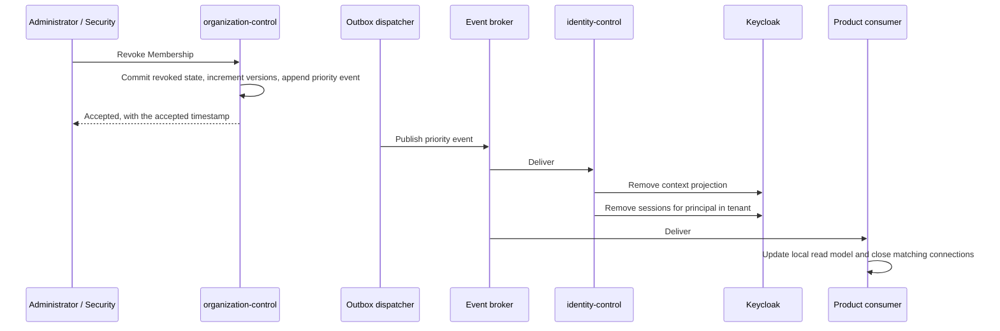

---
doc_meta:
  id: TDD-organization-control-002
  title: Membership Authority, Revocation, and Projection Publication
  owner: Core Platform Team
  version: 1.13.0
  status: approved
  classification: restricted
  review_cycle_days: 90
  created_date: 2026-08-11
  last_reviewed: 2026-10-07
  parent_sad: SAD-004
---

# Membership Authority, Revocation, and Projection Publication

## Purpose

Specify the authoritative side of Membership: the state machine, the version counters
consumers use to detect staleness, the revocation transaction, and the projection
contract through which consumers obtain and resume Membership state without calling
this service on every request.

The preceding custom identity implementation held a revocation marker in a cache with
a 24-hour lifetime and no invalidation on write. Suspending an account, resetting a
credential, and revoking all sessions each left issued tokens valid for up to a day.
A containment action that does not contain is worse than an absent one, because
incident response is planned around it. This design makes the authority-side share of
the enforcement interval an explicit, measured, alertable property.

## Scope

**In scope**

- Membership and Tenant authoritative state, versions, and lifecycle transitions.
- The revocation transaction and the priority event it emits.
- Snapshot generation, the high-water mark, and the consumer registry.
- The bootstrap contract every projection consumer follows.
- The authoritative fresh-check contract reserved for high-risk decisions.
- The share of the enforcement budget this service owns.

**Out of scope**

- Applying context into Keycloak and removing Keycloak sessions — owned by
  `TDD-identity-control-002`. This service never calls Keycloak.
- Row-Level Security and tenant isolation — owned by `TDD-organization-control-001`.
- The outbox table, dispatcher, and event envelope — owned by
  `TDD-foundation-platform-001`.
- Access token lifetime, which is the other term in the enforcement interval and
  belongs to the STD-IAM-002 Token and Verification Profile.

## Technical Context

Membership is authoritative in the Organization Database. Two classes of consumer read
it, and neither calls this service per request:

| Consumer | Reads projection for | Delivery |
| :-- | :-- | :-- |
| `identity-control` | Deciding which Tenant context a token may assert, and removing sessions on revocation | Priority event on the broker |
| Product APIs | Enforcing context on requests carrying an already-issued token | Event stream into a local read model |

A token asserts exactly one active Tenant context and at most one Workspace context.
An operator holding Membership in thirty client Tenants receives a token naming one of
them. The full set is retrieved through the context API and never placed in a token,
which bounds token size and stops a single stolen token from carrying authority across
every client relationship. STD-IAM-001 §3.3 makes that rule normative.

The enforcement interval is a sum, not a number:

```text
max_enforcement_delay
    = projection_propagation_time      ← owned here and by foundation-platform
    + remaining_access_token_lifetime  ← owned by the token profile
```

Access token lifetime is therefore a security parameter of this design rather than a
performance setting, which STD-IAM-001 §3.4 states as a requirement. A five-minute
revocation target with a one-minute propagation budget constrains access token
lifetime to four minutes.

The token-lifetime term does not bound a connection authenticated once and held open.
A stream established before a revocation survives expiry of the token that authorized
it, because the consumer receives no further request to reject. For those surfaces the
second term is replaced by the maximum connection lifetime, capped at the access token
lifetime of the connection's profile.

## Component Design

| Component | Package | Responsibility |
| :-- | :-- | :-- |
| `MembershipService` | `internal/membership` | Authoritative mutation, version increment, outbox write in one transaction |
| `TenantService` | `internal/tenant` | Tenant lifecycle and `tenant_security_version` |
| `ContextService` | `internal/context` | Eligible contexts, switch eligibility, authoritative fresh check |
| `ProjectionPublisher` | `internal/projection` | Snapshot generation, high-water mark, consumer registry |
| `ProjectionReporter` | `internal/projection` | Records consumer-reported progress and reconciliation status |

### Revocation Propagation

Four mechanisms enforce a revocation, at three different latencies. This service owns
the first step of all four and the enforcement of none: acknowledgement here means
durable and queued, never enforced.


```mermaid
sequenceDiagram
    participant A as Administrator / Security
    participant O as organization-control
    participant D as Outbox dispatcher
    participant B as Event broker
    participant I as identity-control
    participant K as Keycloak
    participant P as Product consumer

    A->>O: Revoke Membership
    O->>O: Commit revoked state, increment versions, append priority event
    O-->>A: Accepted, with the accepted timestamp
    D->>B: Publish priority event
    B->>I: Deliver
    I->>K: Remove context projection
    I->>K: Remove sessions for principal in tenant
    B->>P: Deliver
    P->>P: Update local read model and close matching connections
```

| Mechanism | Blocks | Owner |
| :-- | :-- | :-- |
| Keycloak context projection removed | Issuance of any new token asserting that context | `identity-control` |
| Keycloak session removal | Refresh, which would otherwise mint a fresh token | `identity-control` |
| Consumer read model updated | Requests carrying an already-issued access token | Product consumer |
| Long-lived connection terminated | Streams opened before the revocation, which issue no further request | Product consumer |

Without session removal a revoked Principal refreshes and receives a new token.
Without consumer projection update an issued token remains accepted until it expires.
Without projection removal a subsequent authentication reasserts the revoked context.
Without connection termination a stream opened before the revocation keeps delivering
tenant-scoped data, because the first three mechanisms act on new requests and an open
connection makes none.

## Data Model

### Authoritative State

```sql
CREATE TABLE membership.membership (
    membership_id       UUID        PRIMARY KEY,
    principal_id        UUID        NOT NULL,
    tenant_id           UUID        NOT NULL REFERENCES tenant.tenant(tenant_id),
    workspace_id        UUID,
    subject_type        TEXT        NOT NULL,
    status              TEXT        NOT NULL,
    membership_version  BIGINT      NOT NULL DEFAULT 1,
    valid_from          TIMESTAMPTZ NOT NULL,
    valid_until         TIMESTAMPTZ,
    provenance          TEXT        NOT NULL,
    created_at          TIMESTAMPTZ NOT NULL DEFAULT now(),
    updated_at          TIMESTAMPTZ NOT NULL DEFAULT now(),
    CONSTRAINT membership_status_check
        CHECK (status IN ('active', 'suspended', 'revoked')),
    CONSTRAINT membership_subject_check
        CHECK (subject_type IN ('human', 'workload')),
    -- A referenced Workspace must belong to this Membership's Tenant.
    CONSTRAINT membership_workspace_in_tenant
        FOREIGN KEY (tenant_id, workspace_id)
        REFERENCES workspace.workspace (tenant_id, workspace_id)
);

-- One active Membership per subject, context, and type.
CREATE UNIQUE INDEX membership_active_unique
    ON membership.membership (principal_id, tenant_id, COALESCE(workspace_id, tenant_id), subject_type)
    WHERE status = 'active';
```

### Two objects this design depends on and does not declare

`workspace.workspace (tenant_id, workspace_id)` must carry
`UNIQUE (tenant_id, workspace_id)` for the composite foreign key above to be creatable at
all — PostgreSQL requires the referenced column set to be uniquely constrained — and
`tenant.tenant` must carry `tenant_security_version`. Version 0.3.0 of this design
declared both with `ALTER TABLE`, and so did
`TDD-organization-control-003`, which owns those two tables.

Two designs declaring one object is not a stylistic duplication. Applied as SQL in the
order the designs state, the second declaration fails and the migration stops; resolved by
whoever notices, it becomes an undocumented decision about which design is authoritative.
The declaration therefore lives once, in `TDD-organization-control-003`, and this design
records the dependency instead:

| Object | Declared by | Depended on for |
| :-- | :-- | :-- |
| `workspace.workspace` `UNIQUE (tenant_id, workspace_id)` | `TDD-organization-control-003` | `membership_workspace_in_tenant`, the same-Tenant invariant |
| `tenant.tenant.tenant_security_version` | `TDD-organization-control-003` | The Tenant half of the staleness test, carried in every Membership event |

Dropping either as apparent redundancy silently removes an invariant, which is why the
migration test asserts both are present rather than trusting the schema to keep them.

`membership_version` increments on every status transition of that Membership.
`tenant_security_version` increments on Tenant transitions that invalidate every context
in the Tenant at once, and `TDD-organization-control-003` §"Security Version Increments"
is the authoritative list of which ones. Together they give a consumer a staleness test
that costs no remote call: the Membership version answers "is my copy of this
relationship current", the Tenant version answers "has everything in this Tenant been
invalidated".

The composite foreign key relies on the default `MATCH SIMPLE` semantics deliberately.
When `workspace_id` is `NULL` the constraint is satisfied without a lookup, which is
the tenant-scoped Membership case. `MATCH FULL` would reject that row and is therefore
incorrect here. `tenant_id` keeps its own foreign key so it stays validated when no
Workspace is referenced.

### Event History

Every Membership event the service publishes also writes one row to
`membership.membership_event`, in the same transaction as the outbox append:

```sql
CREATE TABLE membership.membership_event (
    event_id            UUID        PRIMARY KEY,
    membership_id       UUID        NOT NULL REFERENCES membership.membership(membership_id),
    tenant_id           UUID        NOT NULL,
    membership_version  BIGINT      NOT NULL,
    event_type          TEXT        NOT NULL,
    recorded_at         TIMESTAMPTZ NOT NULL DEFAULT now(),
    actor_id            UUID,        -- the acting principal_id (1.9.0)
    correlation_id      UUID,        -- the request that caused the transition (1.9.0)
    reason              TEXT,        -- X-Administrative-Reason, or the freeze's reason (1.9.0)
    CONSTRAINT membership_event_version_unique UNIQUE (membership_id, membership_version),
    CONSTRAINT membership_event_reason_present CHECK (reason IS NULL OR btrim(reason) <> '')
);
```

The three columns added in 1.9.0 are the "record acting subject, reason, and correlation identifier"
step of §Revocation, which until then had nowhere to land: a Membership transition is tenant-scoped,
so it writes no `audit.privileged_access` row, and nothing else recorded who acted or why. They are
nullable because rows written before them have no value to give; every row written since carries the
actor, the correlation when the request had one, and the reason when one arrived. A revocation always
has one, because the route refuses a revocation without it.

From 1.10.0 `recorded_at` is written as the transition's `accepted_at`, the instant the response
returns and the event's envelope carries, rather than defaulted to the transaction's start. The two
differed by the time between the transaction opening and the clock read; the enforcement read
(§Enforcement Evidence) measures the budget from `accepted_at`, so the row must hold that value and
not a neighbour of it. Rows written before 1.10.0 keep the default.

It records which Membership, at which version, a published event concerns. A delivery receipt
names only an event, and a stream position is reassigned by a replay, so neither can say whether
one event is newer than another. This can. The `SUPERSEDED` dead-letter resolution reads it
(`TDD-organization-control-005`). The row is immutable: no runtime role holds `UPDATE` or
`DELETE`, and the foreign key keeps a Membership with published events from being deleted.

### Membership Batches

A bulk action is stored as a batch (`ADR-ORG-004` §5.1), from 1.10.0:

```sql
CREATE TABLE membership.membership_batch (
    batch_id          UUID        PRIMARY KEY,
    tenant_id         UUID        NOT NULL REFERENCES tenant.tenant(tenant_id),
    action            TEXT        NOT NULL,   -- suspend | restore | revoke
    state             TEXT        NOT NULL,   -- previewed | executing | executed
    reason            TEXT,                   -- X-Administrative-Reason; required for revoke
    correlation_id    UUID        NOT NULL,   -- a continuation keeps its parent's
    continues         UUID,                   -- the batch whose failed items this resubmits
    created_by        UUID        NOT NULL,
    created_at        TIMESTAMPTZ NOT NULL,
    expires_at        TIMESTAMPTZ NOT NULL,   -- created_at + 15 minutes
    would_change      INTEGER     NOT NULL,
    would_not_change  INTEGER     NOT NULL,
    fail_on_errors    INTEGER,                -- null: no allowance, every item is attempted
    executed_by       UUID,
    executed_at       TIMESTAMPTZ,
    completed_at      TIMESTAMPTZ,
    lease_id          UUID,                   -- 1.13.0: the executing request's fencing token
    heartbeat_at      TIMESTAMPTZ,            -- 1.13.0: renewed in every item's transaction
    resumed_by        UUID,                   -- 1.13.0: who last took the execution over
    resumed_at        TIMESTAMPTZ,
    CONSTRAINT membership_batch_tenant_scope_unique UNIQUE (tenant_id, batch_id)
);

CREATE TABLE membership.membership_batch_item (
    batch_id          UUID        NOT NULL,
    tenant_id         UUID        NOT NULL,
    position          INTEGER     NOT NULL,   -- the order the request named the item in
    membership_id     UUID        NOT NULL,   -- as named; no foreign key, so a refusal can be recorded
    principal_id      UUID,                   -- null when the Membership was not found
    current_status    TEXT,
    version_read      BIGINT,                 -- the version execution is held to
    resulting_status  TEXT,                   -- null when refused
    refusal           JSONB,                  -- {type, title, status, detail}: the single command's problem
    outcome           TEXT,                   -- succeeded | failed | not_attempted; null until executed
    outcome_reason    TEXT,                   -- not_attempted: refused_at_preview | error_allowance
    accepted_at       TIMESTAMPTZ,            -- succeeded
    event_id          UUID,                   -- succeeded: the event the transition published
    resulting_version BIGINT,                 -- succeeded: the membership_version it produced
    problem           JSONB,                  -- failed: the single command's problem
    PRIMARY KEY (batch_id, position),
    CONSTRAINT membership_batch_item_once UNIQUE (batch_id, membership_id),
    FOREIGN KEY (tenant_id, batch_id) REFERENCES membership.membership_batch (tenant_id, batch_id)
);
```

Both are in the `membership` schema, so Row-Level Security confines them to the Tenant like every
other table there, and `organization_rt` holds `SELECT`, `INSERT` and `UPDATE` on them and nothing
else. The item carries `tenant_id` and a composite foreign key for the reason
`TDD-organization-control-004` §"Why the obligation carries `tenant_id`" gives.

The batch is stored rather than recomputed because the preview is binding. Execution is held to the
version each item was read at, and the only place that version survives between two requests is
here. An expired batch (`expires_at` passed while `previewed`) is reported as `expired` and refused
at execution.

**An expired preview is purged** (1.13.0). The daily maintenance stage (`organization-migrate
-stage=maintenance`, which already runs the platform's retention) deletes every batch still
`previewed` whose `expires_at` is more than `-batch-preview-retention` (24 hours) in the past, with
its items, in one transaction. A batch that began executing is never purged: it is the record of what
a bulk action did. A day past the 15-minute expiry lets an administrator who left the screen open read
the preview as `expired` rather than as absent. No runtime role holds `DELETE` on either table
(`TDD-organization-control-001` §Roles), which is why the purge runs as the migration role, like the
rest of retention. Both tables are under `FORCE ROW LEVEL SECURITY`, which binds their owner too, so
`rls.sql` gives `organization_migrator` one policy on each, `membership_batch_purge` and
`membership_batch_item_purge`: `USING` an expired preview, `WITH CHECK (false)`. That admits the
delete and the read a `DELETE ... WHERE` needs ("the appropriate `SELECT` or `ALL` policies will be
applied in addition to the `DELETE` policies", PostgreSQL 17, `CREATE POLICY`) and refuses every
insert and update.

### Consumer Registry

Owned by the publisher and held in this database. Each consumer's own stream position
lives in that consumer's database, never here.

```sql
CREATE TABLE projection.consumer (
    consumer_id        TEXT        PRIMARY KEY,
    principal_id       UUID        NOT NULL UNIQUE,
    projection_version TEXT        NOT NULL,
    max_accepted_age   INTERVAL    NOT NULL,
    stale_behavior     TEXT        NOT NULL,
    registered_at      TIMESTAMPTZ NOT NULL DEFAULT now(),
    snapshot_mark      BIGINT,
    last_reported_at   TIMESTAMPTZ,
    last_reported_mark BIGINT,
    last_reconciled_at       TIMESTAMPTZ,   -- 1.13.0: when this service last reconciled its report
    last_reconciled_mark     BIGINT,        -- 1.13.0: the mark that report stated
    last_reconciled_findings INTEGER,       -- 1.13.0: how many findings the run produced
    CONSTRAINT stale_behavior_check
        CHECK (stale_behavior IN ('use_with_marker', 'revalidate', 'fail_closed'))
);
```

A consumer that has not registered receives no projection. `last_reported_*` records
what the consumer said about its own progress; it is a report, not an authority, and
the publisher never infers a position from it. `last_reconciled_*` is the opposite kind of
fact: a measurement this service made, written by every reconciliation run against the consumer's
report (§Reconciliation).

`snapshot_mark` is what §"Bootstrap Contract" reads to refuse a progress report from a
consumer that never took a snapshot. Version 0.4.0 of this design stated that refusal and
declared the table without the column, so the rule had nowhere to read from; the column is
the enforcement of a rule this design already made rather than a new one. `NULL` means no
snapshot has been taken, which is precisely the condition that refuses the report.

Re-registering a consumer replaces its declared terms and leaves `snapshot_mark`
untouched. A consumer raising its freshness budget has not un-bootstrapped itself, and
clearing the mark there would refuse its next progress report for a reason unrelated to
what it changed. A re-bootstrap may move the mark forward and never backward: a lower mark
would claim the consumer rebuilt from an older instant than one it has already reported
progress against, which no sequence of correct operations produces.

**A consumer subscribes to the event types it applies** (`ADR-GLB-018 §5.1`). Registration
names them in `event_types`, and each must be one this registry offers:
`projection.SubscribableEventTypes`: the eight Membership and Tenant types a projection's
authority depends on, the four provider authority types (`TDD-organization-control-001`
§Provider Authority Projection), and `projection.repair.reconciled`, which a reconciliation publishes when it
finds the projection wrong. A consumer that does not subscribe to the repair never receives one, so
its drift is corrected only by its next bootstrap. The subscription is recorded with foundation-platform's `outbox.Subscribe`,
in `platform.subscription`, inside the registering transaction. From its commit, every event of
those types owes the consumer a delivery of its own, with its own attempts, receipt and dead
letter. A type it does not subscribe to is never delivered to it, so it cannot be refused there as
unknown and park as poison.

- **Re-registering with the same types** changes the declared terms only.
- **Re-registering with other types** replaces the subscription and clears `snapshot_mark` and the
  reported position. Events of a newly added type that committed before the change were never
  delivered, so the consumer bootstraps again before a progress report is accepted. As Google's
  subscription filter "is an immutable property of a subscription" (`ADR-GLB-018` [R2]), a change
  is a replacement and not an edit.
- **Reviving a retired consumer** subscribes it again and clears the same columns, because nothing
  was delivered to it while it was retired.

**Retiring a consumer retires its subscription and abandons what it was owed**, in one transaction
(`outbox.Unsubscribe`, then `outbox.Abandon`, `ADR-GLB-018 §5.5`). Its dispatcher refuses to
start, so those deliveries would otherwise stay owed and hold outbox retention for every day they
belong to. Abandoned deliveries are neither evidence nor debt. The tradeoff: a consumer retired by
mistake loses its backlog and bootstraps from a snapshot when it is registered again, which is
what the bootstrap contract already requires of a consumer whose model is older than its budget.

**A consumer reads only the snapshot of what it subscribes to.** The Organization snapshot answers
a consumer whose subscription names a Membership or Tenant type, and the provider authority
snapshot one whose subscription names a provider type. Any other is refused with `403`. A
subscription is the consumer's declared need, and a snapshot beyond it would hand over authority
data no delivery would ever have carried to it (NIST SP 800-53 AC-6, `TDD-organization-control-001`
[R6]).

**Several consumers are active at once.** Up to v1.5.0 this registry refused a second active
consumer (`consumer_single_active`), because the outbox could record one outcome per event. With
per-consumer delivery (foundation-platform v0.3.0) that limit is gone, and so is the index. Each
consumer declares its own budget and stale behavior, and its frontier, debt and dead letters are
its own (`TDD-organization-control-005`).

**A consumer is the workload Principal it was registered with.** `principal_id` is how a
consumer's token is recognized (`ADR-ORG-001 §5.11`, `TDD-organization-control-001` §Caller
Authority): a workload token is a consumer's when an active row carries its `principal_id`.
Registration requires it. It is unique across every row, retired ones included, so a workload
Principal names one consumer for good, and re-registering a consumer under a different
`principal_id` is refused rather than moving the consumer's records to another workload. A
`client_id` would not do: a retired client registration frees its `client_key` for the next one.

### Context Claims Supplied to Token Issuance

```json
{
  "tenant_id": "019235f2-4d11-7a03-b8c7-1e9f7a2c4b60",
  "workspace_id": "019235f3-9b72-7f45-8e21-6d3c8a1f0e52",
  "membership_version": 14,
  "tenant_security_version": 3
}
```

A consumer comparing these against its local read model detects staleness without
contacting this service. A token whose `membership_version` is lower than the locally
known version is rejected, because the local model is newer and has already recorded a
change.

## API / Interface

```text
GET    /v1/principals/{principal_id}/contexts       ?after=&limit=
GET    /v1/context/{tenant_id}/{principal_id}:verify
GET    /v1/memberships                       ?after=&limit=&status=&workspace_id=&principal_id=
GET    /v1/memberships/{membership_id}
POST   /v1/memberships                            Idempotency-Key
POST   /v1/memberships/{membership_id}/suspend   {"expected_version": n}, Idempotency-Key
POST   /v1/memberships/{membership_id}/revoke    {"expected_version": n}, X-Administrative-Reason, Idempotency-Key
POST   /v1/memberships/{membership_id}/restore   {"expected_version": n}, Idempotency-Key
GET    /v1/memberships/{membership_id}/enforcement
POST   /v1/membership-batches                     X-Administrative-Reason (required for revoke), Idempotency-Key
GET    /v1/membership-batches/{batch_id}
POST   /v1/membership-batches/{batch_id}/execute  Idempotency-Key
POST   /v1/projections/snapshot
POST   /v1/projections/reconcile
GET    /v1/projections/consumers                 ?after=&limit=&state=
GET    /v1/projections/consumers/{consumer_id}
POST   /v1/projections/consumers
```

Every command above requires an `Idempotency-Key` from 1.13.0, as do registering and retiring a
consumer; the projection protocol routes, snapshot, progress, bootstrap and reconcile, honour one and
do not require it. `TDD-organization-control-003` §The `Idempotency-Key` Is Required on Commands is
the service-wide statement and gives each optional route its reason.

The projection routes are the ones this service serves. Until 1.8.1 this list named them under
`/v1/projections/organization/`, a path that was never served. identity-control's client followed
the list and was answered 404, which the three-stack `deploy-dev` found.

The Membership routes are tenant-scoped: the Tenant is the caller's, from the token, and Row-Level
Security confines every read and write to it, so a Membership in another Tenant answers `404`. Until
1.9.0 the three transitions were written `:suspend`, `:revoke` and `:restore`. They are served as path
segments, because a Go 1.22 `net/http` wildcard fills a whole segment, and that is the form a client
uses (`TDD-organization-control-003` §API / Interface says the same of every lifecycle route).

**The list** is `GET /v1/memberships`, in the form STD-GLB-001 1.3.0 §Pagination fixes for the estate
and identity-control serves for `GET /v1/registrations`:

| Part | Form |
| :-- | :-- |
| Cursor | `after`: the `membership_id` of the last item of the previous page. Absent, the list starts at the first. Not a UUID: `400` |
| Page size | `limit`: 50 when absent; a whole number from 1 to 100. Anything else, `0` included: `400`, never coerced |
| Order | `membership_id`, a UUIDv7, so creation order: the keyset `membership_id > $after ORDER BY membership_id LIMIT limit + 1` |
| Filters | `status` = `active` \| `suspended` \| `revoked`; `workspace_id` and `principal_id`, each a UUID. Each optional, each holding for every page; any other value: `400` |
| Response | `{"memberships": [...], "next": "<membership_id>" \| null}`, `next` null on the last page |

Each item has the shape `GET /v1/memberships/{membership_id}` returns: the Membership with its
`version`, which is the `membership_version` a transition must name. Without `status`, revoked
Memberships are listed too, because a revocation is the record of access that existed.
`workspace_id` matches only Memberships scoped to that Workspace; a Tenant-wide Membership has none.
Both reads run in a read-only transaction on the tenant pool.

**Every transition names the version the caller was shown.** Suspend, revoke and restore take the body
`{"expected_version": n}`, required and positive. The service compares it with the locked row's
`membership_version` inside the transaction, after the state machine has accepted the action, and a
mismatch answers `409` `version-conflict` with nothing written, the way a Tenant or Workspace
transition does (`TDD-organization-control-003` §The optimistic check lives in the service). Until
1.9.0 these routes took no body, so two administrators acting on one Membership from two views had the
second action land on a state neither had seen.

**A revocation carries a reason.** It is irreversible, so `X-Administrative-Reason` is required on
`/revoke` from a tenant caller as well as a provider, and its absence answers `400` before anything is
read. Suspend and restore take the header when it is sent. Whatever reason arrives is recorded with
the acting `principal_id` and the request's correlation identifier on the transition's
`membership.membership_event` row, in the same transaction (§Event History). The offboarding freeze
suspends each Membership at the version it locked and records the freeze's own reason.

**A transition names its event.** From 1.10.0 the response to grant, suspend, restore and revoke
carries `event_id`, the identifier of the event the transition published, beside `accepted_at`. It
is what the enforcement read reports on and what a client correlates a batch item with.

### The Consumer List

From 1.11.0, `GET /v1/projections/consumers` lists the registry, so an operator sees every consumer's
freshness on one screen (`TDD-organization-experience-002` §Projection Health). Until then the
registry was readable one consumer at a time, by a caller who already knew the `consumer_id`.

It is a provider route. It requires provider authority and `X-Administrative-Reason`, and each page
writes the privileged-access record with that reason before it reads, as every provider list does
(`TDD-organization-control-003` §Lists). A registered consumer is refused `403`: it reads its own
record at `GET /v1/projections/consumers/{consumer_id}`, and other consumers' budgets and positions
are not its concern (NIST SP 800-53 AC-6, `TDD-organization-control-001` [R6]).

The list takes the form STD-GLB-001 1.3.0 §Pagination fixes for the estate:

| Part | Form |
| :-- | :-- |
| Cursor | `after`: the `consumer_id` of the last item of the previous page. Absent, the list starts at the first |
| Page size | `limit`: 50 when absent; a whole number from 1 to 100. Anything else, `0` included: `400`, never coerced |
| Order | `consumer_id`, the primary key: the keyset `consumer_id > $after ORDER BY consumer_id LIMIT limit + 1` |
| Filters | `state` = `active` \| `retired`. Optional, and it holds for every page; any other value: `400` |
| Response | `{"consumers": [...], "next": "<consumer_id>" \| null}`, `next` null on the last page |

The order is not creation order. STD-GLB-001 orders a list by its primary key, and this one's key is
the consumer's chosen name, `TEXT`, so the list is in the database's collation order of the names. The
cursor is still an identifier the client already holds, which is the standard's reason for not making
it opaque. An unknown parameter, or one given twice, is `400`, as on every list.

Each item is the shape `GET /v1/projections/consumers/{consumer_id}` returns, which already carries
`max_accepted_age_seconds`, `stale_behavior`, `last_reported_mark`, `last_reported_at` and
`event_types`, and adds three fields:

| Field | Value |
| :-- | :-- |
| `state` | `active`, or `retired` once `retired_at` is set |
| `retired_at` | When the consumer was retired; absent while it is active |
| `stale` | `true` when an active consumer has never reported, or when its last report is older than `max_accepted_age` |

From 1.13.0 both the single read and each item also carry the consumer's last reconciliation
(§Reconciliation), each absent until one has run:

| Field | Value |
| :-- | :-- |
| `last_reconciled_at` | When this service last reconciled the consumer's report |
| `last_reconciled_mark` | The mark that report stated |
| `last_reconciled_findings` | How many findings the run produced; `0` for a clean run |
| `reconciliation_age_seconds` | Whole seconds since `last_reconciled_at`, computed when the response is built |

This is the reconciliation age `TDD-organization-experience-002` §Projection Health renders. Until
1.13.0 nothing recorded a run per consumer, so it could not be served (ROADMAP item 31).

`stale` is computed by this service when the page is read, on the service's clock, which is the clock
`last_reported_at` was written with. It is the rule of `Consumer.Age`: a consumer that has never
reported is stale by definition, because nothing is known about its copy. The report-age metric
(README §Metrics and alerts) differs on that one case: it counts a consumer that never reported from
its registration, so a new consumer is `stale` here before its age alert can fire. A retired consumer is never stale. It enforces nothing and is owed nothing, and
the list says that with `state`. `stale` describes the consumer's report, not its enforcement. The
consumer decides what a stale projection means for its own requests, by its `stale_behavior`
(§Staleness Policy), which is why the item carries both.

A retired consumer's `event_types` is `[]`, because retirement retires its subscription (§Consumer
Registry). Without `state`, every consumer is listed, retired ones included: a retired consumer's
marks are the record an investigation reads (§Consumer Registry). The page runs on the provider pool
in one transaction, so every item describes the same instant.

### The Context List

From 1.12.0, `GET /v1/principals/{principal_id}/contexts` lists where a person may work
(`ADR-ORG-005`). It is the context API §Technical Context names. The set is read here and never
placed in a token (`STD-IAM-001 §3.3`).

**Who may call it** (`ADR-ORG-005 §5.1`, `TDD-organization-control-001` §Caller Authority):

- **The person themselves.** A human token whose `principal_id` is the path's is a self caller,
  with or without `tenant_id` and with or without a provider grant. The read runs as
  `organization_self_rt`, bound to that `principal_id`, and writes no privileged-access record.
- **A provider** with authority in force reads anyone's, with `X-Administrative-Reason`, on the
  provider pool, and each page records the access with that reason.
- **Everyone else** is refused `403`: a Tenant administrator or an eligible provider reading
  another person's, and every consumer.

**What it lists** (`ADR-ORG-005 §5.2`): one item per Membership of the Principal whose status is
`active`, in a Tenant whose status is `active`.

```json
{
  "contexts": [
    {"membership_id": "<uuid>", "tenant_id": "<uuid>", "tenant_display_name": "Acme",
     "tenant_status": "active", "workspace_id": "<uuid>" | null, "administers": true}
  ],
  "next": "<membership_id>" | null
}
```

| Field | Value |
| :-- | :-- |
| `workspace_id` | The Workspace a Workspace-scoped Membership names; `null` for a Tenant-wide one |
| `administers` | Whether the Principal holds an unrevoked tenant administration grant in that Tenant (`ADR-ORG-003`) |
| `tenant_status` | Always `active` today, since only active Tenants are listed. Carried so a client renders what it reads rather than assuming it |

Nothing else is returned: no version, no grant identifier and no other person. The list takes
STD-GLB-001 1.3.0 §Pagination's form: `after` is the `membership_id` of the last item, `limit` is
1 to 100 and 50 when absent, the order is `membership_id`, a UUIDv7, and `next` is null on the last
page. It takes no filter, and any parameter but those two, or one given twice, is `400`. A
`principal_id` that is not a UUID is `400` to a provider; any other caller is refused `403` before
that, because no token names such a Principal. A Principal with no context reads `{"contexts": [], "next":
null}`, the same answer as a `principal_id` nobody holds: the list says where the caller may work,
and nothing about whether a Principal exists.

**An item selects; it does not grant** (`ADR-ORG-005 §5.3`). Choosing a Tenant is a sign-in for it
(`ADR-IAM-006 §5.2`), and every request in it is checked again: the Membership, the Tenant and the
administration grant are read for each tenant token (`TDD-organization-control-001` §Caller
Authority). An `administers` of `true` read a moment ago is not admission.

### Membership Batches

A Tenant administrator's bulk suspend, restore or revoke is a batch the server previews and then
executes (`ADR-ORG-004` §5.1; `SAD-004` §8.3). All three routes are tenant-scoped: the Tenant is the
caller's, Row-Level Security confines the batch and every Membership it names, and a provider or
consumer caller is refused `403`, as on the single transition.

**The preview.** `POST /v1/membership-batches`:

```json
{"action": "suspend" | "restore" | "revoke",
 "membership_ids": ["<uuid>", ...],
 "continues": "<batch_id>"}
```

- `membership_ids` holds 1 to 500 identifiers, each a UUID and none repeated. An empty list or a
  repeat is `400`. More than 500 is `413` `payload-too-large` (1.13.0), as SCIM answers too many
  operations, and the detail names the limit: "The returned response MUST specify the limit exceeded
  in the body" (RFC 7644 §3.7.4; `ADR-ORG-004` §5.1). Until 1.13.0 it was `400`, because
  foundation-platform's closed problem registry had no `413` type; v0.4.1 added `PayloadTooLarge`.
- `X-Administrative-Reason` is required for `revoke` (`400` before anything is read, as on the single
  route) and recorded on the batch whenever it is sent.
- `continues`, optional, names an executed batch of the same Tenant whose failed items this
  resubmits. The new batch keeps that batch's `correlation_id`; a batch that does not continue one
  takes the request's.

Each item runs through the single transition's own checks, in one transaction that writes the batch
and nothing else: the Membership is read under the Tenant's policy, the command is validated
(`ExpectedVersion` being the version just read), and the state machine resolves the action, through
the same functions `TransitionWithin` calls. An item that would be refused records the problem
document the single command would return (`type`, `title`, `status`, `detail`), so a Membership of
another Tenant is `not-found`, a revoked one `state-transition-refused`, and a restore of an active
one `state-transition-refused`. A preview writes no Membership, no event and no outbox row
(AIP-163, `ADR-ORG-004` [R2]). The response is `201` with the batch view.

**The execution.** `POST /v1/membership-batches/{batch_id}/execute`, with an optional body
`{"fail_on_errors": n}` (a whole number, `0` or more; absent, every item is attempted), and an
`Idempotency-Key`, required as on every command.

- The batch moves from `previewed` to `executing` in a first transaction, under its row lock; the
  idempotency claim commits with it, and so does the execution's lease (§Resuming an execution). A
  second execute of an executed batch is `409` `state-transition-refused`; of a batch executing under
  a live lease, `409` `request-in-progress`; a replay of the same key answers the stored response with
  `Idempotent-Replay: true`.
- A batch past `expires_at` is refused `409` `state-transition-refused`, with nothing written. Its
  view reports `expired`, and every item `not_attempted` with reason `expired`.
- Each item that would change runs `TransitionWithin` in its own transaction, named with the
  version the preview read, and records its outcome in that transaction. A Membership changed since
  the preview fails with `409` `version-conflict` and is not applied (AIP-154, RFC 9110 §13.1.1). A
  success publishes the same event, with the same actor, correlation and reason on its
  `membership_event` row, as the single command.
- A failure records the problem the single command would return, in a transaction of its own.
- `fail_on_errors` is SCIM's `failOnErrors` (RFC 7644 §3.7): the number of failures tolerated.
  The failure after the last tolerated one stops the run, and every item not yet attempted is
  `not_attempted` with reason `error_allowance`. `0` stops at the first failure.
- Items refused at preview are `not_attempted` with reason `refused_at_preview`.
- The batch becomes `executed`, and the response is `200` with the batch view whatever the items'
  outcomes, as SCIM and Graph report per-operation status inside a successful batch response
  (`ADR-ORG-004` [R1][R7]).

#### Resuming an execution

From 1.13.0 an execution its request did not finish is resumed by the next execute. Until then a
request that ended mid-execution, a crashed process or simply the request timeout, left the batch
`executing` for ever: the items it finished had outcomes, the rest had none, and every retry with the
same key was refused as in progress.

**The lease.** The first transaction gives the executing request a lease: `lease_id`, a fresh UUID,
and `heartbeat_at`. Every item's transaction begins by renewing it,
`UPDATE ... SET heartbeat_at = now WHERE batch_id = $1 AND lease_id = $mine AND state = 'executing'`.
A lease is "a contract that gives its holder specified rights over property for a limited period of
time" (Gray and Cheriton, *Leases*, SOSP 1989), and here the period is `BatchLease`, 30 seconds.

**"Gone", concretely.** The executing request is taken to have ended when `heartbeat_at` is more than
30 seconds old on the service's clock, or absent (a batch left `executing` before 1.13.0). The
execution runs inside its HTTP request and stops when the request's context ends, and the composition
root refuses to start with an `HTTP_REQUEST_TIMEOUT` at or above the lease (5 seconds by default). The
gap between two heartbeats is at most one item's transactions, bounded by the request timeout, so a
heartbeat 30 seconds old belongs to a request that has ended.

**The resume.** An execute on an `executing` batch:

- with a live lease is refused `409` `request-in-progress`, writing nothing: the earlier request may
  still be running, and the answer is to read the batch;
- with a stale lease takes the lease over, in one transaction under the batch's row lock: a new
  `lease_id`, `heartbeat_at`, and `resumed_by` and `resumed_at` naming who resumed it. It then
  continues the items that have no outcome, in position order, each still held to the version its
  preview read. The allowance is the one fixed when execution began: a resume naming a different
  `fail_on_errors` is `400`, and the failures already recorded count against it;
- may carry the same `Idempotency-Key` as the request that began the execution. That key's claim was
  committed and never completed, so it is adopted rather than refused as in progress
  (`db.AdoptInProgressClaim`), and completed with the resume's response. The same caller, key and
  body name the same request; only the lease can tell a retry of a dead request from a concurrent
  duplicate, which is why the batch decides and not the key. A new key resumes it too, so a client
  that lost its key is not stuck. On a batch already `executed`, the adopted key is answered with the
  batch as it ended: the request committed everything and died before recording its response.

**No item is applied twice.** Each item's transaction takes, in order: the fence (the lease
renewal), the item's row lock with `outcome IS NULL` read after it, the Membership's row lock, the
transition, and the outcome. The transition and its outcome commit together, so an item with no
outcome was not applied by this batch, and an item with one is skipped. A request whose lease was
taken over finds the fence matching no row and rolls back the item it was on, so it can do nothing
after the takeover: the `lease_id` is a fencing token (Kleppmann, *How to do distributed
locking*, 2016: "the storage server remembers that it has already processed a write with a higher
token number (34), and so it rejects the request with token 33"), compared for equality rather than
order, because the row holds the one current lease. The final transaction, which settles the unattempted items and marks the batch
`executed`, is fenced the same way.

A request that ends records nothing for the item it was on, so the item stays for the resume. The
recorded response of a request that dies after the final commit is lost as before; a retry with its
key is answered from the batch.

**The view.** `GET /v1/membership-batches/{batch_id}`, and the body of both commands:

```json
{
  "batch_id": "<uuid>", "action": "revoke",
  "state": "previewed" | "executing" | "executed" | "expired",
  "reason": "..." | null, "correlation_id": "<uuid>", "continues": "<uuid>" | null,
  "created_by": "<uuid>", "created_at": "<ts>", "expires_at": "<ts>",
  "executed_at": "<ts>" | null, "completed_at": "<ts>" | null, "fail_on_errors": 2 | null,
  "heartbeat_at": "<ts>" | null, "resumed_by": "<uuid>" | null, "resumed_at": "<ts>" | null,
  "counts": {"would_change": 2, "would_not_change": 1,
             "succeeded": 1, "failed": 1, "not_attempted": 1},
  "items": [
    {"membership_id": "<uuid>", "principal_id": "<uuid>" | null,
     "current_status": "active" | null, "version": 3 | null,
     "resulting_status": "revoked" | null,
     "refusal": {"type": "...", "title": "...", "status": 409, "detail": "..."} | null,
     "outcome": null
              | {"status": "succeeded", "accepted_at": "<ts>", "event_id": "<uuid>", "version": 4}
              | {"status": "failed", "problem": {"type": "...", "title": "...", "status": 409, "detail": "..."}}
              | {"status": "not_attempted", "reason": "refused_at_preview" | "error_allowance" | "expired"}}
  ]
}
```

Items are in the order the request named them. `outcome` is null until the batch executes; the
three execution counts are `0` until then. A batch of another Tenant is `404`.

### Enforcement Evidence

`GET /v1/memberships/{membership_id}/enforcement` reports the evidence for the Membership's latest
transition and the state derived from it (`ADR-ORG-004` §5.2), never from the response alone:

```json
{
  "membership_id": "<uuid>", "event_id": "<uuid>",
  "transition": "grant" | "suspend" | "restore" | "revoke",
  "accepted_at": "<ts>", "published_at": "<ts>" | null, "budget_seconds": 10,
  "consumers": [{"consumer_id": "identity-control",
                 "evidence": "consumer_applied" | "transport_accepted" | "pending" | "dead_lettered",
                 "recorded_at": "<ts>" | null}],
  "state": "accepted" | "propagating" | "enforced" | "over_budget",
  "evaluated_at": "<ts>"
}
```

- **The transition** is the `membership_event` row with the highest `membership_version`, read under
  the Tenant's policy, so another Tenant's Membership is `404`. A Membership with no recorded event
  (written before the history existed) is `404` too, and the detail says so.
- **The subscribed consumers** are the deliveries the event was owed: the
  `platform.outbox_delivery` rows `outbox.Append` wrote for it, one per consumer whose subscription
  named the event's type when it committed (§Consumer Registry). Not today's subscriptions: a
  consumer that subscribed afterwards was never sent the event, and one retired afterwards was.
  A delivery abandoned at its consumer's retirement (`failure_class` `abandoned`) is excluded: it
  is "neither evidence nor debt", and its consumer no longer enforces anything.
- **A consumer's evidence** is `consumer_applied` when its `platform.delivery_receipt` says so;
  otherwise `dead_lettered` when an unresolved `platform.dead_letter` row holds the delivery;
  otherwise `transport_accepted` when the receipt says that; otherwise `pending`. `recorded_at` is
  the receipt's.
- **`published_at`** is the earliest `published_at` among the event's deliveries, null while none
  is published.
- **`budget_seconds`** is the propagation subtotal of §Enforcement Budget, 10.

| State | When |
| :-- | :-- |
| `enforced` | Every subscribed consumer has `consumer_applied`, or the event was owed to none |
| `over_budget` | Not enforced, and a consumer is `dead_lettered` or `evaluated_at` is more than `budget_seconds` after `accepted_at` |
| `propagating` | Not enforced and not over budget, and at least one delivery is published |
| `accepted` | Otherwise: committed, not yet published |

An event owed to no consumer is `enforced` because no projection holds the Membership: authority is
the only copy, and `:verify` reads it. The empty `consumers` list says so rather than implying an
applied consumer. `transport_accepted` is `propagating`, not `enforced`: delivery is not acting on
an event (RFC 8936, `ADR-ORG-004` [R8]).

**Read as the tenant role, with four narrow grants** (`internal/controldb/grants.sql`). The read runs
in `db.WithTenantRead`, like every other read of a Tenant's Membership. No path in this repository
reads platform tables for a tenant caller through another role, and the provider role would file a
privileged-access record for a Tenant administrator reading their own Tenant, which is the
cross-Tenant evidence that table exists to keep. So `organization_rt` gains:

- `SELECT (event_id, membership_id, membership_version, event_type, recorded_at)` on
  `membership.membership_event`. Row-Level Security confines it to the Tenant. The columns carry no
  actor, correlation or reason, and the role still holds no `UPDATE` or `DELETE`, which is what the
  immutability of the history rests on.
- `SELECT (event_id, consumer, published_at, failure_class)` on `platform.outbox_delivery`;
- `SELECT (event_id, consumer, evidence, recorded_at)` on `platform.delivery_receipt`;
- `SELECT (event_id, consumer, resolved_at)` on `platform.dead_letter`.

The three platform grants are column-level and carry no payload, envelope, failure detail or
resolution record. The platform tables have no Row-Level Security, so the boundary is the statement:
it reaches them only by the `event_id` the Tenant's own policy returned. The role still holds no
`INSERT` on `delivery_receipt`, which is what keeps a request path from forging the evidence that
closes a security debt (`TDD-organization-control-005`).

`:verify` is the authoritative fresh check, reserved for high-risk operations and
never placed on an ordinary request path. Its use is measured: a consumer whose
`:verify` rate approaches its request rate has misclassified its operations, and that
is treated as a defect rather than as load.

### How the verify rate is measured

The signal is calls *per request*, and neither side can compute that alone. This service is
the only party that knows how many fresh checks a consumer made; the consumer is the only
party that knows how many requests it served. So the numerator is counted here and the
denominator arrives with the progress report the consumer already sends on its declared
cadence — one number from each side, and no new mechanism.

`projection.consumer` carries three columns for it: `verify_calls_since_report`,
`last_reported_requests`, and `last_verify_ratio`. Version 1.1.0 of this design required
the measurement and declared none of them, which left the signal stated and uncomputable.

Both counters reset at every report, which makes the ratio per-interval rather than
lifetime. A lifetime ratio dilutes forever: a consumer that misused the path for a day and
then corrected itself would read as healthy a month later, and one that has run for years
could never trip the threshold at all.

An interval with zero reported requests leaves the ratio `NULL` rather than dividing. A
consumer that served nothing and checked nothing is misusing nothing, and one that served
nothing and checked repeatedly has a ratio of infinity, which no threshold comparison
handles usefully. The call counter still clears, so the next interval measures the next
interval.

Every check is metered, including a refused one. A consumer probing contexts it does not
hold would otherwise be the one consumer the signal cannot see. The meter and the
authoritative read commit together, and the meter is an `UPDATE` on the consumer's own row —
so a consumer's checks serialise against each other. That cost is accepted rather than
worked around: a consumer generating enough fresh-check traffic to contend on its own
counter row is exactly the consumer this signal exists to flag, and the contention is
confined to it rather than shared with the estate.

An unregistered caller cannot use the path at all. The rate is per consumer, so a caller
that cannot be metered would have an unmetered route to the authoritative read, which is
precisely the route that becomes an ordinary read.

### What a verify refusal discloses

A refused check reports one of two reasons. `tenant-not-active` is returned only when an
active Membership exists, so it discloses nothing to a caller who holds nothing, and it is
separate because it is the refusal an operator can fix and a user can be told about.
Everything else — no Membership, a suspended or revoked Membership, a Tenant that does not
exist — answers identically as `no-membership`.

That uniformity is deliberate. Distinguishing a suspended Membership would be truthful and
would disclose that this Principal once held access in this Tenant, to a caller that holds
nothing there now; distinguishing an absent Tenant would let a caller enumerate which Tenant
identifiers exist. In both cases the caller's next move is the same, so the disclosure buys
nothing it is entitled to. A refusal also carries no Membership identifier and no versions:
those describe a context the caller may not assert, and a caller that logged them would be
recording the shape of the access it was denied.

Errors are RFC 7807 problem documents from `foundation-platform`. Commands require an
`Idempotency-Key`, an optimistic version, an actor, and a reason; the routes, and why the projection
protocol routes and the fresh check do not require the key, are in `TDD-organization-control-003`
§The `Idempotency-Key` Is Required on Commands.

### Published Events

```text
com.scnehaux.organization.membership.lifecycle.granted
com.scnehaux.organization.membership.lifecycle.restored
com.scnehaux.organization.membership.security.suspended      (priority)
com.scnehaux.organization.membership.security.revoked        (priority)
com.scnehaux.organization.tenant.security.suspended          (priority)
com.scnehaux.organization.tenant.lifecycle.activated
com.scnehaux.organization.projection.repair.reconciled
```

Version 0.4.0 of this design named the last one
`com.scnehaux.organization.projection.reconciled`. `TDD-foundation-platform-001` requires six
or seven segments and reserves the fifth for the event's class, so a five-segment name is not
merely rejected by the validator — it has no room to say what kind of event it is. `repair`
is that class, and it is deliberately not `security`: the fifth segment is what routes an
event to the reserved dispatch lane, and a sweep corrects a divergence that has already been
delivered, so a large sweep on that lane would delay the live revocations the lane exists
for.

Envelopes are CloudEvents 1.0 per `TDD-foundation-platform-001`. Priority events carry
outbox priority `0` and occupy the reserved dispatch lane. Delivery is at-least-once
and consumers deduplicate on `event_id`. Every envelope carries the publisher-local
`streamposition` assigned from `platform.outbox.sequence`; gaps are valid and the value
is never interpreted as a broker offset.

Every Membership state event carries the complete security state needed to reject a
reordered predecessor:

```json
{
  "membership_id": "019235f4-...",
  "principal_id": "019235f1-...",
  "tenant_id": "019235f2-...",
  "workspace_id": "019235f3-...",
  "membership_status": "revoked",
  "membership_version": 14,
  "tenant_security_version": 3
}
```

Every Tenant security or activation event similarly carries `tenant_id`, complete
`tenant_status`, `tenant_version` and `tenant_security_version`. Snapshot rows use the same fields:
each row carries its Membership's fields and its Tenant's `tenant_status`, `tenant_version` and
`tenant_security_version`. The versions, not delivery order or `streamposition`, decide which
desired state is newer; this is mandatory because the priority lane may deliver a revocation
before an older grant.
- **`tenant_version` joined the snapshot row in 1.8.0.** Before it, a consumer that keeps Tenant
  state could not order a row's `tenant_status` against a Tenant event it had already applied.
- **The two Tenant versions answer different questions.** `tenant_version` orders two states of one
  Tenant, and `tenant_security_version` decides whether a held context is stale. A transition that
  does not increment the security version publishes the same value twice, so it cannot order them.
- **The consumer that needs it** is identity-control, which projects each Tenant's status into the
  kernel (`TDD-identity-control-002` 2.0.0).

### Bootstrap Contract

1. Register the consumer, declaring `max_accepted_age`, `stale_behavior` and `event_types`.
2. The registration is the subscription. From its commit, every event of those types owes the
   consumer a delivery, so the consumer accepts deliveries and buffers them without applying.
   The registration commits before the snapshot is requested, and an append and a subscription
   are ordered by foundation-platform's subscription lock, so every event either committed
   before the subscription and is in the snapshot, or owes the consumer a delivery. No event can
   fall into a snapshot-to-subscribe gap.
3. Request a versioned snapshot. The endpoint reads authority and
   `MAX(platform.outbox.sequence)` in one repeatable-read database snapshot and returns
   that value as `high_water_mark`.
4. Replace the local read model with the snapshot, then apply **every** buffered event,
   deciding each one by version comparison. The mark is the position the consumer reports
   as its starting point; it is not a boundary below which events may be discarded.
5. Continue normal durable consumption and report the last applied `streamposition`
   and reconciliation status on the declared cadence.

Reading the stream without a snapshot yields an incomplete model, so the registry
refuses a progress report whose snapshot mark is absent. Broker redelivery after
bootstrap remains harmless because `event_id` is the deduplication identity; position
orders the source stream and never replaces deduplication.

#### Why the mark is not a discard boundary

Version 0.4.0 of this design ended step 4 with "events at or below the mark are
acknowledged as already represented by the snapshot". That is unsound, and the projection
suite reproduces it against a real engine.

`platform.outbox.sequence` is allocated by `nextval` at `INSERT`, not at `COMMIT`. So
transaction A can take sequence 103 and still be open while transaction B takes 104 and
commits. A snapshot taken in that window sees `MAX(sequence) = 104` and does not see A's
row — nor A's Membership, because both are the same uncommitted transaction. A consumer
that discarded everything at or below 104 would discard the only event that would ever
have delivered that Membership, and nothing downstream would report the loss: authority
holds a Membership, the consumer holds none, and both sides believe they are current until
a reconciliation sweep happens to compare them.

Making the mark exact would take either transaction-id arithmetic against the snapshot's
`xmin` or a lock serialising every outbox append against every snapshot. The first is
fragile; the second puts a global serialisation point on the mutation path to buy a
property that is not needed, because this design already states the rule that closes the
hole: **the versions, not delivery order or `streamposition`, decide which desired state is
newer.** A consumer applying an event it already has either matches or is superseded, so
applying a duplicate is free and discarding a straggler is not.

The cost of the amendment is a bounded amount of redundant work once per bootstrap. The
cost of the original wording is a silently missing context.

## Algorithms / Logic

### Revocation

```text
BEGIN
    load membership FOR UPDATE
    reject if the transition is not permitted by the state machine
    reject if membership_version is not the caller's expected_version (409)
    set status = 'revoked'
    membership_version = membership_version + 1
    read tenant_security_version
    outbox.Append(priority, com.scnehaux.organization.membership.security.revoked)
    record acting subject, reason, and correlation identifier   (membership.membership_event)
COMMIT
```

The event is appended inside the same transaction as the status change. A revocation
that commits without its event is unreachable by every consumer: authority says revoked,
every projection says active, and nothing in the system disagrees out loud. That is the
failure the transactional outbox exists to prevent.

The version increment is expressed as `membership_version = membership_version + 1` in the
same statement as the status change rather than as a value computed by the service. Two
concurrent transitions read the same version, and the one that computed it would write a
number the other already used. The row lock serialises them, and writing the increment
relationally keeps it correct even if the lock is ever removed.

**A Membership revocation reads `tenant_security_version` and does not increment it.**
Version 0.3.0 of this design incremented it when "the revocation is tenant-wide", which
contradicted this document's own §"Data Model" — where the Tenant version increments on
changes invalidating every context in the Tenant at once — and
`TDD-organization-control-003` §"Security Version Increments", whose list of incrementing
transitions contains no Membership operation at all.

The phrase was also ambiguous in a way that mattered: a *Tenant-wide Membership* is one
scoped to the Tenant rather than to a Workspace, which is a property of one relationship
and not a Tenant-wide event. Incrementing on it would mean one person's revocation
invalidating every cached context for every Principal in the Tenant. In a busy Tenant the
counter would then move constantly, which destroys what it is for: a cheap test a consumer
applies without a remote call is only cheap while a change to it means something. The
per-Membership staleness test is `membership_version`, which the event already carries.

The value is read inside the same transaction as the mutation, not earlier. Read before
the transaction, a Tenant suspension committing in between would produce an event carrying
a version older than the state it describes — and a consumer comparing versions would
classify the newer Membership change as superseded and keep serving revoked access.

Acknowledgement carries the accepted timestamp so enforcement delay is measurable from
a recorded origin rather than from a log line. Per STD-IAM-001 §3.4 it means durable and
queued, never enforced.

### Staleness Policy

A consumer evaluates its projection age against its declared policy on every request:

| Condition | Action |
| :-- | :-- |
| Age within `max_accepted_age` | Serve from the local model |
| Age exceeded, `use_with_marker` | Serve and expose a staleness indicator to the caller |
| Age exceeded, `revalidate` | Call `:verify` for this decision |
| Age exceeded, `fail_closed` | Deny |
| Any irreversible or high-risk operation | Call `:verify` regardless of age |

Token issuance uses `fail_closed`. Issuing a token from a projection of unknown age
mints authority that outlives the uncertainty, and no downstream control can undo it.

### Reconciliation

```text
authoritative := active memberships as of the watermark
projected     := state reported by the consumer

missing   := authoritative − projected    → republish, emit repair event
extra     := projected − authoritative    → instruct removal, emit repair event, alert
mismatch  := version divergence           → republish the authoritative value
```

An `extra` finding means a context is projected that authority does not grant. It is
escalated as a potential privilege escalation rather than filed as a data-quality
issue, because reaching that state requires either a defect in the projection path or
a write outside it.

Reconciliation repairs toward authority in one direction. A projection is never
promoted into authority.

**The repair event carries what it repairs.** `projection.repair.reconciled` has one finding per
difference. Each finding carries `state`, the authoritative Membership in the shape of a Membership
event's payload:

- the active Membership, for `missing` and `mismatch`;
- the suspended or revoked Membership, for an `extra` that authority has withdrawn;
- `null`, for an `extra` that authority never granted, which tells the consumer to remove the row.

The state is read in the same snapshot transaction as the authoritative set. A consumer applies it
by the rule it applies Membership events with: a higher version replaces a lower one, and an older
repair changes nothing. A consumer ahead of authority, a `mismatch` or `extra` with the projected
version above the authoritative one, is therefore not repaired automatically. That case is a
corruption of the consumer, and it stays a finding and an alert.

Until this, findings carried versions alone. A consumer could not apply them, so every sweep that
found something dead-lettered at the consumer as poison.

**Every run is recorded against its consumer** (1.13.0). The transaction that publishes the repair
event also writes `last_reconciled_at` (the run's instant), `last_reconciled_mark` (the report's mark)
and `last_reconciled_findings` on the consumer's registry row, and a clean run, which publishes
nothing, writes them all the same: a clean sweep is the evidence that the copy was compared and
agreed. A retired consumer's row is left as it was. The consumer view serves them with the age
(§The Consumer List). The "Consumer reconciliation age" signal in §Operational Notes is still alerted
from the report age, because no reconciliation cadence is declared per consumer to alert against.

## Configuration

| Variable | Default | Purpose |
| :-- | :-- | :-- |
| `ORGANIZATION_SNAPSHOT_INTERVAL` | `1h` | Snapshot generation cadence |
| `ORGANIZATION_SNAPSHOT_PAGE_SIZE` | `1000` | Rows per snapshot page |
| `ORGANIZATION_RECONCILE_INTERVAL` | `15m` | Authority-versus-report comparison cadence |
| `ORGANIZATION_VERIFY_RATE_ALERT` | `0.05` | `:verify` calls per request above which a consumer is flagged |

Consumer-side freshness values are declared per consumer in the registry rather than
configured globally, because a work queue and a financial approval path do not share a
freshness requirement.

### Enforcement Budget

| Term | Budget | Owner |
| :-- | :-- | :-- |
| Accept to outbox commit | 100 ms | This design |
| Outbox commit to dispatch claim | 1 s | `foundation-platform` |
| Dispatch to Keycloak projection and session removal | 2 s | `identity-control` |
| Dispatch to consumer read model applied | 5 s | Product consumer |
| Dispatch to long-lived connection closed | 5 s | Product consumer |
| Propagation subtotal | under 10 s | — |
| Remaining access token lifetime | token profile | STD-IAM-002 Token and Verification Profile |

No single owner states the enforcement interval. The operational dashboard presents
the sum, because that is the number incident response works from.

## Testing Strategy

### Correctness

- A revocation and its outbox append commit atomically; a failure injected after the
  status change and before the append rolls back both.
- `membership_version` increments on every status transition and never decreases.
- The partial unique index rejects a second active Membership for the same subject,
  context, and type.
- A Membership referencing a Workspace of another Tenant is rejected by the composite
  foreign key, and a Membership with a `NULL` Workspace is accepted.
- Dropping `workspace_tenant_scope_unique` fails the migration test.
- Every transition outside the state machine is refused.

### Batches and Enforcement Evidence

- A preview's refusal is the problem the single command returns for the same Membership, and a
  preview writes no Membership, event or outbox row.
- An item whose Membership changed after the preview fails with `version-conflict` and the others
  succeed, each with its event.
- Past `fail_on_errors`, the remaining items are `not_attempted`; an expired batch is refused at
  execution; a second execution is refused and the same `Idempotency-Key` replays.
- More than 500 items is refused as too large, naming the limit, before any item is read.
- An execution halted mid-item leaves the batch `executing`, the items before it with their outcome
  and the one in flight rolled back. An execute inside the lease is refused; past it, the same key
  adopts its claim and finishes the batch, and every item is applied exactly once: the earlier
  outcomes and events are kept, each Membership's version moves by one, and each publishes one event.
- A request whose lease was taken over applies nothing: its item's transaction finds the fence gone.
- The maintenance stage, run as `organization_migrator` under the purge policies, deletes an expired
  preview and its items past the retention, and keeps a preview inside it, an executing batch and an
  executed one; the policy lets that role rewrite no batch.
- Another Tenant's Membership is `not-found` in a preview, and another Tenant's batch is `404`.
- The enforcement state follows the receipts and dead letters: `accepted` before publication,
  `propagating` on transport acceptance, `enforced` on every subscribed consumer's
  `consumer_applied`, `over_budget` past the budget or on a dead letter.

### Projection

- A consumer that has not registered receives no snapshot.
- A progress report without a snapshot mark is refused.
- A reported position below one already accepted is refused; re-reporting the same
  position is accepted, because an idle consumer is still reporting liveness.
- A mutation committed while a snapshot is being produced appears either in the snapshot
  or in the buffered set, never in neither. It is **not** required to appear above the
  mark: a transaction in flight when the mark is taken holds a lower sequence, which is
  why §"Why the mark is not a discard boundary" exists and why a test holds a transaction
  open across a snapshot to demonstrate it.
- A snapshot plus the buffered set reconstructs the authoritative set with no gap;
  repeated `event_id` values do not apply twice.
- Every page of one snapshot reports the same high-water mark, and continuing a snapshot
  without carrying its mark is refused rather than served with a fresh one.
- Paging covers the set exactly once: keyset paging on `membership_id`, never `OFFSET`.
- The context list names each active Membership in an active Tenant once, with `administers` from
  an unrevoked grant; a suspended or revoked Membership, or one in a suspended or offboarding Tenant,
  is not listed; it pages by `membership_id`. A self read records no access; a provider's records
  each page with its reason.
- The consumer list pages by `consumer_id` with `next` null on the last page, `state` holds on every
  page, each page records the access with the caller's reason, and `stale` is true for a consumer that
  never reported or reported longer ago than its budget, and false for a retired one.
- Gaps in `streamposition` caused by rolled-back transactions do not stall bootstrap.
- Delivering Membership version 14 before version 13 leaves version 14 as desired state;
  the later delivery of version 13 is classified as superseded and cannot restore
  access.
- A Membership grant carrying Tenant security version 3 cannot restore context after a
  Tenant event advances the Tenant security version to 4 and suspends it.
- A lifecycle backlog of ten thousand events does not delay a priority event beyond
  its budget.

### Reconciliation

- A reported projection containing a context authority does not grant is detected as
  `extra`, repaired, and alerted as a security finding.
- A dropped event produces a `missing` finding the next sweep repairs.
- Reconciliation is idempotent across repeated runs against a consistent state.
- A clean run and a run with findings are both recorded on the consumer, with their mark and
  count, and the single read and the list serve them with the age.

### Negative

- A context switch to a Tenant without active Membership is refused.
- A `:verify` call rate above the configured threshold raises the consumer-misuse
  alert.
- No code path in this service opens a connection to Keycloak or to the Control
  Database.

## Security Notes

The projection carries context, not authorization. It contains Tenant identity,
Workspace identity, Membership status, and versions. It contains no Product
permission, no Entitlement, and no business role. A projection that grows to carry
permissions has recreated the token-as-permission-snapshot pattern EAD-006 rejects and
STD-IAM-001 §3.3 prohibits.

Revocation acknowledgement is a durability statement. Operational procedures and the
security dashboard present the accepted timestamp and the enforced timestamp
separately, so incident response works from the enforced value rather than the
convenient one.

This service holds no Keycloak credential and has no network route to Keycloak.
ADR-ORG-001 §5.4 prohibits Organization from writing to Keycloak, and the absence of
the credential makes that prohibition structural rather than procedural.

## Performance Notes

Snapshot generation reads the active Membership set for one consumer under admission
control so it cannot contend with priority dispatch. Snapshot size grows with active
Membership count and is paged.

`:verify` is a synchronous authoritative read with a p95 target of 200 ms. Its call
rate is a monitored signal; a sustained rise indicates consumers are using it as an
ordinary read.

Placing one context in a token rather than the full Membership set keeps token size
independent of how many client relationships an operator holds, which is the property
that makes the model workable for cross-client operators.

## Operational Notes

| Signal | Warning | Critical |
| :-- | :-- | :-- |
| Accept-to-enforcement delay, security events | above budget | twice budget |
| Consumer reconciliation age | one interval | consumer stale policy exceeded |
| `extra` reconciliation findings | any occurrence | any occurrence |
| Consumers with an unregistered cursor | any occurrence | — |
| `:verify` rate per consumer | above threshold | ten times threshold |

This side exports these signals from `internal/telemetry` over OTLP, together with the outbox lag
and security debt of TDD-foundation-platform-001 and TDD-005. `deploy/alerts` evaluates them at
these thresholds. "Consumer reconciliation age" is alerted critical when a consumer's report age
exceeds its own `max_accepted_age`. The one-interval warning is not alerted, because no reporting
interval is declared per consumer.

Runbooks required before production: revocation not enforced within budget, projection
drift repair, consumer read model rebuild, reconciliation reporting an `extra`
finding, and consumer misuse of the fresh-check path.

## Traceability

| Relationship | Target |
| :-- | :-- |
| Parent system | SAD-004 — Scnehaux Organization Control |
| Realizes capability | PAD-PLT-002 — Organization & Tenancy Platform |
| Governed by | ADR-ORG-001 — Separate Organization Authority and Keycloak Projection; §5.11 a consumer is a registered workload Principal |
| Governed by | ADR-GLB-003 — Transactional Outbox |
| Governed by | ADR-GLB-006 — Event Versioning |
| Conforms to | STD-IAM-001 §3.3 — one active Tenant context per token; the Membership set is never placed in a token |
| Conforms to | STD-IAM-001 §3.4 — enforcement delay is propagation plus remaining token lifetime |
| Conforms to | STD-GLB-001 — RFC 7807 problem details |
| Conforms to | STD-GLB-001 1.3.0 §Pagination — `GET /v1/memberships`: `after`, `limit` 1 to 100, key order, `next` |
| Conforms to | STD-GLB-001 1.3.0 §Pagination — `GET /v1/projections/consumers` (1.11.0): `after` is the `consumer_id`, key order, `state` filter, `next` |
| Consumed by | `TDD-organization-experience-002` §Projection Health — the consumer list, with `stale` computed by the API |
| Governed by | ADR-ORG-005 — a person lists their own contexts (1.12.0, §The Context List) |
| Conforms to | STD-GLB-001 1.3.0 §Pagination — `GET /v1/principals/{principal_id}/contexts`: `after`, `limit` 1 to 100, key order, `next` |
| Governed by | ADR-ORG-004 §5.1 — a bulk action is a batch the server previews, then executes; §5.2 — revocation is shown by its evidence |
| Conforms to | SAD-004 §8.3 — bulk operations validate each item independently and return a per-item outcome |
| Conforms to | STD-GLB-001 1.3.0 — the batch is bounded (500 items) and versioned under `/v1/` |
| Conforms to | RFC 7644 §3.7.4 — more operations than the bound is `413`, the limit named in the body (1.13.0) |
| Depends on | `TDD-organization-control-003` §The `Idempotency-Key` Is Required on Commands — which routes require the key (1.13.0) |
| Related reference | Gray and Cheriton, *Leases: An Efficient Fault-Tolerant Mechanism for Distributed File Cache Consistency*, SOSP 1989; Kleppmann, *How to do distributed locking*, 2016 — the execution lease and its fencing token (1.13.0) |
| Depends on | foundation-platform v0.4.1 — `PayloadTooLarge` (1.13.0) |
| Consumed by | `TDD-organization-experience-001` §Bulk Operations, §Presenting Revocation Honestly |
| Enterprise constraint | EAD-003 — projection contract with freshness, stale behavior, and reconciliation |
| Enterprise constraint | EAD-006 — Membership, Entitlement, and Permission are distinct |
| Enterprise constraint | EAD-002 — no universal synchronous control-plane fan-in |
| Depends on | `TDD-foundation-platform-001` — outbox, dispatcher, envelope |
| Depends on | `TDD-organization-control-001` — tenant isolation and Row-Level Security |
| Consumed by | `TDD-identity-control-002` — Keycloak projection and session removal |
| Depends on | STD-IAM-002 — Token and Verification Profile, which owns access token lifetime |

### Open Questions

1. Context switch mechanism, judged against the nine acceptance criteria retained from
   the superseded design. A new authorization request on the existing SSO session is
   the baseline because it needs no extension; Standard Token Exchange is evaluated
   against it. The decision is made in `identity-kernel` and consumed here.
2. Whether an Organization-level operation spanning several Tenants can remain
   representable under the current model, in which every `operation` row belongs to
   one Tenant.
