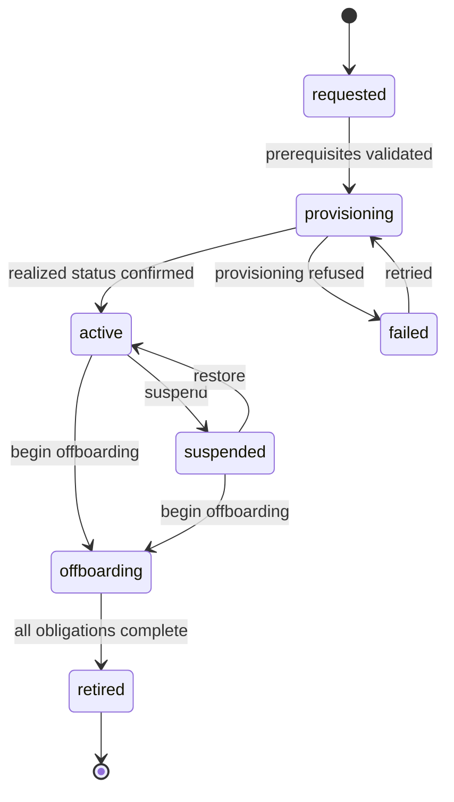

---
doc_meta:
  id: TDD-organization-control-003
  title: Organization, Tenant, and Workspace Lifecycle
  owner: Core Platform Team
  version: 1.1.0
  status: approved
  classification: restricted
  review_cycle_days: 90
  created_date: 2026-08-11
  last_reviewed: 2026-08-14
  parent_sad: SAD-004
---

# Organization, Tenant, and Workspace Lifecycle

## Purpose

Specify the three authoritative aggregates this service owns before Membership can
reference them: the Organization registry, the Tenant state machine, and the Workspace
lifecycle bound to one Tenant.

`TDD-organization-control-002` already writes a composite foreign key into
`workspace.workspace (tenant_id, workspace_id)` and increments
`tenant_security_version` on Tenant-wide changes. Neither table nor either constraint
is designed anywhere. This design supplies them, and it is written before the first
migration rather than during it.

## Scope

**In scope**

- Organization registry: identity, classification, status, relationships, external
  references.
- Tenant state machine, including the provisioning gate before activation.
- Workspace lifecycle within exactly one Tenant, and the constraint Membership depends
  on.
- Which transitions increment `tenant_security_version` and why.
- Provisioning coordination and the handling of an ambiguous provisioning outcome.

**Out of scope**

- Membership, versions, and revocation — owned by `TDD-organization-control-002`.
- Row-Level Security and the two runtime roles — owned by
  `TDD-organization-control-001`.
- Invitation and offboarding obligations — owned by `TDD-organization-control-004`.
- Physical provisioning of infrastructure, which is external to this system.

## Technical Context

Four concepts, three owned here, and the distinctions matter because collapsing any two
of them is the failure ADR-ORG-001 §5.2 was written to prevent:

| Concept | Is | Is not |
| :-- | :-- | :-- |
| Organization | A party in the ecosystem: provider, customer, partner, publisher | A Tenant, a Subscriber Account, or a BPO Client Account |
| Tenant | A technical isolation and operating boundary | The legal customer, the commercial subscriber, a Product, or a deployment |
| Workspace | A collaboration or operating context inside one Tenant | An HCM department, a BPO workstream, a Product, or an Application |
| Membership | A Principal-to-context relationship | Entitlement, permission, or employment |

An Organization may sponsor several Tenants. A Tenant belongs to exactly one sponsoring
Organization. A Workspace belongs to exactly one Tenant and never moves.

## Component Design

| Component | Package | Responsibility |
| :-- | :-- | :-- |
| `OrganizationService` | `internal/organization` | Registry, classification, relationships, external references |
| `TenantService` | `internal/tenant` | Tenant state machine, security version, desired provisioning profile |
| `WorkspaceService` | `internal/workspace` | Workspace lifecycle inside one Tenant |
| `ProvisioningCoordinator` | `internal/tenant` | Desired-state publication and realized-status correlation |

### Tenant State Machine



A Tenant is not `active` until provisioning confirms, per SAD-004 §5.1. Activating on
request would mean Memberships could be granted into a Tenant whose isolation boundary
does not exist yet.

`retired` is terminal. There is no transition out of it, because the identifiers of a
retired Tenant have been released to consumers as retired and reviving one would make
a downstream projection wrong in a way no reconciliation would detect.

### Organization Lifecycle

Deliberately simpler, and deliberately not coupled to Tenant:

```text
active ──► suspended ──► active
   │
   └─────► retired
```

**Retiring an Organization does not retire its Tenants.** A cascade here would take an
irreversible action on isolation boundaries as a side effect of a registry change. An
Organization with Tenants that are not retired cannot itself be retired; the refusal
names the Tenants, and the operator retires them deliberately.

### Workspace Lifecycle

```text
active ──► archived ──► retired
```

A Workspace never moves between Tenants. Its Tenant is fixed at creation and is part of
the key that Membership references, so a move would silently reassign every Membership
scoped to it.

## Data Model

### Organization

```sql
CREATE TABLE organization.organization (
    organization_id     UUID        PRIMARY KEY,
    display_name        TEXT        NOT NULL,
    classification      TEXT        NOT NULL,
    status              TEXT        NOT NULL,
    parent_id           UUID        REFERENCES organization.organization(organization_id),
    version             BIGINT      NOT NULL DEFAULT 1,
    created_at          TIMESTAMPTZ NOT NULL DEFAULT now(),
    updated_at          TIMESTAMPTZ NOT NULL DEFAULT now(),
    CONSTRAINT organization_classification_check
        CHECK (classification IN ('provider', 'customer', 'partner', 'publisher')),
    CONSTRAINT organization_status_check
        CHECK (status IN ('active', 'suspended', 'retired'))
);

CREATE TABLE organization.external_reference (
    organization_id UUID  NOT NULL REFERENCES organization.organization(organization_id),
    authority       TEXT  NOT NULL,
    external_id     TEXT  NOT NULL,
    PRIMARY KEY (organization_id, authority)
);
```

`external_reference` holds identifiers owned elsewhere — a Subscriber Account, a BPO
Client Account, a CRM record. It stores the authority name and the opaque identifier
and nothing else. Copying attributes from those systems would make this registry a
stale mirror of records it does not own, which EAD-003 §6.2 prohibits.

`parent_id` supports internal hierarchy only. It carries no Tenant implication: a child
Organization does not inherit its parent's Tenants.

### Tenant

```sql
CREATE TABLE tenant.tenant (
    tenant_id               UUID        PRIMARY KEY,
    organization_id         UUID        NOT NULL REFERENCES organization.organization(organization_id),
    display_name            TEXT        NOT NULL,
    status                  TEXT        NOT NULL,
    isolation_profile       TEXT        NOT NULL,
    residency_region        TEXT,
    tenant_security_version BIGINT      NOT NULL DEFAULT 1,
    version                 BIGINT      NOT NULL DEFAULT 1,
    activated_at            TIMESTAMPTZ,
    suspended_at            TIMESTAMPTZ,
    offboarding_started_at  TIMESTAMPTZ,
    retired_at              TIMESTAMPTZ,
    created_at              TIMESTAMPTZ NOT NULL DEFAULT now(),
    updated_at              TIMESTAMPTZ NOT NULL DEFAULT now(),
    CONSTRAINT tenant_status_check
        CHECK (status IN ('requested','provisioning','active','failed','suspended','offboarding','retired')),
    CONSTRAINT tenant_isolation_check
        CHECK (isolation_profile IN ('pooled', 'bridge', 'silo', 'regional'))
);
```

`isolation_profile` records which of the EAD-005 §5.3 multi-tenant deployment profiles
applies. It is a reference for provisioning and a fact for audit; this service does not
implement isolation, it records which profile was chosen.

`organization_id` is a plain foreign key rather than a composite, because a Tenant
belongs to one Organization and that binding is fixed at creation.

### Workspace

```sql
CREATE TABLE workspace.workspace (
    workspace_id   UUID        PRIMARY KEY,
    tenant_id      UUID        NOT NULL REFERENCES tenant.tenant(tenant_id),
    display_name   TEXT        NOT NULL,
    workspace_type TEXT        NOT NULL,
    status         TEXT        NOT NULL,
    version        BIGINT      NOT NULL DEFAULT 1,
    created_at     TIMESTAMPTZ NOT NULL DEFAULT now(),
    updated_at     TIMESTAMPTZ NOT NULL DEFAULT now(),
    CONSTRAINT workspace_status_check
        CHECK (status IN ('active', 'archived', 'retired'))
);

-- Required as the target of the composite foreign key in
-- TDD-organization-control-002. Without it that constraint cannot be created and
-- the same-Tenant invariant on Membership is unenforced.
ALTER TABLE workspace.workspace
    ADD CONSTRAINT workspace_tenant_scope_unique UNIQUE (tenant_id, workspace_id);
```

The `UNIQUE (tenant_id, workspace_id)` looks redundant beside a primary key on
`workspace_id` alone, and it is not. PostgreSQL requires a composite foreign key to
reference a uniquely constrained column set, so this constraint is what allows
`membership.membership` to enforce that a referenced Workspace belongs to the
Membership's Tenant. Dropping it as apparent redundancy silently removes that
invariant, which is why the migration test asserts its presence.

### Provisioning Correlation

```sql
CREATE TABLE tenant.provisioning_request (
    request_id      UUID        PRIMARY KEY,
    tenant_id       UUID        NOT NULL REFERENCES tenant.tenant(tenant_id),
    desired_profile JSONB       NOT NULL,
    state           TEXT        NOT NULL,
    correlation_id  UUID        NOT NULL,
    requested_at    TIMESTAMPTZ NOT NULL DEFAULT now(),
    resolved_at     TIMESTAMPTZ,
    detail          TEXT,
    CONSTRAINT provisioning_state_check
        CHECK (state IN ('requested', 'realized', 'failed', 'unresolved'))
);
```

`unresolved` is a first-class state, not an error code. SAD-004 §7.5 requires an
ambiguous provisioning outcome to remain pending or failed and never to be inferred as
success. A timeout after the request left is `unresolved`, and reconciliation resolves
it later. Treating a timeout as failure and retrying would provision twice.

## API / Interface

```text
POST   /v1/organizations
GET    /v1/organizations/{organization_id}
POST   /v1/organizations/{organization_id}:suspend
POST   /v1/organizations/{organization_id}:restore
POST   /v1/organizations/{organization_id}:retire

POST   /v1/tenants
GET    /v1/tenants/{tenant_id}
POST   /v1/tenants/{tenant_id}:activate
POST   /v1/tenants/{tenant_id}:suspend
POST   /v1/tenants/{tenant_id}:restore

POST   /v1/tenants/{tenant_id}/workspaces
GET    /v1/tenants/{tenant_id}/workspaces/{workspace_id}
POST   /v1/tenants/{tenant_id}/workspaces/{workspace_id}:archive
POST   /v1/tenants/{tenant_id}/workspaces/{workspace_id}:retire
```

Every mutation requires an `Idempotency-Key`, the optimistic `version` of the record the
caller was shown, an authenticated actor, and a reason where the operation is
provider-scoped. A version mismatch returns `409` rather than retrying, because the
caller acted on a view that has since changed.

Errors are RFC 7807 problem documents from `foundation-platform`.

### Published Events

```text
com.scnehaux.organization.organization.registry.created
com.scnehaux.organization.organization.registry.suspended
com.scnehaux.organization.organization.registry.retired
com.scnehaux.organization.tenant.lifecycle.requested
com.scnehaux.organization.tenant.lifecycle.activated
com.scnehaux.organization.tenant.lifecycle.retired
com.scnehaux.organization.tenant.security.suspended     (priority)
com.scnehaux.organization.tenant.security.restored      (priority)
com.scnehaux.organization.workspace.lifecycle.created
com.scnehaux.organization.workspace.lifecycle.archived
com.scnehaux.organization.workspace.lifecycle.retired
```

Suspension and restoration are priority events because both invalidate cached context:
suspension removes it, restoration makes a cached denial wrong.

`tenant.security.suspended` is the security consequence event, not a one-to-one mirror
of the lifecycle state name. It is emitted both for `active -> suspended` and when an
`active` or already-suspended Tenant enters `offboarding`; in both cases every existing
Tenant context must stop. The event carries the incremented `tenant_security_version`.

## Algorithms / Logic

### Security Version Increments

`tenant_security_version` is the cheap staleness test consumers use without a remote
call, so it increments on every transition that invalidates cached context — in either
direction:

| Transition | Increments | Why |
| :-- | :-- | :-- |
| `active → suspended` | Yes | Every cached context in the Tenant is now invalid |
| `suspended → active` | Yes | Every cached denial is now wrong |
| `active → offboarding` | Yes | Context is frozen |
| `suspended → offboarding` | Yes | A new terminal process boundary must invalidate every cached version |
| `* → retired` | Yes | Every context is permanently invalid |
| `requested → provisioning → active` | No | No context existed to invalidate |
| Display name change | No | Carries no security consequence |

Incrementing on restore is the one that is easy to omit and expensive to omit. A
consumer that cached "suspended" and never sees a version change keeps denying a Tenant
that has been restored, and the symptom presents as a support ticket rather than as a
projection failure.

### Tenant Activation

```text
BEGIN
    load tenant FOR UPDATE
    reject if status is not 'provisioning'
    reject if the provisioning request is not 'realized'
    reject if the sponsoring Organization is not 'active'
    set status = 'active', activated_at = now()
    increment version
    outbox.Append(tenant.lifecycle.activated)
COMMIT
```

The Organization check is at activation rather than at creation. A Tenant may be
requested while its Organization is still being onboarded; it may not become active
under a suspended or retired sponsor.

### Organization Retirement Refusal

```text
retire(organization):
    count tenants where organization_id = this and status != 'retired'
    if count > 0:
        refuse with 409, naming the tenants
    set status = 'retired'
```

The refusal names the Tenants rather than reporting a count. An operator who has to
find them will retire the wrong one.

### Provisioning Correlation

```text
on tenant creation:
    persist tenant as 'requested'
    persist provisioning_request as 'requested' with a correlation identifier
    publish desired state

on realized status:
    match by correlation identifier
    set provisioning_request to 'realized'
    advance tenant to 'provisioning' complete, awaiting explicit activation

on timeout with no status:
    set provisioning_request to 'unresolved'
    do not retry automatically
    reconciliation queries the provisioning system and resolves it
```

An unresolved request is never retried automatically. Retrying an operation whose
outcome is unknown is how a Tenant gets provisioned twice, and EAD-004 §6.6 requires
critical mutations to define duplicate protection at the business boundary rather than
at the transport.

## Configuration

| Variable | Default | Purpose |
| :-- | :-- | :-- |
| `ORGANIZATION_PROVISIONING_TIMEOUT` | `30m` | Age at which a provisioning request becomes `unresolved` |
| `ORGANIZATION_PROVISIONING_RECONCILE_INTERVAL` | `15m` | Cadence for resolving unresolved requests |
| `ORGANIZATION_TENANT_NAME_MAX` | `120` | Display name bound |

## Testing Strategy

### State Machines

- Every transition outside each diagram is refused.
- A Tenant cannot become `active` from `requested` without passing `provisioning`.
- A Tenant cannot become `active` under a suspended or retired Organization.
- `retired` is terminal for Tenant, Organization, and Workspace.

### Constraints

- `workspace.workspace` carries `UNIQUE (tenant_id, workspace_id)`; dropping it fails
  the migration test.
- A Membership referencing a Workspace of another Tenant is rejected by the composite
  foreign key from `TDD-organization-control-002`.
- A Workspace cannot be reassigned to another Tenant.
- An Organization with a non-retired Tenant cannot be retired, and the refusal names
  the Tenants.

### Security Version

- Suspension increments `tenant_security_version`.
- **Restoration increments it.**
- Offboarding and retirement increment it.
- Entering offboarding emits `tenant.security.suspended` with the incremented version,
  including when the prior lifecycle state was already `suspended`.
- Provisioning transitions and display-name changes do not.
- The version never decreases.

### Provisioning

- A timeout with no status produces `unresolved`, not `failed`.
- An unresolved request is not retried automatically.
- A realized status arriving after the timeout resolves the request by correlation.
- A duplicate realized status produces one effect.

### Concurrency

- A stale `version` on any mutation returns `409`.
- Two concurrent activations of the same Tenant produce one activation.

## Security Notes

This design creates the isolation boundaries the rest of the platform enforces. A
Tenant that becomes active before its boundary exists would accept Memberships into
nothing, so the provisioning gate is a security control and not a workflow nicety.

Cascading retirement is deliberately absent. An irreversible action taken as a side
effect of a registry change is the shape of an accidental mass outage, and the refusal
that replaces it costs an operator one extra deliberate step.

`external_reference` stores an authority name and an opaque identifier. Copying
attributes from Subscriber Account, Client Account, or CRM records would place data
this domain does not own inside its authority, which EAD-003 §6.1 prohibits.

## Performance Notes

All three aggregates are low-volume and low-churn relative to Membership. Reads are
served from indexes on the natural access paths: Tenants by Organization, Workspaces by
Tenant.

The provisioning reconciler queries only unresolved requests, so its cost is
proportional to the ambiguity in flight rather than to Tenant count.

## Operational Notes

| Signal | Warning | Critical |
| :-- | :-- | :-- |
| Provisioning requests in `unresolved` | any occurrence | older than two reconcile intervals |
| Tenants stuck in `provisioning` | 1 hour | 4 hours |
| Organization retirement refused | any occurrence | — |
| `tenant_security_version` unchanged across a suspend or restore | — | any occurrence |

The last signal is a correctness assertion expressed as an alert. A suspension that
does not move the version leaves every consumer holding a projection it has no way to
know is stale.

Runbooks required before production: stuck provisioning, unresolved provisioning
resolution, and Tenant activation refused.

## Traceability

| Relationship | Target |
| :-- | :-- |
| Parent system | SAD-004 — Scnehaux Organization Control |
| Realizes capability | PAD-PLT-002 — Organization & Tenancy Platform |
| Governed by | ADR-ORG-001 §5.2 — Organization, Subscriber Account, Client Account, Tenant, and Workspace remain distinct |
| Conforms to | EAD-005 §5.3 — pooled, bridge, silo, and regional isolation profiles |
| Enterprise constraint | EAD-003 — one authority per fact; an external reference does not copy the record |
| Enterprise constraint | EAD-004 §6.6 — critical mutations define duplicate protection at the business boundary |
| Depends on | `TDD-foundation-platform-001` — outbox, envelope, idempotency |
| Consumed by | `TDD-organization-control-002` — Membership references `tenant.tenant` and `workspace.workspace` |
| Consumed by | `TDD-organization-control-004` — offboarding drives the Tenant terminal transitions |
