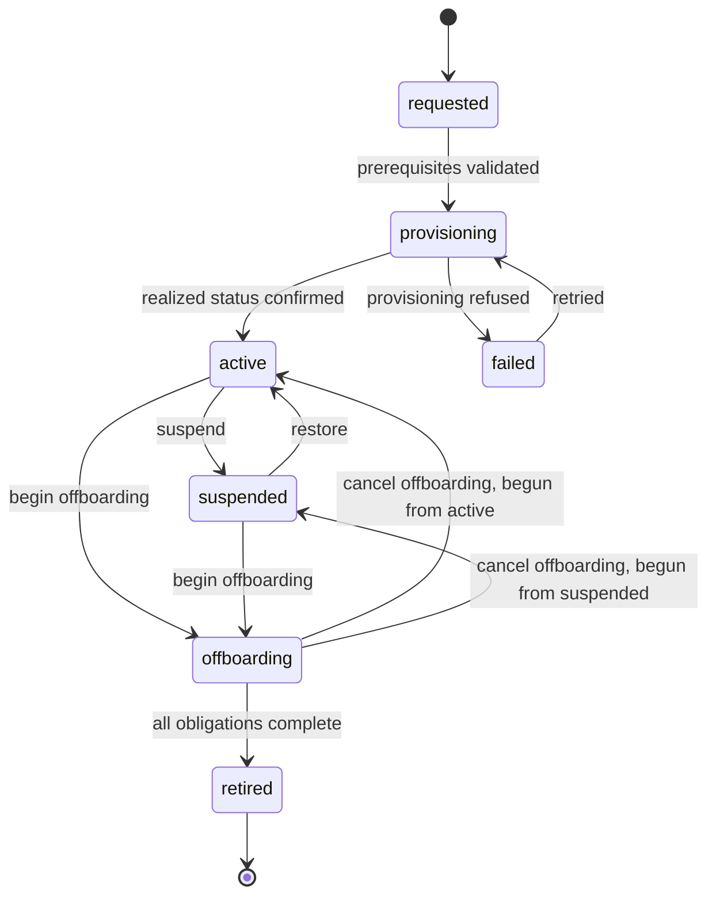

---
doc_meta:
  id: TDD-organization-control-003
  title: Organization, Tenant, and Workspace Lifecycle
  owner: Core Platform Team
  version: 1.13.0
  status: approved
  classification: restricted
  review_cycle_days: 90
  created_date: 2026-08-11
  last_reviewed: 2026-10-09
  parent_sad: SAD-004
---

# Organization, Tenant, and Workspace Lifecycle

## Purpose

Specify the three authoritative aggregates this service owns before Membership can
reference them: the Organization registry, the Tenant state machine, and the Workspace
lifecycle bound to one Tenant.

`TDD-organization-control-002` writes a composite foreign key into
`workspace.workspace (tenant_id, workspace_id)` and carries `tenant_security_version` in
every Membership event. Neither the tables nor the two objects those depend on were
designed anywhere. This design supplies them, and it is written before the first migration
rather than during it.

**This design is the sole declaring authority for `tenant.tenant` and
`workspace.workspace`,** including `tenant_security_version` and the
`UNIQUE (tenant_id, workspace_id)` constraint. Version 0.3.0 of
`TDD-organization-control-002` declared both as well; applied as SQL in the order the two
designs state, the second declaration fails and the migration stops. That design now
records the dependency instead of restating the declaration, and this section is where a
reader settles which document to change.

This design is also the authoritative list of which transitions increment
`tenant_security_version` — see §"Security Version Increments". No Membership operation
appears on it.

## Scope

**In scope**

- Organization registry: identity, classification, status, relationships, external
  references.
- Tenant state machine, including the provisioning gate before activation.
- Workspace lifecycle within exactly one Tenant, and the constraint Membership depends
  on.
- Which transitions increment `tenant_security_version` and why.
- Provisioning coordination and the handling of an ambiguous provisioning outcome.

**Out of scope**

- Membership, versions, and revocation — owned by `TDD-organization-control-002`.
- Row-Level Security and the two runtime roles — owned by
  `TDD-organization-control-001`.
- Invitation and offboarding obligations — owned by `TDD-organization-control-004`.
- Physical provisioning of infrastructure, which is external to this system.

## Technical Context

Four concepts, three owned here, and the distinctions matter because collapsing any two
of them is the failure ADR-ORG-001 §5.2 was written to prevent:

| Concept | Is | Is not |
| :-- | :-- | :-- |
| Organization | A party in the ecosystem: provider, customer, partner, publisher | A Tenant, a Subscriber Account, or a BPO Client Account |
| Tenant | A technical isolation and operating boundary | The legal customer, the commercial subscriber, a Product, or a deployment |
| Workspace | A collaboration or operating context inside one Tenant | An HCM department, a BPO workstream, a Product, or an Application |
| Membership | A Principal-to-context relationship | Entitlement, permission, or employment |

An Organization may sponsor several Tenants. A Tenant belongs to exactly one sponsoring
Organization. A Workspace belongs to exactly one Tenant and never moves.

## Component Design

| Component | Package | Responsibility |
| :-- | :-- | :-- |
| `OrganizationService` | `internal/organization` | Registry, classification, relationships, external references |
| `TenantService` | `internal/tenant` | Tenant state machine, security version, desired provisioning profile |
| `WorkspaceService` | `internal/workspace` | Workspace lifecycle inside one Tenant |
| `ProvisioningCoordinator` | `internal/tenant` | Desired-state publication and realized-status correlation |

### Tenant State Machine


```mermaid
stateDiagram-v2
    [*] --> requested
    requested --> provisioning: prerequisites validated
    provisioning --> active: realized status confirmed
    provisioning --> failed: provisioning refused
    failed --> provisioning: retried
    active --> suspended: suspend
    suspended --> active: restore
    active --> offboarding: begin offboarding
    suspended --> offboarding: begin offboarding
    offboarding --> active: cancel offboarding, begun from active
    offboarding --> suspended: cancel offboarding, begun from suspended
    offboarding --> retired: all obligations complete
    retired --> [*]
```

A Tenant is not `active` until provisioning confirms, per SAD-004 §5.1. Activating on
request would mean Memberships could be granted into a Tenant whose isolation boundary
does not exist yet.

`retired` is terminal. There is no transition out of it, because the identifiers of a
retired Tenant have been released to consumers as retired and reviving one would make
a downstream projection wrong in a way no reconciliation would detect.

**A refusal before the dispatch was recorded (1.13.0).** The machine has no `requested -> failed`
edge, and a provisioning system can refuse a Tenant whose dispatch this service never recorded. The
refusal walks the declared path, `provision` then `fail`, in one transaction. That is safe because
both transitions are silent and neither increments the security version (§Published Events). The
edge is not added: the machine is asserted as one table, and an edge added for one caller would be
inherited by every other.

#### Who issues which transition

The machine above is declared once and here. The commands that drive it are split, and the
split is not arbitrary:

| Transition | Command owned by |
| :-- | :-- |
| `requested -> provisioning`, `provisioning -> failed`, `failed -> provisioning` | `ProvisioningCoordinator`, from correlated realized status |
| `provisioning -> active` | `TenantService.Activate` |
| `active -> suspended`, `suspended -> active` | `TenantService.Suspend` / `.Restore` |
| `active -> offboarding`, `suspended -> offboarding` | `OffboardingService`, `TDD-organization-control-004` |
| `offboarding -> retired` | `OffboardingService`, `TDD-organization-control-004` |
| `offboarding -> active`, `offboarding -> suspended` | `OffboardingService.Cancel`, `TDD-organization-control-004` (1.9.0) |

The last two are transitions here and commands there because each is a stage of a process
that does more than move this row: entering offboarding also creates an
`operation.offboarding` record, raises obligations across domains, and suspends every
Membership in the Tenant, and retirement is refused while any obligation is open or a legal
hold is set. A command in `TenantService` that moved only the Tenant row would look
complete and leave access running, which is why `TenantService` exposes neither and
`internal/tenant` is given no dependency on `internal/membership`.

**Cancelling an offboarding returns the Tenant to where it was** (1.9.0, `ADR-ORG-006 §5.2`).
Two transitions, one per prior status, because the machine maps an action to one destination:

| Action | Transition | Event | Security version | Clears |
| :-- | :-- | :-- | :-- | :-- |
| `cancel-offboarding-to-active` | `offboarding -> active` | `tenant.security.restored` (priority) | increments | `offboarding_started_at` |
| `cancel-offboarding-to-suspended` | `offboarding -> suspended` | `tenant.security.suspended` (priority) | increments | `offboarding_started_at` |

The offboarding chooses the action from the status it recorded when it began; nothing else issues
either. A suspension in force before the offboarding stays in force, and its `suspended_at` is
kept. Both reuse the event types a consumer already applies, with `tenant_status` in the payload
saying which state the Tenant is in, the same way `tenant.security.suspended` already serves both a
suspension and an offboarding (§Published Events). A new type would need every consumer to
subscribe to it before a cancellation could reach it; these need no consumer change.

Both increment `tenant_security_version`. Consumers apply a Tenant event only when its version is
higher than the one they hold, so an event that did not increment would be discarded and the
consumer would keep `offboarding`. A Membership restored by the same cancellation is restored after
the Tenant transition commits, so it carries the incremented version and is not superseded by it
(`TDD-organization-control-004` §Cancellation).

Keeping the transitions themselves in one table is what makes that split safe: the
refusal rules, the security-version consequences, and the timestamps do not fork between
two services.

### Organization Lifecycle

Deliberately simpler, and deliberately not coupled to Tenant:

```text
active ──► suspended ──► active
   │
   └─────► retired
```

**Retiring an Organization does not retire its Tenants.** A cascade here would take an
irreversible action on isolation boundaries as a side effect of a registry change. An
Organization with Tenants that are not retired cannot itself be retired; the refusal
names the Tenants, and the operator retires them deliberately.

### Workspace Lifecycle

```text
active ──► archived ──► retired
```

A Workspace never moves between Tenants. Its Tenant is fixed at creation and is part of
the key that Membership references, so a move would silently reassign every Membership
scoped to it.

## Data Model

### Organization

```sql
CREATE TABLE organization.organization (
    organization_id     UUID        PRIMARY KEY,
    display_name        TEXT        NOT NULL,
    classification      TEXT        NOT NULL,
    status              TEXT        NOT NULL,
    parent_id           UUID        REFERENCES organization.organization(organization_id),
    version             BIGINT      NOT NULL DEFAULT 1,
    created_at          TIMESTAMPTZ NOT NULL DEFAULT now(),
    updated_at          TIMESTAMPTZ NOT NULL DEFAULT now(),
    CONSTRAINT organization_classification_check
        CHECK (classification IN ('provider', 'customer', 'partner', 'publisher')),
    CONSTRAINT organization_status_check
        CHECK (status IN ('active', 'suspended', 'retired'))
);

CREATE TABLE organization.external_reference (
    organization_id UUID  NOT NULL REFERENCES organization.organization(organization_id),
    authority       TEXT  NOT NULL,
    external_id     TEXT  NOT NULL,
    PRIMARY KEY (organization_id, authority)
);
```

`external_reference` holds identifiers owned elsewhere — a Subscriber Account, a BPO
Client Account, a CRM record. It stores the authority name and the opaque identifier
and nothing else. Copying attributes from those systems would make this registry a
stale mirror of records it does not own, which EAD-003 §6.2 prohibits.

`parent_id` supports internal hierarchy only. It carries no Tenant implication: a child
Organization does not inherit its parent's Tenants.

### Tenant

```sql
CREATE TABLE tenant.tenant (
    tenant_id               UUID        PRIMARY KEY,
    organization_id         UUID        NOT NULL REFERENCES organization.organization(organization_id),
    display_name            TEXT        NOT NULL,
    status                  TEXT        NOT NULL,
    isolation_profile       TEXT        NOT NULL,
    residency_region        TEXT,
    tenant_security_version BIGINT      NOT NULL DEFAULT 1,
    version                 BIGINT      NOT NULL DEFAULT 1,
    activated_at            TIMESTAMPTZ,
    suspended_at            TIMESTAMPTZ,
    offboarding_started_at  TIMESTAMPTZ,
    retired_at              TIMESTAMPTZ,
    created_at              TIMESTAMPTZ NOT NULL DEFAULT now(),
    updated_at              TIMESTAMPTZ NOT NULL DEFAULT now(),
    CONSTRAINT tenant_status_check
        CHECK (status IN ('requested','provisioning','active','failed','suspended','offboarding','retired')),
    CONSTRAINT tenant_isolation_check
        CHECK (isolation_profile IN ('pooled', 'bridge', 'silo', 'regional'))
);
```

`isolation_profile` records which of the EAD-005 §5.3 multi-tenant deployment profiles
applies. It is a reference for provisioning and a fact for audit; this service does not
implement isolation, it records which profile was chosen.

`organization_id` is a plain foreign key rather than a composite, because a Tenant
belongs to one Organization and that binding is fixed at creation.

The four timestamp columns record the *current* position, not a history. Each transition
stamps its own — `activated_at`, `suspended_at`, `offboarding_started_at`, `retired_at` —
and **restore sets `suspended_at` back to NULL**. Left populated it would make a restored
Tenant indistinguishable from a suspended one to every report and alert that filters on
the column, and that is the reading someone will take, because a non-null timestamp named
`suspended_at` says the Tenant is suspended. The history of past suspensions belongs to the
event stream, which is the record that is supposed to be append-only; a mutable column is
the wrong place to accumulate one.

Each stamp carries the accepted instant of the transition rather than `now()` evaluated
independently, so the lifecycle fact in the row and the `time` in the published envelope
are the same instant. `updated_at` keeps `now()`: it is database housekeeping and answers a
different question.

`version` increments on every transition, including the ones that publish nothing.
`tenant_security_version` increments only where the table in
§"Security Version Increments" says so. The two are separate because they answer separate
questions — `version` orders two events about this row and backs the optimistic check,
`tenant_security_version` decides whether a token a consumer is holding is stale. Carrying
only the second would leave a restore-then-suspend pair with the same value on one of the
two events and no ordering between them.

### Tenant Event History

`tenant.tenant_event` records, for every event `tenant.Service` publishes, the Tenant and the
`tenant_security_version` the event carries. It is written in the transaction that appends the
event to the outbox, so the row exists if and only if the event does. Every published
transition after activation increments the security version, and activation is the first, so
`UNIQUE (tenant_id, tenant_security_version)` holds and the version identifies the event within
its Tenant. The consumer orders Tenant state by that version, which lets the dead-letter
resolver prove that a newer applied Tenant event made a dead-lettered one moot.
`TDD-organization-control-005` §"The resolution predicate" owns that use and the table's privileges.
`tenant.lifecycle.requested` is published by intake, carries no authority, and has no row.

### Workspace

```sql
CREATE TABLE workspace.workspace (
    workspace_id   UUID        PRIMARY KEY,
    tenant_id      UUID        NOT NULL REFERENCES tenant.tenant(tenant_id),
    display_name   TEXT        NOT NULL,
    workspace_type TEXT        NOT NULL,
    status         TEXT        NOT NULL,
    version        BIGINT      NOT NULL DEFAULT 1,
    created_at     TIMESTAMPTZ NOT NULL DEFAULT now(),
    updated_at     TIMESTAMPTZ NOT NULL DEFAULT now(),
    CONSTRAINT workspace_status_check
        CHECK (status IN ('active', 'archived', 'retired'))
);

-- Required as the target of the composite foreign key in
-- TDD-organization-control-002. Without it that constraint cannot be created and
-- the same-Tenant invariant on Membership is unenforced.
ALTER TABLE workspace.workspace
    ADD CONSTRAINT workspace_tenant_scope_unique UNIQUE (tenant_id, workspace_id);
```

The `UNIQUE (tenant_id, workspace_id)` looks redundant beside a primary key on
`workspace_id` alone, and it is not. PostgreSQL requires a composite foreign key to
reference a uniquely constrained column set, so this constraint is what allows
`membership.membership` to enforce that a referenced Workspace belongs to the
Membership's Tenant. Dropping it as apparent redundancy silently removes that
invariant, which is why the migration test asserts its presence.

### Provisioning Correlation

```sql
CREATE TABLE tenant.provisioning_request (
    request_id      UUID        PRIMARY KEY,
    tenant_id       UUID        NOT NULL REFERENCES tenant.tenant(tenant_id),
    desired_profile JSONB       NOT NULL,
    state           TEXT        NOT NULL,
    correlation_id  UUID        NOT NULL,
    requested_at    TIMESTAMPTZ NOT NULL DEFAULT now(),
    resolved_at     TIMESTAMPTZ,
    detail          TEXT,
    CONSTRAINT provisioning_state_check
        CHECK (state IN ('requested', 'realized', 'failed', 'unresolved'))
);
```

`unresolved` is a first-class state, not an error code. SAD-004 §7.5 requires an
ambiguous provisioning outcome to remain pending or failed and never to be inferred as
success. A timeout after the request left is `unresolved`, and reconciliation resolves
it later. Treating a timeout as failure and retrying would provision twice.

## API / Interface

The routes as served (`internal/httpapi/routes.go`):

```text
Provider-scoped: provider authority and X-Administrative-Reason
GET    /v1/organizations                          ?after=&limit=&status=&classification=
POST   /v1/organizations
GET    /v1/organizations/{organization_id}
POST   /v1/organizations/{organization_id}/suspend
POST   /v1/organizations/{organization_id}/restore
POST   /v1/organizations/{organization_id}/retire

GET    /v1/tenants                                ?after=&limit=&status=&organization_id=
POST   /v1/tenants
GET    /v1/tenants/{tenant_id}
POST   /v1/tenants/{tenant_id}/activate
POST   /v1/tenants/{tenant_id}/suspend
POST   /v1/tenants/{tenant_id}/restore

POST   /v1/tenants/{tenant_id}/provisioning              dispatch, or retry after failed (1.13.0)
POST   /v1/provisioning/realized         {"correlation_id", "detail"?}       the provisioning system's reports (1.13.0)
POST   /v1/provisioning/failed           {"correlation_id", "detail"}
POST   /v1/provisioning/sweep-unresolved {"size"}                             ages unanswered requests (1.13.0)

Tenant-scoped: the Tenant is the caller's, from the token, and never in the path
GET    /v1/workspaces                             ?after=&limit=&status=
POST   /v1/workspaces
GET    /v1/workspaces/{workspace_id}
POST   /v1/workspaces/{workspace_id}/archive
POST   /v1/workspaces/{workspace_id}/restore
POST   /v1/workspaces/{workspace_id}/retire
```

Until 1.6.0 this list wrote the transitions as `:suspend`, `:activate`, `:restore`, `:retire` and `:archive`, and nested
Workspaces under `/v1/tenants/{tenant_id}/`. Neither was ever served. A transition is a path
segment (`/suspend`), because every route on this surface is registered as a Go 1.22
`net/http` pattern, where a wildcard fills a whole segment and `{id}:suspend` is not a
pattern. A Workspace route names no Tenant, because a tenant-scoped route takes its Tenant
from the token (`TDD-organization-control-001` §Scope Resolution): a Tenant in the path
would be a requested scope for a handler to compare, and here there is none to mistake for
the bound one. A client follows this list, not the earlier one.

**The provisioning routes (1.13.0).** The routes above this design's 1.12.0 list stopped at
activation, while it requires realized-status correlation and gives this service no inbound
transport but HTTP. The four provisioning routes mirror `POST /v1/offboardings/{id}/deprovisioning`,
which reports the other direction's outcome. All four are provider routes. The two reports are made
by the provisioning system, and they are authenticated all the same: a callback exempted for an
external system's convenience would let anyone holding a correlation identifier declare a Tenant's
boundary built, and activation reads exactly that statement. The correlation identifier is in the
body, not the path, because it is the handle the desired-state publication carried outward and not
this service's identifier for a resource. A report answers `200` on a first delivery and on a
replay, and says which in `replay`.

### Lists

The three lists follow STD-GLB-001 1.3.0 §Pagination, in the form identity-control serves
for `GET /v1/registrations` (`TDD-identity-control-003` §API / Interface):

| Part | Form |
| :-- | :-- |
| Cursor | `after`: the identifier of the last item of the previous page. Absent, the list starts at its first item. Not a UUID: `400` |
| Page size | `limit`: 50 when absent; a whole number from 1 to 100. Anything else, `0` included: `400`, never coerced |
| Order | The primary key (`organization_id`, `tenant_id`, `workspace_id`), a UUIDv7, so creation order. The query is the keyset `id > $after ORDER BY id LIMIT limit + 1`; the extra row only says whether a page follows |
| Filters | Each a closed set or an identifier, each optional, each holding for every page. A value outside the set, or an identifier that is not a UUID: `400` |
| Response | `{"organizations": [...], "next": "<organization_id>" \| null}`, and `tenants` and `workspaces` likewise. `next` is the `after` of the following page, and null on the last |

Each item has the shape the single read returns: `GET /v1/organizations/{organization_id}`,
`GET /v1/tenants/{tenant_id}` and `GET /v1/workspaces/{workspace_id}` — with one exception, below.

From 1.7.0 the single Tenant read carries two fields the list items do not:

| Field | Value |
| :-- | :-- |
| `offboarding_id` | The Tenant's offboarding (`TDD-organization-control-004`), the most recently begun if there were ever more than one; `null` when none was begun |
| `active_memberships` | The count of the Tenant's Memberships whose status is `active` |

Both are computed by this service in the transaction that reads the Tenant, so they describe the
same instant as the record. `active_memberships` is the number an operator confirms before
beginning an offboarding — the Memberships the freeze will suspend — and
`TDD-organization-experience-001` §Irreversible Operations requires that count to come from the
API rather than from the client: a client counting a paged Membership list would count what it had
fetched, and it cannot fetch another Tenant's at all. `offboarding_id` is how a client gets from a
Tenant in `offboarding` or `retired` to the process that put it there, without listing every
offboarding. The list leaves both out because each is a further read per row, and the list is the
screen that does not need them.

From 1.8.0 the single Tenant read also carries `provisioning`: the Tenant's latest provisioning
request (§Provisioning Correlation), or `null` when none was ever recorded.

```json
"provisioning": {
  "request_id": "<uuid>",
  "correlation_id": "<uuid>",
  "state": "requested" | "realized" | "failed" | "unresolved",
  "detail": "<text>" | null,
  "requested_at": "<timestamp>",
  "resolved_at": "<timestamp>" | null
}
```

| Field | Value |
| :-- | :-- |
| `state` | The request's state, not the Tenant's. `unresolved` exists only here: the Tenant whose request timed out stays in `requested` or `provisioning` |
| `detail` | The reason a failure was reported with, the sweep's note on an `unresolved` request, or whatever a realized status carried; `null` when nothing was |
| `resolved_at` | When the outcome was recorded, or when the sweep declared it unknown; `null` while `requested` |

Each field is a column of `tenant.provisioning_request`, read as stored. "Latest" is the request
activation reads (§Tenant Activation): the provisioning direction only
(`coalesce(desired_profile->>'operation', 'provision') = 'provision'`), newest `requested_at`, then
`request_id`. A deprovisioning command is offboarding's and is read on the offboarding
(`TDD-organization-control-004`). A retry from `failed` records a new request, so `provisioning`
is the current attempt, and the earlier one stays in the table as the history.

It is read in the same transaction as the record, so the request and the Tenant describe one instant.
`TDD-organization-experience-002` §Tenant States Are Rendered Individually needs it: `unresolved`
renders with retry disabled, because retrying an outcome nobody knows is how a Tenant is provisioned
twice (§Provisioning Correlation), and `failed` renders with its reason. Neither is readable from the
Tenant's own `status`. The list leaves `provisioning` out for the reason it leaves out the other two.

| List | Filters |
| :-- | :-- |
| `GET /v1/organizations` | `status` = `active` \| `suspended` \| `retired`; `classification` = `provider` \| `customer` \| `partner` \| `publisher` |
| `GET /v1/tenants` | `status` = `requested` \| `provisioning` \| `active` \| `failed` \| `suspended` \| `offboarding` \| `retired`; `organization_id` = a UUID |
| `GET /v1/workspaces` | `status` = `active` \| `archived` \| `retired` |

Without `status` every state is listed, `retired` included, because a retired record is
still the record of something that existed. The two provider lists run on the provider
pool, so each page writes the privileged-access record with the caller's
`X-Administrative-Reason` before it reads, as every provider read does. The Workspace list
runs on the tenant pool in a read-only transaction, and Row-Level Security confines it to the
caller's Tenant: there is no parameter that could name another.

Every command requires an `Idempotency-Key` (§The `Idempotency-Key` Is Required on Commands), the optimistic `version` of the record the
caller was shown, an authenticated actor, and a reason where the operation is
provider-scoped. A version mismatch returns `409` rather than retrying, because the
caller acted on a view that has since changed.

Errors are RFC 7807 problem documents from `foundation-platform`.

### The `Idempotency-Key` Is Required on Commands

From 1.10.0 the key is required, not only honoured. Until then a command sent without one was
executed, and a client that retried it after a lost response executed it twice: a second Workspace,
a second grant, a second offboarding begun. This section is the service-wide statement; the routes
of `TDD-organization-control-001`, `-002`, `-004` and `-005` refer to it.

**A command requires it.** A command is a `POST` a person or an operator sends to change
authoritative state: a Tenant administrator acting on Memberships, Workspaces and invitations, or a
provider acting on Organizations, Tenants, offboardings, grants, activations, Tenant administrators,
the consumer registry and the review of provider access. Sent without the header, or with a blank one, it is refused `400`
`validation-failed` with a detail naming the header and what it is for, before anything is decoded
or read. The IETF draft that standardises the header gives that answer: "If the `Idempotency-Key`
request header is missing for a documented idempotent operation requiring this header, the resource
SHOULD reply with an HTTP `400` status code" (draft-ietf-httpapi-idempotency-key-header-07 §2.7). The
check runs in the caller check every handler opens with, after the caller's authority and reason, so
a caller the route does not admit is told `403` rather than about a header.

| Required | Routes |
| :-- | :-- |
| Memberships (`-002`) | `POST /v1/memberships`; `/{membership_id}/suspend`, `/restore`, `/revoke`; `POST /v1/membership-batches`; `/{batch_id}/execute` |
| Workspaces (this design) | `POST /v1/workspaces`; `/{workspace_id}/archive`, `/restore`, `/retire` |
| Organizations and Tenants (this design) | `POST /v1/organizations`; `/{organization_id}/suspend`, `/restore`, `/retire`; `POST /v1/tenants`; `/{tenant_id}/activate`, `/suspend`, `/restore`, `/provisioning` |
| Invitations (`-004`) | `POST /v1/invitations`; `/{invitation_id}/revoke`; `/accept`; `/verify-identity` |
| Offboardings and obligations (`-004`) | `POST /v1/offboardings`; `/{offboarding_id}/freeze`, `/complete-freeze`, `/release`, `/retire`, `/cancel`, `/legal-hold`, `/obligations`, `/deprovisioning/resend` (1.13.0); `POST /v1/obligations/{obligation_id}/resolve` |
| Provider authority (`-001`) | `POST /v1/provider-grants`; `/{grant_id}/revoke`; `POST /v1/provider-activations`; `/{activation_id}/approve`, `/deny`, `/end`; `POST /v1/tenants/{tenant_id}/administrators`; `/{grant_id}/revoke`; `POST /v1/privileged-access/reviews` (1.12.0); `POST /v1/tenant-administration-pause` (1.13.0) |
| Consumer registry and recovery (`-002`) | `POST /v1/projections/consumers`; `/{consumer_id}/retire`; `POST /v1/projections/advance-versions` (1.13.0) |

From 1.13.0 three more commands are classified as required, per STD-GLB-001 1.4.0 §Commands Require
an `Idempotency-Key`: each is an operator's change to authoritative state. Sending a failed
deprovisioning again publishes a command, and a retry of it without a key would publish it twice.
A pause or its lifting is a decision recorded as a row, and a retry would record it twice. The
version advance is safe to repeat by its own rule, since a second run finds no Membership behind
the consumer, and is still a command: it changes authority's versions and publishes events, so it
is held to the same rule as every other command rather than excepted for a property a later change
could remove.

**Every other `POST` honours a key and does not require one**, each for a reason of its own. None is
a person's command:

| Optional | Why |
| :-- | :-- |
| `POST /v1/projections/snapshot`, `/provider-authority/snapshot`, `/v1/context/verify`, `/v1/context/switch-eligible` | Reads carried in a body. They change nothing, and a snapshot page can be larger than the 1 MiB a recorded response may be |
| `POST /v1/projections/consumers/{id}/progress`, `/bootstrap` | A consumer's report of its own position: the same position is accepted again, and the mark moves forward only (`-002` §Projection) |
| `POST /v1/context/rate` | A consumer's measurement report. A repeat closes an empty interval; the meter is a signal, not authority |
| `POST /v1/projections/reconcile` | A comparison. Against the same report a repeat finds the same findings, and the repair it publishes is applied by version (`-002` §Reconciliation) |
| `POST /v1/provisioning/realized`, `/failed`, `POST /v1/offboardings/{id}/deprovisioning` | The provisioning system's reports, identified by the correlation identifier they carry: a duplicate is answered as a replay (§Provisioning Correlation), or records the same state again |
| `POST /v1/provisioning/sweep-unresolved`, `POST /v1/invitations/expire-lapsed` | Sweeps: a repeat finds nothing left to do |
| `POST /v1/dead-letters/{event_id}/consumers/{consumer}/replay`, `/resolve`, `/waive` | Honoured and not required by `TDD-organization-control-005`: a replay re-sends a delivery the consumer deduplicates by `event_id`, and a second resolve or waiver is refused `409` by the incident's own state |

`internal/httpapi/commands.go` holds the second table, with the reasons, and the routes wrap every
command in `command`; a test fails on a `POST` that is in neither. A key is refused on a `GET` or
`HEAD`, as before, because a key spent on a read would answer the caller's later command.

### The Response Is Recorded with the Effect

(1.11.0.) The claim on a key has always committed with the effect it guards: `internal/db` makes it
inside the scoped transaction the service opens, so a rolled-back command releases its key. The
*response* was recorded afterwards, by the HTTP surface, in a transaction of its own, because the
status and body did not exist until the handler rendered them. A process dying between the commit
and that completion left a key claimed and uncompleted, and every later retry was refused as in
progress. The command still ran exactly once; the caller could not learn what it returned.

That broke the retry rule the IETF draft states: "The request was retried after the original request
completed. The resource SHOULD respond with the result of the previously completed operation, success
or an error" (draft-ietf-httpapi-idempotency-key-header-07 §2.6). Stripe's account of the same
mechanism says what the key is for: "On a response failure (i.e. the operation executed successfully,
but the client couldn't get the result), the server simply replies with a cached result of the
successful operation" [STRIPE-IDEMPOTENCY]. Brandur Leach's write-up of Stripe-style keys in Postgres
records the response in the transaction that completes the work, so the two cannot diverge: "When in
an atomic phase, the transition to a new recovery point should be committed as part of that phase's
transaction", and "we can use an ACID-compliant database like Postgres to guarantee that either all of
them will occur, or none will" [BRANDUR-KEYS]. foundation-platform's `idempotency.Complete` is written
for that use: it "stores a response for future replay in the transaction that completed the mutation".

**The mechanism.** No service gained a second signature:

1. The handler supplies a renderer (`httpapi.answer`): the status and the view function it would have
   passed to `respond`.
2. The service, as the last step of its transaction, hands the value it is about to return to
   `db.Respond(ctx, tx, result)`.
3. `db.Respond` acts only in the transaction that made the request's claim. It renders the result and
   calls `idempotency.Complete` there, so the claim, the effect and the response commit together or
   roll back together. A failure to record fails the transaction: the caller is told of a failure and
   retries a command that did not happen, which is the safe direction.
4. The handler writes the same rendered bytes, so what a retry replays is what the first caller was
   sent. The surface completes nothing afterwards for such a request.

`db.Respond` does nothing for a request without a key, a renderer for another type, or a transaction
other than the claiming one. In those cases the surface completes the key after the handler writes,
as before.

**The commands that keep the earlier window**, because their effects commit in more than one
transaction and no single transaction can hold the response to all of them:

| Command | Why |
| :-- | :-- |
| `POST /v1/membership-batches/{batch_id}/execute` | Each item commits in its own transaction (ADR-ORG-004 §5.1). A batch left `executing` is resumed under the same key (`-002` §Resuming an execution), which is that route's own answer to the window |
| `POST /v1/offboardings/{offboarding_id}/freeze` | The stage is read in one transaction and the batch frozen in another, on the tenant pool |
| `POST /v1/offboardings/{offboarding_id}/cancel` | The Tenant's return commits first and each Membership restore after it (ADR-ORG-006 §5.2). Sending the cancellation again finishes it |
| `POST /v1/projections/consumers/{consumer_id}/retire` | `204` with no body: there is nothing to record, before or after |

The key-optional routes of the previous section also complete afterwards.
`TestEveryCommandRecordsItsResponseWithItsEffect` reads `routes.go` and fails on a command route that
neither uses `answer` nor is named in that table with its reason.

**Privilege.** The provider role, which claimed and never completed, gains `UPDATE` on the three
completion columns of `platform.idempotency_key` (`response_status`, `response_body`, `completed_at`)
and nothing else: it cannot rewrite the scope, key or digest a claim is matched on. grantcheck derives
the grant from the code.

**Tests.** `TestAResponseRecordedWithTheEffectSurvivesACrashBeforeTheReply` commits a claimed effect
with its response, runs nothing after the commit, and shows the retry replayed without running the
body; the same sequence without `db.Respond` is `TestASecondUseOfAnUncompletedKeyIsRefused`. A failure
after `db.Respond` rolls the response back with the effect, and `db.Respond` in a transaction that did
not make the claim records nothing. A Membership revocation (tenant role) and a Tenant suspension
(provider role) are replayed the same way through their services.

[STRIPE-IDEMPOTENCY]: Brandur Leach, "Designing robust and predictable APIs with idempotency", Stripe
blog, https://stripe.com/blog/idempotency

[BRANDUR-KEYS]: Brandur Leach, "Implementing Stripe-like Idempotency Keys in Postgres",
https://brandur.org/idempotency-keys

### Every Tenant transition is provider-scoped

`TenantService` binds to the provider pool, not the tenant-scoped one, and this is forced
rather than preferred. A Tenant does not activate, suspend, or restore itself: the decision
belongs to the provider. More concretely, `organization_rt` holds no `SELECT` on
`organization.organization` at all — `TDD-organization-control-001` revokes it, because a
tenant-scoped caller with that grant could read every customer in the estate — so the
activation precondition on the sponsoring Organization is not evaluable on a tenant-scoped
connection. The provider binding is the only one under which the checks this design
requires can run.

That binding brings its obligations with it rather than as a separate discipline.
`db.WithProviderScope` refuses a blank reason and refuses to proceed when the
privileged-access record cannot be written, so every Tenant transition carries an actor, a
correlation identifier, and a reason as recorded evidence — PAD-PLT-002 §3.3 invariant 22 —
and the evidence is written *before* the transaction runs. Evidence written on the way out
is missing for exactly the cases an investigation asks about, because a transaction that
panics or is killed mid-flight never reaches its own epilogue.

### The optimistic check lives in the service, not only at the edge

The `version` requirement above is stated for the HTTP surface, and it is enforced one
layer lower: the service refuses a command whose expected version does not match the
locked row. A check that only the edge performs is a check the next caller of the same
method does not perform, and the case it protects — two operators acting on one Tenant
from two stale views — is precisely the case where the second write silently wins.

The order of the two refusals is deliberate. The state machine is consulted first and the
version second, because a caller acting on a stale view usually has both wrong, and
"restore is not permitted from active" tells an operator what happened where "version 4 is
not version 5" tells them only that something did.

### Published Events

```text
com.scnehaux.organization.organization.registry.created
com.scnehaux.organization.organization.registry.suspended
com.scnehaux.organization.organization.registry.restored
com.scnehaux.organization.organization.registry.retired
com.scnehaux.organization.tenant.lifecycle.requested
com.scnehaux.organization.tenant.lifecycle.activated
com.scnehaux.organization.tenant.lifecycle.retired
com.scnehaux.organization.tenant.security.suspended     (priority)
com.scnehaux.organization.tenant.security.restored      (priority)
com.scnehaux.organization.workspace.lifecycle.created
com.scnehaux.organization.workspace.lifecycle.archived
com.scnehaux.organization.workspace.lifecycle.restored
com.scnehaux.organization.workspace.lifecycle.retired
```

**`tenant.lifecycle.requested` carries the desired state (1.13.0).** It is the desired-state
publication: the event by which the provisioning system learns what to build. The shared Tenant
payload carries no profile, so this event's payload embeds it unchanged and adds `display_name`,
`isolation_profile`, `residency_region` (omitted when unset), `provisioning_request_id` and
`correlation_id`, the two identifiers the provisioning system reports back on
(`internal/tenant.RequestedPayload`). A consumer projecting Tenants reads the same common fields here
as on every other Tenant event. Widening the shared payload instead would have made every lifecycle
event carry an empty display name.

`registry.restored` and `workspace.lifecycle.restored` are additions to the original list,
which gave both aggregates a way in to their withdrawn state and no way back. An archive or a
suspension that could not be undone would make the reversibility the lifecycles are shaped
around theoretical — it is the property that makes starting one safe, and it only holds if the
return path exists and is published. Neither row carries history a restore would corrupt, and
both events travel the standard lane for the same reason as their counterparts.

Suspension and restoration are priority events because both invalidate cached context:
suspension removes it, restoration makes a cached denial wrong.

`tenant.security.suspended` is the security consequence event, not a one-to-one mirror
of the lifecycle state name. It is emitted both for `active -> suspended` and when an
`active` or already-suspended Tenant enters `offboarding`; in both cases every existing
Tenant context must stop. The event carries the incremented `tenant_security_version`.

From 1.9.0 `tenant.security.suspended` is also what `offboarding -> suspended` publishes when an
offboarding begun from `suspended` is cancelled, and `tenant.security.restored` what
`offboarding -> active` publishes (§Who issues which transition).

Two transitions therefore share one event type, deliberately. A consumer that must tell
them apart reads `tenant_status` out of the payload — which is present for exactly this
reason, and is why "one event type per action" is an invariant for Membership and not for
Tenant.

**The three provisioning transitions publish nothing.** `requested -> provisioning`,
`provisioning -> failed`, and `failed -> provisioning` are silent, and the silence is part
of the specification rather than an omission from the list above: no context exists to
invalidate inside a Tenant that has never been active, and no consumer holds a projection
of a Tenant that has never existed to it. An event here would carry a state change nobody
outside this service can act on. The implementation declares the silent set explicitly and
asserts that every action is either published or declared silent, so a transition added
later cannot become quiet by default.

**Retirement takes the standard lane and increments `tenant_security_version`.** The
pairing looks inconsistent and is not. The only way into `retired` is from `offboarding`,
which already published `tenant.security.suspended` on the priority lane and already froze
context, so by the time a Tenant retires there is no access left to withdraw — the urgency
was discharged one transition earlier. The increment is still correct: the version is
monotonic and every context is now permanently invalid.

What is enforced instead of a version-to-lane rule is that the lane agrees with the
event's own classification. The fifth segment of the type carries the class, so a type
containing `security` and a standard-lane append cannot coexist: an event that tells a
consumer it is urgent while sitting behind a lifecycle backlog is a lie the consumer has
no way to detect.

## Algorithms / Logic

### Security Version Increments

`tenant_security_version` is the cheap staleness test consumers use without a remote
call, so it increments on every transition that invalidates cached context — in either
direction:

| Transition | Increments | Why |
| :-- | :-- | :-- |
| `active → suspended` | Yes | Every cached context in the Tenant is now invalid |
| `suspended → active` | Yes | Every cached denial is now wrong |
| `active → offboarding` | Yes | Context is frozen |
| `suspended → offboarding` | Yes | A new terminal process boundary must invalidate every cached version |
| `* → retired` | Yes | Every context is permanently invalid |
| `requested → provisioning → active` | No | No context existed to invalidate |
| Display name change | No | Carries no security consequence |

Incrementing on restore is the one that is easy to omit and expensive to omit. A
consumer that cached "suspended" and never sees a version change keeps denying a Tenant
that has been restored, and the symptom presents as a support ticket rather than as a
projection failure.

### Tenant Activation

```text
BEGIN
    load tenant FOR UPDATE
    reject if status is not 'provisioning'
    reject if the caller's expected version is not the stored version
    reject if the most recent provisioning request is not 'realized'
    reject if the sponsoring Organization is not 'active'
    set status = 'active', activated_at = accepted_at
    version = version + 1
    outbox.Append(tenant.lifecycle.activated)
COMMIT
```

The Organization check is at activation rather than at creation. A Tenant may be
requested while its Organization is still being onboarded; it may not become active
under a suspended or retired sponsor.

Both preconditions are evaluated inside the transaction that performs the update, after
the row is locked. Evaluated before it they would be checks against a state that can change
before the write lands — for the sponsor check, a Tenant going active under an Organization
suspended a moment earlier.

**The provisioning check reads the most recent attempt, not any attempt.** A failed attempt
followed by a successful retry must activate, and a realized attempt followed by a later
failure must not. `EXISTS (... AND state = 'realized')` satisfies the first case and gets
the second one wrong in the permissive direction, which is the direction that activates a
Tenant whose boundary was torn down. The ordering key is `requested_at` with the request
identifier as a tiebreaker, so two attempts recorded in the same instant still order
deterministically.

A Tenant with no provisioning request at all is refused for the same reason and with the
same error as one whose request is unrealized. From the caller's side "provisioning has not
confirmed" is true either way, and the distinction between "never requested" and "requested
and pending" belongs in the operator's view of the Tenant rather than in the refusal.

**The check reads provisioning requests only.** `tenant.provisioning_request` carries desired
state in both directions — `TDD-organization-control-004` records its deprovisioning command
here, because a deprovisioning is desired provisioning state sent outward and a realized
status reported back, and that design's release stage needs exactly the `unresolved` outcome
this table already models. Both flows therefore write to one table, and the predicate filters
`desired_profile->>'operation'`: without it a failed deprovisioning would be the most recent
request for the Tenant and would refuse an activation on an unrelated flow. Rows written
before the field existed read as `provision`, which is what every historical row in this
table is.

### Organization Retirement Refusal

```text
retire(organization):
    count tenants where organization_id = this and status != 'retired'
    if count > 0:
        refuse with 409, naming the tenants
    set status = 'retired'
```

The refusal names the Tenants rather than reporting a count. An operator who has to
find them will retire the wrong one.

### Provisioning Correlation

```text
on tenant creation:
    persist tenant as 'requested'
    persist provisioning_request as 'requested' with a correlation identifier
    publish desired state

on realized status:
    match by correlation identifier
    set provisioning_request to 'realized'
    advance tenant to 'provisioning' complete, awaiting explicit activation

on timeout with no status:
    set provisioning_request to 'unresolved'
    do not retry automatically
    reconciliation queries the provisioning system and resolves it
```

**A correlation identifier matching two Tenants is refused (1.13.0).** "Match by correlation
identifier" does not say what happens when it matches more than one request. Two requests of one
Tenant sharing an identifier are unusual and unambiguous: the most recent is the one the outcome is
about. Requests of two Tenants are refused as ambiguous (`tenant.ErrAmbiguousCorrelation`, `412`),
never resolved by taking the most recent, which would mark the wrong Tenant's boundary as built.

An unresolved request is never retried automatically. Retrying an operation whose
outcome is unknown is how a Tenant gets provisioned twice, and EAD-004 §6.6 requires
critical mutations to define duplicate protection at the business boundary rather than
at the transport.

## Configuration

| Variable | Default | Purpose |
| :-- | :-- | :-- |
| `ORGANIZATION_PROVISIONING_TIMEOUT` | `30m` | Age at which a provisioning request becomes `unresolved` |
| `ORGANIZATION_PROVISIONING_RECONCILE_INTERVAL` | `15m` | Cadence for resolving unresolved requests |
| `ORGANIZATION_TENANT_NAME_MAX` | `120` | Display name bound |

## Testing Strategy

### State Machines

- Every transition outside each diagram is refused.
- A Tenant cannot become `active` from `requested` without passing `provisioning`.
- A Tenant cannot become `active` under a suspended or retired Organization.
- `retired` is terminal for Tenant, Organization, and Workspace.
- `offboarding -> active` and `offboarding -> suspended` increment the security version, clear
  `offboarding_started_at`, keep `suspended_at`, and publish `tenant.security.restored` and
  `tenant.security.suspended` on the priority lane.

### Constraints

- `workspace.workspace` carries `UNIQUE (tenant_id, workspace_id)`; dropping it fails
  the migration test.
- A Membership referencing a Workspace of another Tenant is rejected by the composite
  foreign key from `TDD-organization-control-002`.
- A Workspace cannot be reassigned to another Tenant.
- An Organization with a non-retired Tenant cannot be retired, and the refusal names
  the Tenants.

### Security Version

- Suspension increments `tenant_security_version`.
- **Restoration increments it.**
- Offboarding and retirement increment it.
- Entering offboarding emits `tenant.security.suspended` with the incremented version,
  including when the prior lifecycle state was already `suspended`.
- Provisioning transitions and display-name changes do not.
- The version never decreases.
- A Membership transition does not increment it. The Membership event reads it and carries
  it; `TDD-organization-control-002` §"Revocation" states why.
- A rolled-back transition does not increment it. Asserted by injecting a failure between
  the status change and the outbox append: the status, `version`,
  `tenant_security_version`, and the outbox are all unchanged afterwards, and the same
  transition then succeeds once the injection is removed.
- Every published Tenant event has a `tenant.tenant_event` row with the version it carries,
  and a rolled-back transition leaves none (`TestEveryPublishedTenantEventRecordsItsSecurityVersion`).

### Lifecycle Timestamps and Lanes

- `restore` sets `suspended_at` back to NULL.
- Each stamped timestamp equals the `time` in the event the same transition published.
- The three provisioning transitions publish nothing, and an action that is neither
  published nor declared silent fails the test rather than defaulting to quiet.
- An event type whose class segment is `security` is appended to the priority lane, and one
  whose class is `lifecycle` is not — asserted for every action rather than per event.

### Provisioning

- A timeout with no status produces `unresolved`, not `failed`.
- An unresolved request is not retried automatically.
- A realized status arriving after the timeout resolves the request by correlation.
- A duplicate realized status produces one effect.
- The single Tenant read carries the latest provisioning request with its state, detail and
  resolution instant, `unresolved` included; a retry's newer request replaces the failed one there;
  a deprovisioning command is not read as one; a Tenant with no request reads `null`.

### Concurrency

- A stale `version` on any mutation returns `409`.
- Two concurrent activations of the same Tenant produce one activation.

## Security Notes

This design creates the isolation boundaries the rest of the platform enforces. A
Tenant that becomes active before its boundary exists would accept Memberships into
nothing, so the provisioning gate is a security control and not a workflow nicety.

Cascading retirement is deliberately absent. An irreversible action taken as a side
effect of a registry change is the shape of an accidental mass outage, and the refusal
that replaces it costs an operator one extra deliberate step.

`external_reference` stores an authority name and an opaque identifier. Copying
attributes from Subscriber Account, Client Account, or CRM records would place data
this domain does not own inside its authority, which EAD-003 §6.1 prohibits.

## Performance Notes

All three aggregates are low-volume and low-churn relative to Membership. Reads are
served from indexes on the natural access paths: Tenants by Organization, Workspaces by
Tenant.

The provisioning reconciler queries only unresolved requests, so its cost is
proportional to the ambiguity in flight rather than to Tenant count.

## Operational Notes

| Signal | Warning | Critical |
| :-- | :-- | :-- |
| Provisioning requests in `unresolved` | any occurrence | older than two reconcile intervals |
| Tenants stuck in `provisioning` | 1 hour | 4 hours |
| Organization retirement refused | any occurrence | — |
| `tenant_security_version` unchanged across a suspend or restore | — | any occurrence |

The last signal is a correctness assertion expressed as an alert. A suspension that
does not move the version leaves every consumer holding a projection it has no way to
know is stale.

**Exported from 1.13.0.** The first two are gauges over `tenant.provisioning_request`, read on each
metric collection through `operation.lifecycle_signals` (`TDD-organization-control-004` §Operational
Notes describes the view and why it exists): `organization_provisioning_requests` and
`organization_provisioning_oldest_request_age_seconds`, labelled `operation` (`provision` or
`deprovision`) and `state` (`requested` or `unresolved`). `observability/alerts` evaluates them:

| Signal | As alerted |
| :-- | :-- |
| Provisioning requests in `unresolved` | `ProvisioningUnresolved`, warning at any. The critical "older than two reconcile intervals" is not alerted, because no reconcile interval is declared: `POST /v1/provisioning/sweep-unresolved` is called, not scheduled |
| Tenants stuck in `provisioning` | `ProvisioningStuckWarning` and `ProvisioningStuckCritical`, on the oldest `provision` request still `requested`, at 1 and 4 hours. A Tenant is in `provisioning` exactly while its dispatched request awaits an outcome, so the request's age is the Tenant's time there |

Organization retirement refused is a `409` to the operator who asked, and the version assertion is a
test (§Testing Strategy, Security Version); neither is exported.

Runbooks required before production: stuck provisioning, unresolved provisioning
resolution, and Tenant activation refused. Written (1.13.0): `docs/runbooks/provisioning.md`, all
three.

## Traceability

| Relationship | Target |
| :-- | :-- |
| Parent system | SAD-004 — Scnehaux Organization Control |
| Realizes capability | PAD-PLT-002 — Organization & Tenancy Platform |
| Governed by | ADR-ORG-001 §5.2 — Organization, Subscriber Account, Client Account, Tenant, and Workspace remain distinct |
| Conforms to | EAD-005 §5.3 — pooled, bridge, silo, and regional isolation profiles |
| Enterprise constraint | EAD-003 — one authority per fact; an external reference does not copy the record |
| Enterprise constraint | EAD-004 §6.6 — critical mutations define duplicate protection at the business boundary |
| Conforms to | STD-GLB-001 1.3.0 §Pagination — the list form: `after`, `limit` 1 to 100, key order, `next` |
| Depends on | `TDD-foundation-platform-001` — outbox, envelope, idempotency |
| Consumed by | `TDD-organization-control-002` — Membership references `tenant.tenant` and `workspace.workspace` |
| Consumed by | `TDD-organization-control-004` — offboarding drives the Tenant terminal transitions |
| Consumed by | `TDD-organization-experience-001` §Irreversible Operations — the affected-subject count, computed by the API |
| Consumed by | `TDD-organization-experience-002` §Tenant States Are Rendered Individually — `provisioning` on the Tenant read (1.8.0) |
| Governed by | ADR-ORG-006 §5.2 — a cancelled offboarding returns the Tenant to its prior status (1.9.0) |
| Conforms to | draft-ietf-httpapi-idempotency-key-header-07 §2.7 — a missing key on an operation requiring it is `400` (1.10.0) |
| Conforms to | draft-ietf-httpapi-idempotency-key-header-07 §2.6 — a retry after completion answers the first result; recorded with the effect (1.11.0) |
