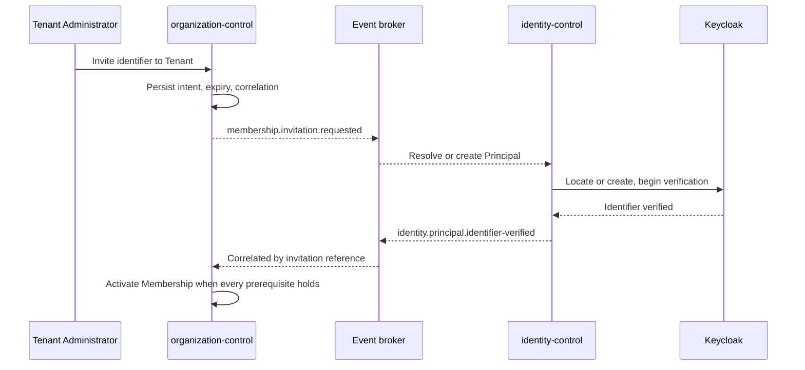

---
doc_meta:
  id: TDD-organization-control-004
  title: Invitation, Onboarding Correlation, and Offboarding Obligations
  owner: Core Platform Team
  version: 1.3.0
  status: approved
  classification: restricted
  review_cycle_days: 90
  created_date: 2026-08-11
  last_reviewed: 2026-08-23
  parent_sad: SAD-004
---

# Invitation, Onboarding Correlation, and Offboarding Obligations

## Purpose

Specify the two long-running flows this service coordinates but does not complete alone:
bringing a Principal into a Tenant, and taking a Tenant out of the platform.

Both share a property that shapes their design. Neither finishes inside one
transaction, both cross domain boundaries, and both have a failure mode where a partial
outcome looks like a complete one. An invitation that grants Membership before identity
is verified admits the wrong person. An offboarding that reports complete before
obligations are met destroys data someone still needed.

## Scope

**In scope**

- Invitation intent, expiry, and correlation with identity onboarding.
- Why possession of an invitation proves nothing.
- Enumeration resistance on the unauthenticated acceptance path.
- Offboarding stages, obligation tracking across domains, and resumability.
- Legal hold, and what it blocks.

**Out of scope**

- Principal creation and identifier verification — owned by
  `TDD-identity-control-001` and the identity kernel.
- Membership authority and revocation — owned by `TDD-organization-control-002`.
- Tenant state transitions — owned by `TDD-organization-control-003`. This design
  drives them; it does not define them.
- Notification delivery, which is asynchronous and external.

## Technical Context

### Invitation crosses two authorities

An invitation says a Tenant administrator intends someone to hold Membership. It does
not say who that someone is. Identity is established by the kernel, through identifier
verification, and Membership activates only when both facts exist.

SAD-004 §5.5 states it directly: **invitation possession alone never proves identity.**
A design that grants Membership on link click has authenticated an email inbox, and an
inbox is not a Principal.

### Offboarding crosses many

A Tenant leaving the platform obliges several domains to act: export data, satisfy
retention, release infrastructure, retire projections. This service owns none of that
work. It owns the record of which obligations exist, which have completed, and the
refusal to finish while any remain.

SAD-004 §5.6 requires offboarding to be resumable and to infer completion from no
single infrastructure response. A deprovisioning call that returns success says storage
was released; it says nothing about whether the export the client contracted for was
delivered.

## Component Design

| Component | Package | Responsibility |
| :-- | :-- | :-- |
| `InvitationService` | `internal/invitation` | Intent, expiry, acceptance, correlation |
| `OnboardingCorrelator` | `internal/invitation` | Joins identity lifecycle facts to pending invitations |
| `OffboardingService` | `internal/offboarding` | Stages, obligation registry, resumability |
| `ObligationTracker` | `internal/offboarding` | Records domain completion and refuses premature finalisation |

### Invitation Flow



Membership activates on the **join** of two independent facts: an unexpired invitation,
and a verified identity carrying the invited identifier. Either alone activates nothing.

## Data Model

```sql
CREATE TABLE invitation.invitation (
    invitation_id     UUID        PRIMARY KEY,
    tenant_id         UUID        NOT NULL REFERENCES tenant.tenant(tenant_id),
    workspace_id      UUID,
    target_identifier TEXT        NOT NULL,
    target_hash       TEXT        NOT NULL,
    subject_type      TEXT        NOT NULL,
    invited_by        UUID        NOT NULL,
    reason            TEXT,
    state             TEXT        NOT NULL,
    correlation_id    UUID        NOT NULL,
    principal_id      UUID,
    expires_at        TIMESTAMPTZ NOT NULL,
    created_at        TIMESTAMPTZ NOT NULL DEFAULT now(),
    accepted_at       TIMESTAMPTZ,
    revoked_at        TIMESTAMPTZ,
    CONSTRAINT invitation_state_check
        CHECK (state IN ('pending', 'identity_verified', 'accepted', 'expired', 'revoked')),
    CONSTRAINT invitation_workspace_in_tenant
        FOREIGN KEY (tenant_id, workspace_id)
        REFERENCES workspace.workspace (tenant_id, workspace_id)
);

CREATE UNIQUE INDEX invitation_pending_unique
    ON invitation.invitation (tenant_id, target_hash, COALESCE(workspace_id, tenant_id))
    WHERE state IN ('pending', 'identity_verified');
```

`expires_at` is not nullable. An invitation without expiry is a standing grant that
nobody revokes, and it will be found years later still valid.

`target_hash` carries the lookup, and `target_identifier` carries the display value.
The unique index is built on the hash so a pending invitation can be found without a
scan over identifiers, and the same index prevents two pending invitations for the same
person and context.

The composite foreign key mirrors `membership.membership`: an invitation cannot name a
Workspace belonging to a different Tenant, so the Membership it eventually produces
cannot either.

### Offboarding

```sql
CREATE TABLE operation.offboarding (
    offboarding_id  UUID        PRIMARY KEY,
    tenant_id       UUID        NOT NULL REFERENCES tenant.tenant(tenant_id),
    stage           TEXT        NOT NULL,
    initiated_by    UUID        NOT NULL,
    reason          TEXT        NOT NULL,
    legal_hold      BOOLEAN     NOT NULL DEFAULT FALSE,
    correlation_id  UUID        NOT NULL,
    started_at      TIMESTAMPTZ NOT NULL DEFAULT now(),
    frozen_at       TIMESTAMPTZ,
    retired_at      TIMESTAMPTZ,
    CONSTRAINT offboarding_stage_check
        CHECK (stage IN ('freeze', 'obligations', 'release', 'retired')),
    -- The target of the composite foreign key below, so a child's copy of tenant_id
    -- cannot disagree with its parent's.
    CONSTRAINT offboarding_tenant_scope_unique UNIQUE (tenant_id, offboarding_id)
);

CREATE TABLE operation.offboarding_obligation (
    obligation_id   UUID        PRIMARY KEY,
    offboarding_id  UUID        NOT NULL,
    tenant_id       UUID        NOT NULL,
    domain          TEXT        NOT NULL,
    obligation_type TEXT        NOT NULL,
    state           TEXT        NOT NULL,
    due_at          TIMESTAMPTZ,
    completed_at    TIMESTAMPTZ,
    detail          TEXT,
    CONSTRAINT obligation_state_check
        CHECK (state IN ('open', 'completed', 'waived', 'failed')),
    CONSTRAINT offboarding_obligation_parent_fk
        FOREIGN KEY (tenant_id, offboarding_id)
        REFERENCES operation.offboarding (tenant_id, offboarding_id)
);
```

`waived` is a separate state from `completed` on purpose. An obligation that was
consciously waived by an accountable person and an obligation that was actually
satisfied are different facts, and collapsing them removes the only record that a
decision was made.

### Why the obligation carries `tenant_id`

Version 1.1.0 of this design declared `offboarding_obligation` without one, reachable
only through its parent. That contradicted `TDD-organization-control-001`, which
requires a non-nullable `tenant_id` on every table in an RLS schema and has its
structural test reject a table without one. The rule is the one that survives, and the
reason is not consistency for its own sake: Row-Level Security evaluates a predicate per
row and cannot follow a join, so a policy on `offboarding` protects nothing on
`offboarding_obligation`. A child reachable only through a protected path is not a
protected child — it is an unprotected table with a convention in front of it.

The column is a denormalized copy, and the composite foreign key is what keeps the copy
honest rather than making it a second source of truth: the `(tenant_id, offboarding_id)`
pair must exist on the parent, so a row cannot claim a Tenant its offboarding does not
belong to. PostgreSQL requires the referenced column set to be uniquely constrained,
which is what `offboarding_tenant_scope_unique` above is for — it looks redundant beside
the primary key on `offboarding_id` alone and is not.

The alternatives were both worse. Excluding the table from the RLS set is what
`TDD-organization-control-001` explicitly refuses. Leaving it inside an RLS schema with
no policy is the exact failure that design exists to prevent, and it would fail closed
only by accident of the grant.

`schema.hcl` expresses `offboarding_tenant_scope_unique` as a unique index rather than as a
table constraint, because that is the form Atlas's declarative HCL models. PostgreSQL
accepts either as the target of a composite foreign key, so the invariant is identical; the
difference is that the object appears in `pg_indexes` and not in `pg_constraint`, which is
what any assertion on its presence must query.

## API / Interface

```text
POST   /v1/tenants/{tenant_id}/invitations
GET    /v1/tenants/{tenant_id}/invitations
POST   /v1/invitations/{invitation_id}:revoke
POST   /v1/invitations/{invitation_id}:resend
GET    /v1/invitations:lookup                     unauthenticated, enumeration-resistant

POST   /v1/tenants/{tenant_id}:begin-offboarding
GET    /v1/offboardings/{offboarding_id}
POST   /v1/offboardings/{offboarding_id}/obligations/{obligation_id}:complete
POST   /v1/offboardings/{offboarding_id}/obligations/{obligation_id}:waive
POST   /v1/offboardings/{offboarding_id}:advance
POST   /v1/offboardings/{offboarding_id}:finalise
```

### Published Events

```text
com.scnehaux.organization.membership.invitation.requested
com.scnehaux.organization.membership.invitation.revoked
com.scnehaux.organization.membership.invitation.expired
com.scnehaux.organization.tenant.offboarding.started
com.scnehaux.organization.tenant.security.suspended          (priority)
com.scnehaux.organization.membership.security.suspended      (priority, one per Membership)
com.scnehaux.organization.tenant.offboarding.frozen
com.scnehaux.organization.tenant.offboarding.obligation-raised
com.scnehaux.organization.tenant.lifecycle.retired
```

The security events are what stop access and therefore occupy the priority lane.
`offboarding.started` and `offboarding.frozen` describe process progress for obligation
consumers; Identity does not infer enforcement from either lifecycle event.

The retirement event is named for the aggregate and not for the process. Version 1.1.0 of
this design called it `tenant.offboarding.retired` while
`TDD-organization-control-003` §"Published Events" called the same fact
`tenant.lifecycle.retired`. The 003 name is the one used: an event type says what
happened to which aggregate, and naming it after the process that caused it would give
one fact two types depending on how it arose — leaving a consumer to subscribe to both
and deduplicate, or to miss the retirement it did not expect. The cause is already
carried by the correlation identifier, which is where a cause belongs.

Retirement is not on the priority lane, and it increments `tenant_security_version`. That
pairing looks inconsistent and is not: the only way into `retired` is from `offboarding`,
which already published `tenant.security.suspended` on the priority lane and already
froze context. By the time a Tenant retires there is no access left to withdraw, so the
urgency was discharged one transition earlier. What is enforced instead is that the lane
agrees with the event's own classification — a type containing `security` and a
standard-lane append cannot coexist.

## Algorithms / Logic

### Acceptance, and Enumeration Resistance

The lookup endpoint is unauthenticated, which SAD-004 §8.1 permits for invitation
lookup and only with enumeration resistance.

```text
lookup(token):
    resolve the invitation by the token's hash
    if absent, expired, revoked, or already accepted:
        render the same response as a valid pending invitation
        disclose no Tenant name, no inviter, and no target identifier
```

Every outcome renders identically. A response that differs between "no such invitation"
and "expired" tells an attacker which tokens once existed, and the token space is the
only thing protecting the flow.

The response discloses nothing about the Tenant either. A valid token proves someone
was invited; it does not entitle the holder to learn the organization's name before
they have authenticated.

### Membership Activation

```text
on identity.principal.identifier-verified:
    find the pending invitation by correlation and verified identifier
    if none: ignore
    if expired: mark expired, emit, stop

BEGIN
    reload the invitation FOR UPDATE
    reject if state is not 'pending' or 'identity_verified'
    reject if the Tenant is not active
    reject if an active Membership already exists for this subject and context
    create the Membership through MembershipService
    set invitation state = 'accepted', principal_id, accepted_at
    outbox.Append(membership.lifecycle.granted)
COMMIT
```

The Tenant is rechecked at activation. An invitation issued while a Tenant was active
and accepted after it was suspended must not create Membership into a suspended Tenant,
and the gap between the two is exactly the window a long-lived invitation creates.

### Offboarding Stages

```text
begin
    transition Tenant to offboarding
    increment tenant_security_version
    emit tenant.security.suspended in the same transaction
    emit tenant.offboarding.started
    → tenant-wide access stops through the priority security event

freeze, in resumable batches
    suspend every active Membership in the Tenant
    increment each membership_version
    emit membership.security.suspended for each changed Membership in the same batch

freeze complete
    emit tenant.offboarding.frozen
    → Membership authority and every bounded projection now agree with the Tenant freeze

obligations
    raise obligations from the registered domain set
    each domain reports completion, failure, or requests a waiver
    remain in this stage while any obligation is open

release
    permitted only when no obligation is open and no legal hold is set
    record the deprovisioning command and publish it, in the same transaction
    an ambiguous provisioning outcome holds the stage; it never advances it

retired
    permitted only when the deprovisioning is realized, no obligation is open,
    and no legal hold is set — all three rechecked at this moment
    Tenant transitions to retired
    increment tenant_security_version
```

#### Where the deprovisioning outcome is recorded

The command is recorded in `tenant.provisioning_request`, which
`TDD-organization-control-003` describes as the desired provisioning state sent outward
and the realized state reported back. A deprovisioning is exactly that, and that table's
`state` enum already carries the distinction this stage turns on: `unresolved` is an
outcome that is neither success nor failure. A separate table would duplicate the
correlation machinery and then need its own vocabulary for ambiguity.

`desired_profile.operation` separates the two directions, and the separation is load-
bearing rather than descriptive. Both flows write to one table, so without it a failed
deprovisioning would be the most recent request for the Tenant and would refuse a later
activation on a flow that has nothing to do with this one. §"Tenant Activation" in 003
filters on the same field for the same reason.

The command is recorded in the transaction that advances the stage. Recorded afterwards, a
crash in between would leave an offboarding at `release` with nothing to correlate against,
and the gate below would hold it forever with no way to distinguish that from a genuinely
slow deprovisioning.

Three states hold retirement and they are not collapsed into one refusal. `unresolved` is
ambiguous — a timeout, per 003, rather than a rejection, so the infrastructure may have
been released or may not. `requested` is still in flight. `failed` was refused. A caller
does not need them distinguished to know it cannot proceed, but the operator reading why
responds differently to each: one is waited on, one is retried, one is investigated.

A realized outcome does not retire the Tenant. It records that the deprovisioning
completed, and retirement stays a deliberate act — the alternative is infrastructure
reporting success and a Tenant disappearing from the estate with nobody having decided
that it should.

Access stops at the first stage and data release happens at the third. That ordering is
the design: freezing is reversible and immediate, release is neither, and putting them
in one step would make every offboarding an irreversible act taken under time pressure.

The process is resumable because the stage and every obligation are persisted. A restart
mid-offboarding continues from the recorded stage rather than restarting a flow that has
already frozen a Tenant.

### Legal Hold

```text
if legal_hold is set:
    freeze and obligations proceed
    release is refused
    retirement is refused
```

Legal hold blocks destruction and nothing else. SAD-004 §6.5 requires it to prevent
destructive retirement until released, and a hold that also blocked the freeze would
keep access open on a Tenant that is leaving.

### Expiry Sweep

```text
periodically:
    for each invitation past expires_at in a pending state:
        set state = 'expired'
        emit invitation.expired
```

Expiry is materialised rather than evaluated at read time, so an expired invitation is
visible as expired in every listing and in every report without each reader
reimplementing the comparison.

## Configuration

| Variable | Default | Purpose |
| :-- | :-- | :-- |
| `ORGANIZATION_INVITATION_TTL` | `7d` | Default invitation lifetime |
| `ORGANIZATION_INVITATION_MAX_TTL` | `30d` | Ceiling an inviter cannot exceed |
| `ORGANIZATION_INVITATION_SWEEP_INTERVAL` | `1h` | Expiry materialisation cadence |
| `ORGANIZATION_OFFBOARDING_OBLIGATION_SLA` | `30d` | Default obligation due window |
| `ORGANIZATION_OFFBOARDING_DOMAINS` | none, required | Domains that receive obligations |

## Testing Strategy

### Invitation

- An invitation without expiry cannot be created.
- A second pending invitation for the same subject, Tenant, and Workspace is refused.
- An invitation naming a Workspace of another Tenant is rejected by the composite
  foreign key.
- Membership is not created by acceptance alone, nor by identity verification alone.
- Acceptance into a Tenant suspended after the invitation was issued is refused.
- An expired invitation cannot be accepted, including in the race between the sweep and
  an acceptance.

### Enumeration

- Absent, expired, revoked, and accepted invitations produce identical responses.
- The lookup discloses no Tenant name, inviter, or target identifier.
- Response time distributions do not separate a valid token from an absent one.

### Offboarding

- The freeze stage suspends every Membership and increments
  `tenant_security_version`.
- Release is refused while any obligation is open.
- Release is refused while legal hold is set; freeze and obligations still proceed.
- An ambiguous deprovisioning outcome holds the release stage and does not advance it.
- A restart mid-offboarding resumes from the recorded stage.
- A waived obligation is distinguishable from a completed one in the record.

### Negative

- Finalisation with an open obligation is refused, and the refusal names the
  obligations.
- An obligation cannot be completed by a domain other than the one it was raised
  against.

## Security Notes

An invitation is an intent, not a credential. Every control here follows from that: the
join of two independent facts before Membership exists, the Tenant recheck at
activation, and a lookup that discloses nothing about the organization to an
unauthenticated holder.

The unauthenticated lookup is the only anonymous surface this service exposes.
Uniformity across every outcome is what keeps the token space meaningful, because a
distinguishable response turns an opaque token into an oracle.

Freezing before releasing is the ordering that makes offboarding safe to start. An
operator who begins offboarding by mistake has stopped access, which is reversible, and
has destroyed nothing.

`waived` preserves the evidence that a person decided an obligation would not be met.
Recording it as `completed` would make an audit read as though the obligation was
satisfied, which is a false record rather than a lost one.

## Performance Notes

Both flows are administrative and low-volume. The expiry sweep is an indexed query over
pending invitations, and the offboarding obligation registry is small per Tenant.

The freeze stage suspends every Membership in a Tenant, which for a large Tenant is the
one bulk write in this design. It runs in batches under the same transaction discipline
as any other Membership mutation, so each changed Membership commits with its priority
`membership.security.suspended` outbox row. Tenant-wide enforcement does not wait for
those batches: `tenant.security.suspended` was committed when offboarding began.

## Operational Notes

| Signal | Warning | Critical |
| :-- | :-- | :-- |
| Invitations expiring unaccepted | above baseline | — |
| Offboarding obligations past `due_at` | any occurrence | past the contract deadline |
| Offboarding held in `release` by an ambiguous outcome | any occurrence | over 24 hours |
| Tenant in `offboarding` beyond the expected window | 30 days | 90 days |
| Unauthenticated lookup rate | above baseline | sustained from one source |

A rising unauthenticated lookup rate from one source is token enumeration in progress,
and the uniform response is what makes it expensive rather than impossible.

Runbooks required before production: stuck offboarding obligation, ambiguous
deprovisioning outcome, invitation token enumeration, and legal hold release.

## Traceability

| Relationship | Target |
| :-- | :-- |
| Parent system | SAD-004 — Scnehaux Organization Control |
| Realizes capability | PAD-PLT-002 — invitation, onboarding correlation, offboarding coordination |
| Governed by | ADR-ORG-001 §5.1 — Tenant offboarding and retirement coordination |
| Conforms to | SAD-004 §5.5 — invitation possession never proves identity |
| Conforms to | SAD-004 §5.6 — offboarding is resumable and infers completion from no single response |
| Conforms to | SAD-004 §8.1 — anonymous lookup with enumeration resistance |
| Enterprise constraint | EAD-003 — deletion accounts for projections, derived products, backups, evidence, and legal hold |
| Depends on | `TDD-organization-control-002` — Membership creation and suspension |
| Depends on | `TDD-organization-control-003` — Tenant state transitions this flow drives |
| Correlates with | `TDD-identity-control-001` — identity verification is the other half of the join |
