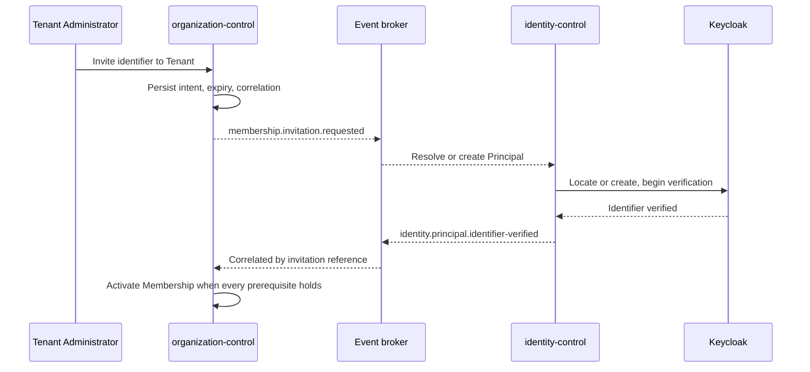

---
doc_meta:
  id: TDD-organization-control-004
  title: Invitation, Onboarding Correlation, and Offboarding Obligations
  owner: Core Platform Team
  version: 1.12.0
  status: approved
  classification: restricted
  review_cycle_days: 90
  created_date: 2026-08-11
  last_reviewed: 2026-10-09
  parent_sad: SAD-004
---

# Invitation, Onboarding Correlation, and Offboarding Obligations

## Purpose

Specify the two long-running flows this service coordinates but does not complete alone:
bringing a Principal into a Tenant, and taking a Tenant out of the platform.

Both share a property that shapes their design. Neither finishes inside one
transaction, both cross domain boundaries, and both have a failure mode where a partial
outcome looks like a complete one. An invitation that grants Membership before identity
is verified admits the wrong person. An offboarding that reports complete before
obligations are met destroys data someone still needed.

## Scope

**In scope**

- Invitation intent, expiry, and correlation with identity onboarding.
- Why possession of an invitation proves nothing.
- Enumeration resistance on the unauthenticated acceptance path.
- Offboarding stages, obligation tracking across domains, and resumability.
- Legal hold, and what it blocks.

**Out of scope**

- Principal creation and identifier verification — owned by
  `TDD-identity-control-001` and the identity kernel.
- Membership authority and revocation — owned by `TDD-organization-control-002`.
- Tenant state transitions — owned by `TDD-organization-control-003`. This design
  drives them; it does not define them.
- Notification delivery, which is asynchronous and external.

## Technical Context

### Invitation crosses two authorities

An invitation says a Tenant administrator intends someone to hold Membership. It does
not say who that someone is. Identity is established by the kernel, through identifier
verification, and Membership activates only when both facts exist.

SAD-004 §5.5 states it directly: **invitation possession alone never proves identity.**
A design that grants Membership on link click has authenticated an email inbox, and an
inbox is not a Principal.

### Offboarding crosses many

A Tenant leaving the platform obliges several domains to act: export data, satisfy
retention, release infrastructure, retire projections. This service owns none of that
work. It owns the record of which obligations exist, which have completed, and the
refusal to finish while any remain.

SAD-004 §5.6 requires offboarding to be resumable and to infer completion from no
single infrastructure response. A deprovisioning call that returns success says storage
was released; it says nothing about whether the export the client contracted for was
delivered.

## Component Design

| Component | Package | Responsibility |
| :-- | :-- | :-- |
| `InvitationService` | `internal/invitation` | Intent, expiry, acceptance, correlation |
| `OnboardingCorrelator` | `internal/invitation` | Joins identity lifecycle facts to pending invitations |
| `OffboardingService` | `internal/offboarding` | Stages, obligation registry, resumability |
| `ObligationTracker` | `internal/offboarding` | Records domain completion and refuses premature finalisation |

### Invitation Flow


```mermaid
sequenceDiagram
    participant A as Tenant Administrator
    participant O as organization-control
    participant B as Event broker
    participant I as identity-control
    participant K as Keycloak

    A->>O: Invite identifier to Tenant
    O->>O: Persist intent, expiry, correlation
    O-->>B: membership.invitation.requested
    B-->>I: Resolve or create Principal
    I->>K: Locate or create, begin verification
    K-->>I: Identifier verified
    I-->>B: identity.principal.identifier-verified
    B-->>O: Correlated by invitation reference
    O->>O: Activate Membership when every prerequisite holds
```

Membership activates on the **join** of two independent facts: an unexpired invitation,
and a verified identity carrying the invited identifier. Either alone activates nothing.

## Data Model

```sql
CREATE TABLE invitation.invitation (
    invitation_id     UUID        PRIMARY KEY,
    tenant_id         UUID        NOT NULL REFERENCES tenant.tenant(tenant_id),
    workspace_id      UUID,
    target_identifier TEXT        NOT NULL,
    target_hash       TEXT        NOT NULL,
    token_hash        TEXT        NOT NULL,
    subject_type      TEXT        NOT NULL,
    invited_by        UUID        NOT NULL,
    reason            TEXT,
    state             TEXT        NOT NULL,
    correlation_id    UUID        NOT NULL,
    principal_id      UUID,
    expires_at        TIMESTAMPTZ NOT NULL,
    created_at        TIMESTAMPTZ NOT NULL DEFAULT now(),
    accepted_at       TIMESTAMPTZ,
    revoked_at        TIMESTAMPTZ,
    CONSTRAINT invitation_state_check
        CHECK (state IN ('pending', 'identity_verified', 'accepted', 'expired', 'revoked')),
    CONSTRAINT invitation_workspace_in_tenant
        FOREIGN KEY (tenant_id, workspace_id)
        REFERENCES workspace.workspace (tenant_id, workspace_id)
);

CREATE UNIQUE INDEX invitation_pending_unique
    ON invitation.invitation (tenant_id, target_hash, COALESCE(workspace_id, tenant_id))
    WHERE state IN ('pending', 'identity_verified');
```

`expires_at` is not nullable. An invitation without expiry is a standing grant that
nobody revokes, and it will be found years later still valid.

`target_hash` carries the correlation, and `target_identifier` carries the display value.
The unique index is built on the hash so a pending invitation can be found without a
scan over identifiers, and the same index prevents two pending invitations for the same
person and context.

`token_hash` is what the invitee presents, and is an addition to the original table. That
table declared only `target_hash`, while §"Acceptance, and Enumeration Resistance" states
that the token space is the only thing protecting the flow — and an identifier is not a
token space. Without the column, the thing carried in the invitation link would have to be
`invitation_id`, which is a UUIDv7 and therefore time-ordered: an attacker who knows
roughly when a Tenant issued invitations can narrow that space sharply. A uniform response
closes the information leak; it does not close a successful guess.

The token is high-entropy, generated at creation, returned exactly once to the caller, and
never stored — only its hash is. `token_hash` is unique across the whole table rather than
per Tenant, because a token is resolved before any Tenant is known and must therefore
identify at most one invitation on its own.

The composite foreign key mirrors `membership.membership`: an invitation cannot name a
Workspace belonging to a different Tenant, so the Membership it eventually produces
cannot either.

### Offboarding

```sql
CREATE TABLE operation.offboarding (
    offboarding_id  UUID        PRIMARY KEY,
    tenant_id       UUID        NOT NULL REFERENCES tenant.tenant(tenant_id),
    stage           TEXT        NOT NULL,
    initiated_by    UUID        NOT NULL,
    reason          TEXT        NOT NULL,
    legal_hold      BOOLEAN     NOT NULL DEFAULT FALSE,
    correlation_id  UUID        NOT NULL,
    started_at      TIMESTAMPTZ NOT NULL DEFAULT now(),
    frozen_at       TIMESTAMPTZ,
    released_at     TIMESTAMPTZ,   -- from 1.7.0: the instant the offboarding entered release
    retired_at      TIMESTAMPTZ,
    prior_status    TEXT,          -- from 1.8.0: the Tenant's status when the offboarding began
    cancelled_by    UUID,          -- from 1.8.0: who cancelled it
    cancel_reason   TEXT,          -- from 1.8.0: why
    cancelled_at    TIMESTAMPTZ,   -- from 1.8.0: when
    CONSTRAINT offboarding_stage_check
        CHECK (stage IN ('freeze', 'obligations', 'release', 'retired', 'cancelled')),
    CONSTRAINT offboarding_prior_status_check
        CHECK (prior_status IS NULL OR prior_status IN ('active', 'suspended')),
    CONSTRAINT offboarding_cancellation_check
        CHECK ((stage = 'cancelled') = (cancelled_at IS NOT NULL)
           AND (cancelled_at IS NULL) = (cancelled_by IS NULL)
           AND (cancelled_at IS NULL) = (cancel_reason IS NULL)),
    -- The target of the composite foreign key below, so a child's copy of tenant_id
    -- cannot disagree with its parent's.
    CONSTRAINT offboarding_tenant_scope_unique UNIQUE (tenant_id, offboarding_id)
);

CREATE TABLE operation.offboarding_obligation (
    obligation_id   UUID        PRIMARY KEY,
    offboarding_id  UUID        NOT NULL,
    tenant_id       UUID        NOT NULL,
    domain          TEXT        NOT NULL,
    obligation_type TEXT        NOT NULL,
    state           TEXT        NOT NULL,
    due_at          TIMESTAMPTZ,
    completed_at    TIMESTAMPTZ,
    detail          TEXT,
    resolved_by     UUID,          -- from 1.7.0: who reported the latest outcome
    resolved_at     TIMESTAMPTZ,   -- from 1.7.0: when, for completed, waived and failed alike
    CONSTRAINT obligation_state_check
        CHECK (state IN ('open', 'completed', 'waived', 'failed', 'cancelled')),
    CONSTRAINT offboarding_obligation_parent_fk
        FOREIGN KEY (tenant_id, offboarding_id)
        REFERENCES operation.offboarding (tenant_id, offboarding_id)
);

-- From 1.8.0: which Memberships the freeze suspended, so a cancellation restores those and no
-- others (ADR-ORG-006 §5.2). In the membership schema because the tenant role writes it, inside the
-- freeze's own transaction, and that role reaches nothing in operation.
CREATE TABLE membership.offboarding_freeze (
    offboarding_id UUID        NOT NULL,
    tenant_id      UUID        NOT NULL,
    membership_id  UUID        NOT NULL REFERENCES membership.membership (membership_id),
    suspended_at   TIMESTAMPTZ NOT NULL DEFAULT now(),
    restored_at    TIMESTAMPTZ,
    PRIMARY KEY (offboarding_id, membership_id),
    FOREIGN KEY (tenant_id, offboarding_id)
        REFERENCES operation.offboarding (tenant_id, offboarding_id)
);
```

**What a cancellation needs is recorded from the start** (1.8.0, `ADR-ORG-006 §5.2`). Beginning
an offboarding stores the Tenant's status in `prior_status`, read under the row lock the transition
takes. Each freeze batch writes one `offboarding_freeze` row per Membership it suspends, in the
transaction that suspends it, so the record and the suspension cannot disagree. A Membership already
suspended before the offboarding is never selected by the freeze, so it has no row, and a
cancellation leaves it suspended. An offboarding begun before 1.8.0 has `prior_status` null and may
have frozen Memberships no row records. Its cancellation is refused rather than guessed
(§Cancellation).

Each stage has an entry instant, and from 1.7.0 every one is readable. `freeze` is entered at
`started_at`. `obligations` is entered at `frozen_at`: completing the freeze and entering
obligations are one transaction stamped with one instant, so the view serves `obligations_at` from
`frozen_at` rather than storing the same fact twice (EAD-003). `release` is entered at
`released_at`, stamped in the transaction that records the deprovisioning command, and `retired`
at `retired_at`. Rows that passed a stage before 1.7.0 keep `released_at` null: the instant was
never recorded, and inventing one from the deprovisioning request would state as a stage fact what
is only a neighbouring row's timestamp.

`resolved_by` and `resolved_at` record who reported an obligation's latest outcome, and when.
`completed_at` is set only for the two resolving states, so without them a `failed` row carried no
time at all and no row carried an actor, and the waiver an audit must be able to attribute was
attributable only through the privileged-access record. The actor is the authenticated principal of
the resolving request. A failed obligation later completed or waived is overwritten with the later
outcome: the earlier one stays in the privileged-access record, and the row states what holds
now. Rows resolved before 1.7.0 keep both null.

`waived` is a separate state from `completed` on purpose. An obligation that was
consciously waived by an accountable person and an obligation that was actually
satisfied are different facts, and collapsing them removes the only record that a
decision was made.

### Why the obligation carries `tenant_id`

Version 1.1.0 of this design declared `offboarding_obligation` without one, reachable
only through its parent. That contradicted `TDD-organization-control-001`, which
requires a non-nullable `tenant_id` on every table in an RLS schema and has its
structural test reject a table without one. The rule is the one that survives, and the
reason is not consistency for its own sake: Row-Level Security evaluates a predicate per
row and cannot follow a join, so a policy on `offboarding` protects nothing on
`offboarding_obligation`. A child reachable only through a protected path is not a
protected child — it is an unprotected table with a convention in front of it.

The column is a denormalized copy, and the composite foreign key is what keeps the copy
honest rather than making it a second source of truth: the `(tenant_id, offboarding_id)`
pair must exist on the parent, so a row cannot claim a Tenant its offboarding does not
belong to. PostgreSQL requires the referenced column set to be uniquely constrained,
which is what `offboarding_tenant_scope_unique` above is for — it looks redundant beside
the primary key on `offboarding_id` alone and is not.

The alternatives were both worse. Excluding the table from the RLS set is what
`TDD-organization-control-001` explicitly refuses. Leaving it inside an RLS schema with
no policy is the exact failure that design exists to prevent, and it would fail closed
only by accident of the grant.

`schema.hcl` expresses `offboarding_tenant_scope_unique` as a unique index rather than as a
table constraint, because that is the form Atlas's declarative HCL models. PostgreSQL
accepts either as the target of a composite foreign key, so the invariant is identical; the
difference is that the object appears in `pg_indexes` and not in `pg_constraint`, which is
what any assertion on its presence must query.

## API / Interface

```text
POST   /v1/tenants/{tenant_id}/invitations
GET    /v1/tenants/{tenant_id}/invitations
POST   /v1/invitations/{invitation_id}:revoke
POST   /v1/invitations/{invitation_id}:resend
GET    /v1/invitations:lookup                     unauthenticated, enumeration-resistant

POST   /v1/tenants/{tenant_id}:begin-offboarding
GET    /v1/offboardings/{offboarding_id}
POST   /v1/offboardings/{offboarding_id}/obligations/{obligation_id}:complete
POST   /v1/offboardings/{offboarding_id}/obligations/{obligation_id}:waive
POST   /v1/offboardings/{offboarding_id}:advance
POST   /v1/offboardings/{offboarding_id}:finalise
```

**The invitation routes as served** (`internal/httpapi/routes.go`), from 1.6.0:

```text
Tenant-scoped: the Tenant is the caller's, from the token
GET    /v1/invitations                       ?after=&limit=&state=
POST   /v1/invitations
GET    /v1/invitations/{invitation_id}
POST   /v1/invitations/{invitation_id}/revoke
POST   /v1/invitations/accept

Provider-scoped
POST   /v1/invitations/verify-identity
POST   /v1/invitations/expire-lapsed

Unauthenticated
POST   /v1/invitations/lookup
```

From 1.9.0 issuing, revoking, accepting and recording a verified identity each require an
`Idempotency-Key`; the expiry sweep honours one and does not require it, because a repeat finds
nothing left to expire (`TDD-organization-control-003` §The `Idempotency-Key` Is Required on
Commands).

The list above names `GET /v1/tenants/{tenant_id}/invitations`. The served path is
`GET /v1/invitations`, as issuing is `POST /v1/invitations`, because a tenant-scoped route takes
its Tenant from the token (`TDD-organization-control-001` §Scope Resolution): a Tenant in the path
would be a requested scope for a handler to compare against the bound one, and a route with none
leaves nothing to mistake for it. Row-Level Security confines the list to the caller's Tenant. A
transition is a path segment (`/revoke`), not `:revoke`, because a Go 1.22 `net/http` wildcard
fills a whole segment. `:resend` is not built: a resend is a revocation and a new issue today, and
the route waits for a client that needs it as one act.

The list follows STD-GLB-001 1.3.0 §Pagination, the form identity-control serves for
`GET /v1/registrations`:

| Part | Form |
| :-- | :-- |
| Cursor | `after`: the `invitation_id` of the last item of the previous page. Absent, the list starts at the first. Not a UUID: `400` |
| Page size | `limit`: 50 when absent; a whole number from 1 to 100. Anything else, `0` included: `400`, never coerced |
| Order | `invitation_id`, a UUIDv7, so creation order: the keyset `invitation_id > $after ORDER BY invitation_id LIMIT limit + 1` |
| Filter | `state` = `pending` \| `identity_verified` \| `accepted` \| `expired` \| `revoked`, optional, holding for every page; any other value: `400` |
| Response | `{"invitations": [...], "next": "<invitation_id>" \| null}`, `next` null on the last page |

Each item has the shape `GET /v1/invitations/{invitation_id}` returns, which carries neither the
target identifier nor its hash (§Security Notes). `state` is the stored state: an invitation past
`expires_at` that the sweep has not yet reached is still `pending`, with its `expires_at` in the
past, and acceptance refuses it all the same (§Expiry Sweep).

**The offboarding routes as served**, from 1.7.0, all provider-scoped: provider authority and
`X-Administrative-Reason`, the access recorded before the transaction runs:

```text
GET    /v1/offboardings                      ?after=&limit=&stage=&tenant_id=
POST   /v1/offboardings
GET    /v1/offboardings/{offboarding_id}
POST   /v1/offboardings/{offboarding_id}/freeze
POST   /v1/offboardings/{offboarding_id}/complete-freeze
POST   /v1/offboardings/{offboarding_id}/release
POST   /v1/offboardings/{offboarding_id}/retire
POST   /v1/offboardings/{offboarding_id}/legal-hold
POST   /v1/offboardings/{offboarding_id}/obligations
GET    /v1/offboardings/{offboarding_id}/obligations
POST   /v1/offboardings/{offboarding_id}/deprovisioning
POST   /v1/offboardings/{offboarding_id}/deprovisioning/resend               (1.11.0)
POST   /v1/offboardings/{offboarding_id}/cancel      {"expected_version": n}   (1.8.0)
POST   /v1/obligations/{obligation_id}/resolve
```

From 1.9.0 every `POST` above requires an `Idempotency-Key` but one:
`/{offboarding_id}/deprovisioning` is the provisioning system's report of an outcome, and the same
outcome sent again records the same state, so it honours a key and does not require one
(`TDD-organization-control-003` §The `Idempotency-Key` Is Required on Commands).

The list near the top of this section is the shape the flow was designed in; the block above is
what a client calls. Beginning names its Tenant in the body, the four stage advances are
`complete-freeze`, `release` and `retire` rather than one `:advance`, and an obligation is
resolved by its own identifier, with the resolving domain and state in the body, rather than by a
`:complete` and a `:waive` under its offboarding.

The offboarding list follows STD-GLB-001 1.3.0 §Pagination in the form of every other list here:

| Part | Form |
| :-- | :-- |
| Cursor | `after`: the `offboarding_id` of the last item of the previous page. Absent, the list starts at the first. Not a UUID: `400` |
| Page size | `limit`: 50 when absent; a whole number from 1 to 100. Anything else, `0` included: `400`, never coerced |
| Order | `offboarding_id`, a UUIDv7, so the order offboardings began in: the keyset `offboarding_id > $after ORDER BY offboarding_id LIMIT limit + 1` |
| Filters | `stage` = `freeze` \| `obligations` \| `release` \| `retired` \| `cancelled`; `tenant_id` = a UUID. Each optional, each holding for every page; any other value: `400` |
| Response | `{"offboardings": [...], "next": "<offboarding_id>" \| null}`, `next` null on the last page |

Each page writes the privileged-access record with the caller's reason before it reads. A
parameter the list does not take, or one given twice, is `400`. `tenant_id` is how a client gets
from a Tenant to its offboarding; `GET /v1/tenants/{tenant_id}` also carries `offboarding_id`
(`TDD-organization-control-003` §Lists).

Each item has the shape `GET /v1/offboardings/{offboarding_id}` returns, and every route that
answers with an offboarding answers with that shape:

```json
{
  "offboarding_id": "<uuid>", "tenant_id": "<uuid>", "stage": "obligations",
  "initiated_by": "<uuid>", "reason": "...", "legal_hold": false, "correlation_id": "<uuid>",
  "started_at": "<ts>", "frozen_at": "<ts>",
  "obligations_at": "<ts>" | null, "released_at": "<ts>" | null,
  "deprovisioning": {"state": "requested|realized|failed|unresolved", "detail": "..." | null,
                     "requested_at": "<ts>", "resolved_at": "<ts>" | null} | null,
  "active_memberships": 0,
  "prior_status": "active|suspended" | null,
  "cancelled_by": "<uuid>" | null, "cancel_reason": "..." | null, "cancelled_at": "<ts>" | null,
  "frozen_memberships": 0, "restore_pending": 0
}
```

From 1.8.0 the view carries the cancellation (`ADR-ORG-006 §5.1`): `prior_status`, the status a
cancellation returns the Tenant to, null on an offboarding begun before 1.8.0, which cannot be
cancelled; `cancelled_by`, `cancel_reason` and `cancelled_at`, null until cancelled;
`frozen_memberships`, the Memberships the freeze record names, which is what a cancellation would
restore; and `restore_pending`, those of them a cancellation has not restored yet and that are still
`suspended`, which is `0` unless the offboarding is cancelled.

`frozen_at` and `retired_at` are omitted until reached, as before 1.7.0; the fields 1.7.0 adds are
present and null until reached. `obligations_at` and `released_at` are stage-entry instants
(§Data Model), so a view can show elapsed time in the current stage without inferring it.
`deprovisioning` is the most recent deprovisioning command recorded for this offboarding — the one
§"Where the deprovisioning outcome is recorded" gates retirement on — and null before release.
`active_memberships` is the count of the Tenant's Memberships still `active`, computed by this
service in the same transaction: what the freeze has left to do, and `0` once it is done.

`GET /v1/offboardings/{offboarding_id}/obligations` answers with the obligation board:

```json
{
  "outstanding": ["billing/final-invoice (failed)", "product/data-export (open)"],
  "obligations": [
    {"obligation_id": "<uuid>", "offboarding_id": "<uuid>", "tenant_id": "<uuid>",
     "domain": "product", "type": "data-export", "state": "open",
     "due_at": "<ts>", "completed_at": "<ts>", "detail": "...",
     "resolved_by": "<uuid>", "resolved_at": "<ts>"}
  ]
}
```

`outstanding` is unchanged from before 1.7.0: the names the release refusal uses, sorted.
`obligations` is every row, whatever its state, in the shape raising and resolving answer with.
`due_at`, `completed_at`, `detail`, `resolved_by` and `resolved_at` are omitted when unset, so
`resolved_by` and `resolved_at` appear on completed, waived and failed rows. The order is the
board's (`TDD-organization-experience-003` §The Obligation Board): `open` rows past `due_at` first,
the most overdue first; then the other `open` rows by `due_at`, undated last; then every other row
in the order it was raised. An unknown offboarding is `404`.

**Cancelling an offboarding** (1.8.0, `ADR-ORG-006`). `POST /v1/offboardings/{offboarding_id}/cancel`
takes the Tenant `version` the operator was shown as `expected_version` and requires
`X-Administrative-Reason`, like every provider route, which becomes `cancel_reason`. It answers with
the offboarding view. In `freeze` and `obligations` it cancels (§Cancellation). In `release` and
`retired` it is refused `409` `state-transition-refused`: release is irreversible. An offboarding
begun before 1.8.0 is refused `409` with a detail saying the freeze recorded nothing to restore. A
stale `expected_version` is `409` `version-conflict`. On an offboarding already `cancelled`, it
resumes the restoration and changes nothing else, so a request that failed part way is completed
by sending it again.

### Published Events

```text
com.scnehaux.organization.membership.invitation.requested
com.scnehaux.organization.membership.invitation.accepted
com.scnehaux.organization.membership.invitation.revoked
com.scnehaux.organization.membership.invitation.expired
com.scnehaux.organization.tenant.offboarding.started
com.scnehaux.organization.tenant.security.suspended          (priority)
com.scnehaux.organization.membership.security.suspended      (priority, one per Membership)
com.scnehaux.organization.tenant.offboarding.frozen
com.scnehaux.organization.tenant.offboarding.obligation-raised
com.scnehaux.organization.tenant.offboarding.released
com.scnehaux.organization.tenant.lifecycle.retired
com.scnehaux.organization.tenant.offboarding.cancelled       (1.8.0)
com.scnehaux.organization.tenant.security.restored           (priority, on a cancellation from active)
com.scnehaux.organization.membership.lifecycle.restored      (one per restored Membership)
```

A cancellation publishes `tenant.offboarding.cancelled` for the process, and the security events
its transitions publish anyway: the Tenant's `tenant.security.restored` (begun from `active`) or
`tenant.security.suspended` (begun from `suspended`), and one `membership.lifecycle.restored` per
Membership it restores (`TDD-organization-control-003` §Who issues which transition). Access returns
by the path it was stopped, and is shown by its evidence (`ADR-ORG-004 §5.2`). No consumer
subscribes to `tenant.offboarding.*`, which `projection.SubscribableEventTypes` does not offer, so
the new type reaches nobody who must handle it, and the Tenant and Membership types are ones every
consumer already applies.

`invitation.accepted` is an addition to the original list, which published an event for every way
an invitation can close except the one that succeeds. `revoked` and `expired` were named and
`accepted` was not, leaving the terminal happy path as the only outcome nothing downstream hears
about — and it is the outcome a dashboard tracking invitation conversion most needs. The
Membership's own `membership.lifecycle.granted` announces the access, but a consumer of invitation
events would have to subscribe to Membership events and correlate to infer that the invitation
closed, which is work the publisher can do once instead.

`verify-identity` remains deliberately silent. It records that one of the two required facts
arrived, and no consumer outside this service can act on half a join; the actionable event is the
Membership that follows.

No invitation event carries the target identifier or the display name. STD-GLB-007 makes the
identifier Tier-2 PII, and an event stream is read by consumers with no business knowing who was
invited — they need to know that an intent exists, changed, or lapsed, keyed by identifiers they
can correlate.

`offboarding.released` is an addition to the original list, which named an event for entering
every stage except the one that sends the deprovisioning command. That stage is the boundary
between reversible and irreversible, and it is the stage an obligation consumer most needs to
observe: after it, the data those obligations were about is being released. A stage that
advances silently is a stage nothing downstream can react to or audit.

The security events are what stop access and therefore occupy the priority lane.
`offboarding.started` and `offboarding.frozen` describe process progress for obligation
consumers; Identity does not infer enforcement from either lifecycle event.

The retirement event is named for the aggregate and not for the process. Version 1.1.0 of
this design called it `tenant.offboarding.retired` while
`TDD-organization-control-003` §"Published Events" called the same fact
`tenant.lifecycle.retired`. The 003 name is the one used: an event type says what
happened to which aggregate, and naming it after the process that caused it would give
one fact two types depending on how it arose — leaving a consumer to subscribe to both
and deduplicate, or to miss the retirement it did not expect. The cause is already
carried by the correlation identifier, which is where a cause belongs.

Retirement is not on the priority lane, and it increments `tenant_security_version`. That
pairing looks inconsistent and is not: the only way into `retired` is from `offboarding`,
which already published `tenant.security.suspended` on the priority lane and already
froze context. By the time a Tenant retires there is no access left to withdraw, so the
urgency was discharged one transition earlier. What is enforced instead is that the lane
agrees with the event's own classification — a type containing `security` and a
standard-lane append cannot coexist.

## Algorithms / Logic

### Acceptance, and Enumeration Resistance

The lookup endpoint is unauthenticated, which SAD-004 §8.1 permits for invitation
lookup and only with enumeration resistance.

```text
lookup(token):
    resolve the invitation by the token's hash
    if absent, expired, revoked, or already accepted:
        render the same response as a valid pending invitation
        disclose no Tenant name, no inviter, and no target identifier
```

Every outcome renders identically. A response that differs between "no such invitation"
and "expired" tells an attacker which tokens once existed, and the token space is the
only thing protecting the flow.

The response discloses nothing about the Tenant either. A valid token proves someone
was invited; it does not entitle the holder to learn the organization's name before
they have authenticated.

**The uniform response has a consequence worth stating, because it decides how the endpoint
is built.** If the answer is identical in every case, then no part of the response derives
from the row — so the anonymous path performs no authoritative read at all. It validates the
token's shape and renders the same page either way. That is what keeps an unauthenticated
endpoint off the provider-scoped pool: `invitation.invitation` is Row-Level Security
protected, an anonymous caller can bind neither a Tenant scope nor an actor, and
`db.WithProviderScope` requires both plus recorded evidence. An anonymous lookup that read
the row would have to hold cross-Tenant authority to do it.

Resolution by token therefore happens on the authenticated path, where the caller has an
identity and the correlation from the identity flow. Response-time uniformity follows from
the same property: with no row read, there is no query whose duration could separate a
valid token from an absent one.

### Membership Activation

```text
on identity.principal.identifier-verified:
    find the pending invitation by correlation and verified identifier
    if none: ignore
    if expired: mark expired, emit, stop

BEGIN
    reload the invitation FOR UPDATE
    reject if state is not 'pending' or 'identity_verified'
    reject if the Tenant is not active
    reject if an active Membership already exists for this subject and context
    create the Membership through MembershipService
    set invitation state = 'accepted', principal_id, accepted_at
    outbox.Append(membership.lifecycle.granted)
COMMIT
```

The Tenant is rechecked at activation. An invitation issued while a Tenant was active
and accepted after it was suspended must not create Membership into a suspended Tenant,
and the gap between the two is exactly the window a long-lived invitation creates.

### Offboarding Stages

```text
begin
    record the Tenant's status as prior_status (1.8.0)
    transition Tenant to offboarding
    increment tenant_security_version
    emit tenant.security.suspended in the same transaction
    emit tenant.offboarding.started
    → tenant-wide access stops through the priority security event

freeze, in resumable batches
    suspend every active Membership in the Tenant
    record each in membership.offboarding_freeze (1.8.0)
    increment each membership_version
    emit membership.security.suspended for each changed Membership in the same batch

freeze complete
    emit tenant.offboarding.frozen
    → Membership authority and every bounded projection now agree with the Tenant freeze

obligations
    raise obligations from the registered domain set
    each domain reports completion, failure, or requests a waiver
    remain in this stage while any obligation is open

release
    permitted only when no obligation is open and no legal hold is set
    record the deprovisioning command and publish it, in the same transaction
    an ambiguous provisioning outcome holds the stage; it never advances it

retired
    permitted only when the deprovisioning is realized, no obligation is open,
    and no legal hold is set — all three rechecked at this moment
    Tenant transitions to retired
    increment tenant_security_version
```

### Cancellation

```text
cancel(offboarding, expected_version, reason):
    -- one provider transaction
    lock the offboarding
    if stage is cancelled: skip to restore              -- a resume
    refuse unless stage is freeze or obligations        -- 409: release is irreversible
    refuse when prior_status is null                    -- 409: begun before the freeze record
    transition the Tenant offboarding -> prior_status at expected_version
        increment tenant_security_version
        emit tenant.security.restored or tenant.security.suspended
    set stage cancelled, cancelled_by, cancel_reason, cancelled_at
    close every open obligation as cancelled, resolved_by and resolved_at set
    emit tenant.offboarding.cancelled

restore, in batches of 100, each in its own tenant transaction like the freeze:
    lock the frozen Memberships of this offboarding not yet restored and still suspended
    restore each through the ordinary restore transition, held to the version locked
        increment membership_version, record actor, correlation and reason
        emit membership.lifecycle.restored
    stamp each freeze row restored_at
    until a batch restores nothing
```

**The Tenant moves first, and the Memberships after it commits.** A restored Membership's event
carries the Tenant's security version, and a consumer discards one older than the Tenant version it
holds. Restored before the Tenant transition, each would carry the offboarding's version and be
superseded by the Tenant event that follows. The cost is a window in which the Tenant is back and its
Memberships are not yet, which errs toward less access.

**The restoration resumes.** It is several transactions because the freeze was, and for the same
reason: a Tenant's Memberships in one transaction is a lock held for minutes. Each batch commits its
restorations, their events and their `restored_at` together, and selects only rows without
`restored_at` whose Membership is still `suspended`, so a batch that committed is not seen again.
A request that failed part way leaves `restore_pending` above `0`, and sending the cancel again
finishes it. A frozen Membership that is no longer `suspended` (none can be changed while the Tenant
is offboarding, but the rule does not rely on that) is left as it is.

**Nothing else is undone** (`ADR-ORG-006 §5.2`). `completed`, `waived` and `failed` obligations keep
their record, and `open` ones become `cancelled`, a terminal state no resolution changes. An export a
domain ran stays run. A cancelled offboarding is terminal: no freeze, stage advance, obligation,
legal hold or second cancellation acts on it, and a new offboarding of the same Tenant is a new row.

**A freeze cannot follow a cancellation.** A freeze batch is refused unless the offboarding is in
`freeze` and, inside its own transaction, the Tenant is still `offboarding`. A batch that read both
before a cancellation committed may still suspend a few Memberships; it records them, so they are
restored by the next cancel request, which `restore_pending` asks for.

#### Where the deprovisioning outcome is recorded

The command is recorded in `tenant.provisioning_request`, which
`TDD-organization-control-003` describes as the desired provisioning state sent outward
and the realized state reported back. A deprovisioning is exactly that, and that table's
`state` enum already carries the distinction this stage turns on: `unresolved` is an
outcome that is neither success nor failure. A separate table would duplicate the
correlation machinery and then need its own vocabulary for ambiguity.

`desired_profile.operation` separates the two directions, and the separation is load-
bearing rather than descriptive. Both flows write to one table, so without it a failed
deprovisioning would be the most recent request for the Tenant and would refuse a later
activation on a flow that has nothing to do with this one. §"Tenant Activation" in 003
filters on the same field for the same reason.

The command is recorded in the transaction that advances the stage. Recorded afterwards, a
crash in between would leave an offboarding at `release` with nothing to correlate against,
and the gate below would hold it forever with no way to distinguish that from a genuinely
slow deprovisioning.

Three states hold retirement and they are not collapsed into one refusal. `unresolved` is
ambiguous — a timeout, per 003, rather than a rejection, so the infrastructure may have
been released or may not. `requested` is still in flight. `failed` was refused. A caller
does not need them distinguished to know it cannot proceed, but the operator reading why
responds differently to each: one is waited on, one is retried, one is investigated.

A realized outcome does not retire the Tenant. It records that the deprovisioning
completed, and retirement stays a deliberate act — the alternative is infrastructure
reporting success and a Tenant disappearing from the estate with nobody having decided
that it should.

#### Sending a Failed Deprovisioning Again

1.11.0. The three holding states are answered differently, and until 1.11.0 the one meant to be
retried could not be: nothing in this service sent the command a second time, so a `failed`
deprovisioning held the offboarding in `release` until the provisioning system retried on its own.

```text
POST /v1/offboardings/{offboarding_id}/deprovisioning/resend
    provider, X-Administrative-Reason, Idempotency-Key required
    -- one provider transaction
    lock the offboarding
    refuse unless stage is release                          -- 409
    refuse on a legal hold or an open or failed obligation   -- 412, the release gates again
    refuse unless the latest deprovisioning is failed        -- 409, naming its state
    record a new deprovisioning request, state requested, same correlation identifier
    publish tenant.offboarding.released again
    answer the offboarding
```

**Only `failed`.** A failure is the provisioning system's refusal, reported with its detail, and
retrying it is the case §"Where the deprovisioning outcome is recorded" gives that state. `unresolved`
is not retried: the target may have released the infrastructure, and sending the command again is
the retry of an unknown outcome that SAD-004 §7.5 and §Provisioning Correlation in
`TDD-organization-control-003` forbid. An operator establishes what happened and reports it with
`POST /v1/offboardings/{id}/deprovisioning`, which records and never advances. `requested` is in
flight and `realized` is done.

**The gates are checked again.** Release passed them, and a legal hold placed since, or an obligation
reopened, holds the command as it would have held the release: a gate that exists at one stage and
not the next is a gate somebody can wait out.

**A new request, under the same correlation identifier.** The earlier request keeps its `failed`
record, which is evidence. The new one is the most recent, which is the one retirement gates on and
the one a report updates, so the provisioning system's next report correlates to it as the first
did. The command is the `released` event published again, with a new event identifier: the
provisioning system acts on it as on the first. The stage does not move.

Access stops at the first stage and data release happens at the third. That ordering is
the design: freezing is reversible and immediate, release is neither, and putting them
in one step would make every offboarding an irreversible act taken under time pressure.

The process is resumable because the stage and every obligation are persisted. A restart
mid-offboarding continues from the recorded stage rather than restarting a flow that has
already frozen a Tenant.

### Legal Hold

```text
if legal_hold is set:
    freeze and obligations proceed
    release is refused
    retirement is refused
```

Legal hold blocks destruction and nothing else. SAD-004 §6.5 requires it to prevent
destructive retirement until released, and a hold that also blocked the freeze would
keep access open on a Tenant that is leaving.

### Expiry Sweep

```text
periodically:
    for each invitation past expires_at in a pending state:
        set state = 'expired'
        emit invitation.expired
```

Expiry is materialised rather than evaluated at read time, so an expired invitation is
visible as expired in every listing and in every report without each reader
reimplementing the comparison.

**Where "periodically" runs (1.12.0).** In the serving process, once at start and then every
`ORGANIZATION_INVITATION_SWEEP_INTERVAL`, on every replica, as the `invitation_expiry` sweep of
`TDD-organization-control-003` §Scheduled Sweeps, which states the schedule, the batches, why
neither the daily maintenance stage nor an external scheduler, and the telemetry and alert. Until
1.12.0 the interval was named here and read nowhere, and expiry was materialised only when someone
called `POST /v1/invitations/expire-lapsed`; acceptance was never exposed by that, because it checks
expiry against the clock (§Membership Activation).

The scheduled run binds no scope and files no privileged-access record. It reads and writes through
`operation.invitation_expiry`, a `security_barrier` view the migration role owns, which returns an
invitation `pending` or `identity_verified` past `expires_at` by the database clock, with its
identifiers, state and expiry and never its target identifier, and lets the state change to
`expired` and nothing else. The selection keeps `FOR UPDATE SKIP LOCKED`, so two replicas expire
different invitations, and each expired invitation still publishes `invitation.expired` in the same
transaction. The route runs the same statements through the same view under a provider scope.

## Configuration

| Variable | Default | Purpose |
| :-- | :-- | :-- |
| `ORGANIZATION_INVITATION_TTL` | `7d` | Default invitation lifetime |
| `ORGANIZATION_INVITATION_MAX_TTL` | `30d` | Ceiling an inviter cannot exceed |
| `ORGANIZATION_INVITATION_SWEEP_INTERVAL` | `1h` | Expiry materialisation cadence, at least `1m`. Read from 1.12.0 (§Expiry Sweep) |
| `ORGANIZATION_OFFBOARDING_OBLIGATION_SLA` | `30d` | Default obligation due window |
| `ORGANIZATION_OFFBOARDING_DOMAINS` | none, required | Domains that receive obligations |

## Testing Strategy

### Invitation

- An invitation without expiry cannot be created.
- A second pending invitation for the same subject, Tenant, and Workspace is refused.
- An invitation naming a Workspace of another Tenant is rejected by the composite
  foreign key.
- Membership is not created by acceptance alone, nor by identity verification alone.
- Acceptance into a Tenant suspended after the invitation was issued is refused.
- An expired invitation cannot be accepted, including in the race between the sweep and
  an acceptance.
- The scheduled expiry, on the raw provider connections, expires a lapsed invitation, publishes
  `invitation.expired`, and files no privileged-access record; through its view it cannot expire an
  invitation still inside its lifetime, nor set any state but `expired` (1.12.0).

### Enumeration

- Absent, expired, revoked, and accepted invitations produce identical responses.
- The lookup discloses no Tenant name, inviter, or target identifier.
- Response time distributions do not separate a valid token from an absent one.

### Offboarding

- The freeze stage suspends every Membership and increments
  `tenant_security_version`.
- Release is refused while any obligation is open.
- Release is refused while legal hold is set; freeze and obligations still proceed.
- An ambiguous deprovisioning outcome holds the release stage and does not advance it.
- A restart mid-offboarding resumes from the recorded stage.
- A waived obligation is distinguishable from a completed one in the record.
- Each stage entry is stamped once, and a failed advance stamps nothing.
- The obligation board names who resolved each settled row and when, and sorts overdue
  open rows first.
- The offboarding list pages by key, filters by stage and Tenant, and records each page's
  access with the caller's reason.
- Cancelling in `freeze` and in `obligations` returns the Tenant to its prior status, `active` or
  `suspended`, with the security version incremented; restores exactly the Memberships the freeze
  record names; leaves a Membership suspended before the offboarding suspended; closes open
  obligations as `cancelled` and keeps settled and failed ones; and records who, why and when.
- Cancelling in `release` or `retired`, an offboarding begun before 1.8.0, or with a stale
  version is refused and changes nothing.
- A second cancel request resumes an unfinished restoration and changes nothing else.
- A freeze batch after a cancellation is refused.

### Negative

- Finalisation with an open obligation is refused, and the refusal names the
  obligations.
- An obligation cannot be completed by a domain other than the one it was raised
  against.

## Security Notes

An invitation is an intent, not a credential. Every control here follows from that: the
join of two independent facts before Membership exists, the Tenant recheck at
activation, and a lookup that discloses nothing about the organization to an
unauthenticated holder.

The unauthenticated lookup is the only anonymous surface this service exposes.
Uniformity across every outcome is what keeps the token space meaningful, because a
distinguishable response turns an opaque token into an oracle.

Freezing before releasing is the ordering that makes offboarding safe to start. An
operator who begins offboarding by mistake has stopped access, which is reversible, and
has destroyed nothing.

`waived` preserves the evidence that a person decided an obligation would not be met.
Recording it as `completed` would make an audit read as though the obligation was
satisfied, which is a false record rather than a lost one.

## Performance Notes

Both flows are administrative and low-volume. The expiry sweep is an indexed query over
pending invitations, and the offboarding obligation registry is small per Tenant.

The freeze stage suspends every Membership in a Tenant, which for a large Tenant is the
one bulk write in this design. It runs in batches under the same transaction discipline
as any other Membership mutation, so each changed Membership commits with its priority
`membership.security.suspended` outbox row. Tenant-wide enforcement does not wait for
those batches: `tenant.security.suspended` was committed when offboarding began.

## Operational Notes

| Signal | Warning | Critical |
| :-- | :-- | :-- |
| Invitations expiring unaccepted | above baseline | — |
| Offboarding obligations past `due_at` | any occurrence | past the contract deadline |
| Offboarding held in `release` by an ambiguous outcome | any occurrence | over 24 hours |
| Tenant in `offboarding` beyond the expected window | 30 days | 90 days |
| Unauthenticated lookup rate | above baseline | sustained from one source |

A rising unauthenticated lookup rate from one source is token enumeration in progress,
and the uniform response is what makes it expensive rather than impossible.

**Exported from 1.11.0.** The four offboarding signals are the obligation past `due_at` (warning)
and past the contract deadline (critical), the ambiguous release, and the prolonged offboarding.
Three are gauges and alerts in `observability/alerts`:

| Signal | Gauge | Alert |
| :-- | :-- | :-- |
| Obligations past `due_at` | `organization_offboarding_obligations_overdue`, and the oldest's age past its due date | `OffboardingObligationOverdue`, warning at any |
| Held in `release` by an ambiguous outcome | `organization_provisioning_requests{operation="deprovision",state="unresolved"}`, and the age since the sweep found it ambiguous | `OffboardingReleaseAmbiguous`, warning at any; `OffboardingReleaseAmbiguousCritical` past 24 hours |
| Tenant in `offboarding` beyond the window | `organization_offboarding_in_progress`, and `organization_offboarding_oldest_in_progress_age_seconds` since `started_at` | `OffboardingProlongedWarning` at 30 days, `OffboardingProlongedCritical` at 90 |

The fourth, past the contract deadline, is not alerted. No contract deadline is recorded: an
obligation carries `due_at` and nothing else, and a threshold invented here would be a deadline no
contract states.

**How they are read.** The gauges are read on every metric collection, on the raw provider
connections, as the enforcement gauges are. A provider scope would record a privileged access per
collection, and the weekly review of that record (`ADR-ORG-002 §5.6`) would become a review of a
timer. The rows are under Row-Level Security all the same, so the read is
`SELECT ... FROM operation.lifecycle_signals`: a `security_barrier` view, owned by the migration role,
that returns one row of counts and ages and names no Tenant, offboarding or person
(`internal/controldb/rls.sql`). A view reads with its owner's privileges, and "if any of the
underlying base relations has row-level security enabled, then by default, the row-level security
policies of the view owner are applied" [R1]. The owner is bound by `FORCE ROW LEVEL SECURITY` like
every role, so three `SELECT` policies give it exactly the rows the counts need: an offboarding in
`freeze`, `obligations` or `release`; an open obligation past `due_at`; a provisioning request
`requested` or `unresolved`. They are declared in `posture.AdditionalPolicies`, so the startup and
readiness check refuses a database with a policy missing or one more. `organization_provider_rt`
holds `SELECT` on the view and nothing new on the tables.

The alternatives were weighed and refused. A `SECURITY DEFINER` function would do the same with a
second object to own and grant, and its safety rests on a pinned `search_path`: "search_path should
be set to exclude any schemas writable by untrusted users" [R3]. A view's references are resolved
when it is created. Recording the reads as provider access was rejected above. Counting in
the daily maintenance stage would leave the 24-hour critical a day late.

**Invitation lookups (1.11.0).** `organization_invitation_lookups_total` counts every request to
`POST /v1/invitations/lookup`, malformed ones included, because an enumeration sends both. It is not
alerted: this design gives "above baseline" and no baseline is recorded. It carries no source label.
A label per source address is unbounded, and Prometheus warns that "every unique combination of
key-value label pairs represents a new time series" [R2]. The rate by source is read from the
gateway's and this service's request logs instead.

Runbooks required before production: stuck offboarding obligation, ambiguous
deprovisioning outcome, invitation token enumeration, and legal hold release.
Written (1.10.0): `docs/runbooks/stuck-offboarding.md`, which covers a stuck obligation, the
ambiguous deprovisioning outcome and a legal-hold release; from 1.11.0 it answers the alerts above
and sends a failed deprovisioning again. Written (1.11.0):
`docs/runbooks/invitation-token-enumeration.md`.

| # | Source |
| :-- | :-- |
| R1 | PostgreSQL 17, *CREATE VIEW*, Notes, <https://www.postgresql.org/docs/17/sql-createview.html>, accessed 2026-10-09: "By default, access to the underlying base relations referenced in the view is determined by the permissions of the view owner." and "If any of the underlying base relations has row-level security enabled, then by default, the row-level security policies of the view owner are applied, and access to any additional relations referred to by those policies is determined by the permissions of the view owner." |
| R2 | Prometheus, *Metric and label naming*, <https://prometheus.io/docs/practices/naming/>, accessed 2026-10-09: "Remember that every unique combination of key-value label pairs represents a new time series" and "Do not use labels to store dimensions with high cardinality (many different label values), such as user IDs, email addresses, or other unbounded sets of values." |
| R3 | PostgreSQL 17, *CREATE FUNCTION*, "Writing SECURITY DEFINER Functions Safely", <https://www.postgresql.org/docs/17/sql-createfunction.html>, accessed 2026-10-09: "For security, search_path should be set to exclude any schemas writable by untrusted users." |

## Traceability

| Relationship | Target |
| :-- | :-- |
| Parent system | SAD-004 — Scnehaux Organization Control |
| Realizes capability | PAD-PLT-002 — invitation, onboarding correlation, offboarding coordination |
| Governed by | ADR-ORG-001 §5.1 — Tenant offboarding and retirement coordination |
| Governed by | ADR-ORG-006 — a mistaken offboarding is cancelled before release, restoring what it removed (1.8.0) |
| Conforms to | SAD-004 §5.5 — invitation possession never proves identity |
| Conforms to | SAD-004 §5.6 — offboarding is resumable and infers completion from no single response |
| Conforms to | SAD-004 §8.1 — anonymous lookup with enumeration resistance |
| Conforms to | STD-GLB-001 1.3.0 §Pagination — `GET /v1/invitations` and `GET /v1/offboardings`: `after`, `limit` 1 to 100, key order, `next` |
| Consumed by | `TDD-organization-experience-003` — the offboarding list, stage timeline and obligation board |
| Enterprise constraint | EAD-003 — deletion accounts for projections, derived products, backups, evidence, and legal hold |
| Depends on | `TDD-organization-control-002` — Membership creation and suspension |
| Depends on | `TDD-organization-control-003` — Tenant state transitions this flow drives |
| Correlates with | `TDD-identity-control-001` — identity verification is the other half of the join |
